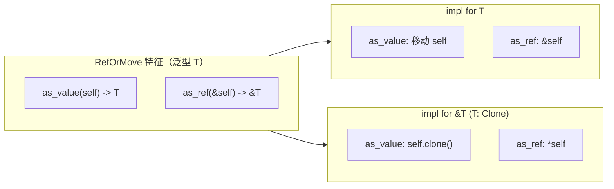

# RefOrMove：按值或按引用统一访问

## 1. 文件角色与职责

`reformove.rs` 定义 **`RefOrMove<T>`（引用或移动）** trait：对「有时是 **`T` 本身（拥有所有权，by value）**，有时是 **`&T` 借用（by reference）**」的泛型代码，提供统一接口——

- **`as_value(self) -> T`**：在需要 **`T` 的所有权** 时取得值（对 `&T` 则 **`clone`**）；  
- **`as_ref(&self) -> &T`**：在仅需只读访问时统一得到 **`&T`**。

适用于 API 希望同时接受 **`T` 与 `&T`**（在 **`T: Clone`** 的前提下）并减少重复实现的场景。

## 2. 公共 API 一览

| 名称 | 类型 | 说明 |
|------|------|------|
| `RefOrMove` | `pub trait` | 关联类型由实现者固定为 `T`（泛型参数） |
| `as_value` | `fn(self) -> T` | 消费 `self`，产出 `T` |
| `as_ref` | `fn(&self) -> &T` | 不消费 `self`，返回对内部 `T` 的引用 |
| `impl RefOrMove<T> for T` | 空白实现 | 值类型：移动即结果 |
| `impl RefOrMove<T> for &T where T: Clone` | 借用实现 | `as_value` 克隆，`as_ref` 解一层引用 |

## 3. 核心数据结构

本文件 **无 struct / enum**；仅 **trait** 与 **impl**。

语义上可把「实现 `RefOrMove<T>` 的类型」理解为：**承载或指向 `T` 的载体**，通过两个方法统一访问模式。

## 4. Trait（特征）定义与实现

### Trait 定义

```rust
pub trait RefOrMove<T> {
    fn as_value(self) -> T;
    fn as_ref(&self) -> &T;
}
```

### `impl RefOrMove<T> for T`

| 方法 | 行为 |
|------|------|
| `as_value(self)` | 直接返回 `self`，**移动（move）** 所有权，无克隆。 |
| `as_ref(&self)` | 返回 `self` 的 **`&T`**。 |

### `impl RefOrMove<T> for &T where T: Clone`

| 方法 | 行为 |
|------|------|
| `as_value(self)` | `self.clone()`，从共享引用得到拥有的 **`T`**。 |
| `as_ref(&self)` | `*self`，即 **`&T` → `&T`**（外层引用指向内层 `T`）。 |

**约束说明**：对 **`&T`** 的实现要求 **`T: Clone`**，否则无法在 `as_value` 中合法获得 **`T`**。

## 5. 算法

无复杂算法；仅为 **移动** 与 **`Clone::clone`** 的分派。

## 6. 所有权与借用分析

| 方法 | 所有权 |
|------|--------|
| `as_value(self) -> T` | **`self` 被移动**；对 `T` 实现为一次性转移；对 `&T` 实现为克隆产生新 **`T`**。 |
| `as_ref(&self) -> &T` | **借用 `self`**，返回的 **`&T` 生命周期** 不超过 `&self`。 |
| 对 `&T` 的 `as_ref` | 参数类型为 `&&T`（`&self` 即对 `&T` 的引用），返回的 `&T` 指向被借用的 **`T`**。 |

**注意**：`as_value` 命名为「move」语义，但对 **`&T`** 实际是 **克隆**；命名强调「得到拥有的值」，而非零成本移动。

## 7. Mermaid 架构图



## 8. 小结

**`RefOrMove<T>`** 用极小 API 面统一 **按值** 与 **按共享引用** 两种入参形态：`T` 路径零额外成本，`&T` 路径在 **`Clone`** 约束下用克隆补足所有权。适合减少 **`fn foo(x: T)` / `fn foo_ref(x: &T)`** 的重复，但调用方需注意 **`as_value` 在引用路径上的克隆开销**。与 **`FlexRef`**（统一 `&T` 来源）或 **`Cow`（写时克隆智能指针）** 等不同：**`RefOrMove`** 聚焦于 **`as_value` / `as_ref` 两操作** 的对称抽象，而非 **`Cow`** 的可变与惰性克隆语义。
