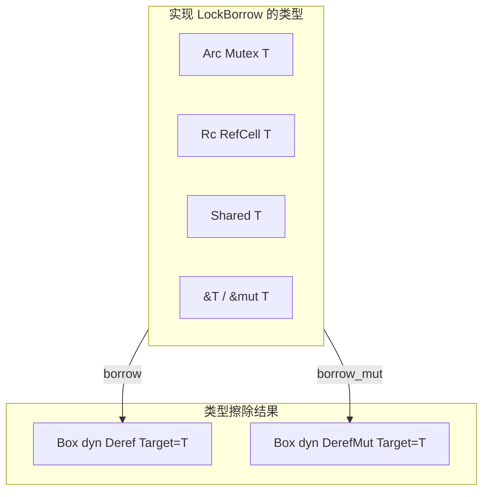

# `shared.rs` 源码分析

## 1. 文件角色与职责

`shared.rs` 解决两类问题：

1. **LockBorrow / LockBorrowMut**：为 **多种承载类型**（`Arc<Mutex<T>>`、`Rc<RefCell<T>>`、裸引用 `&T` / `&mut T`、以及本文件的 `Shared<T>`）提供 **统一接口**，返回 `Box<dyn Deref<Target=T> + '_>` 或 `Box<dyn DerefMut<Target=T> + '_>`，便于上层 **多态地「借出」内容**，而不在每种类型上重复模式代码。

2. **Shared&lt;T&gt;**：对 `Rc<RefCell<T>>` 的 **薄包装**，提供与 `LockBorrow*` 一致的 `borrow` / `borrow_mut`（均返回 trait object），以及 `clone_inner`、`as_ptr`、`unwrap_or_clone` 等辅助方法；并实现 `Clone`（浅克隆 Rc）、按 **指针地址** 的 `PartialEq`、`Debug` / `Display`。

## 2. 公共 API 一览

### 2.1 Trait

| 符号 | 方法 | 说明 |
|------|------|------|
| `LockBorrow<T: ?Sized>` | `borrow(&self) -> Box<dyn Deref<Target=T> + '_>` | 共享借用 |
| `LockBorrowMut<T: ?Sized>` | `borrow_mut(&mut self) -> Box<dyn DerefMut<Target=T> + '_>` | 可变借用（对 `Arc<Mutex<T>>` 与 `Shared` 仍通过锁/RefCell 运行时检查） |

### 2.2 `Shared<T>`

| 符号 | 说明 |
|------|------|
| `Shared<T>(pub Rc<RefCell<T>>)` | 元组结构体，字段公开 |
| `new(value: T) -> Self` | 构造 |
| `borrow` / `borrow_mut` | 与 trait 语义一致，返回 `Box<dyn ...>` |
| `clone_inner` | `T: Clone` 时克隆 **内部值** 到新 `Shared` |
| `as_ptr` | `*mut T`，与 `RefCell` 一致 |
| `unwrap_or_clone` | 尝试 `Rc::try_unwrap`；失败则克隆内部值 |

### 2.3 Trait 实现（`Shared`）

| Trait | 行为摘要 |
|-------|----------|
| `LockBorrow` / `LockBorrowMut` | 委托到固有方法（`borrow_mut` 使用 `Shared::borrow_mut(self)` 避免与 `&mut self` 的 trait 方法签名混淆） |
| `PartialEq` | **仅比较 `RefCell` 指针**，不比较 `T` 值 |
| `Clone` | 克隆 `Rc` |
| `Debug` / `Display` | 打印内容与 `RefCell` 指针地址 |

**非公开**辅助类型：`RefHolder`、`RefHolderMut`、`RefHolderMutMut` —— 用于把 `&&T`、`&&mut T` 等包装成可实现 `Deref`/`DerefMut` 的值，以便装入 `Box<dyn Deref...>`。

## 3. 核心数据结构与内存布局

### 3.1 `Shared<T>`

- **内存**：`Rc` 在堆上含 **强/弱引用计数** 与指向 `RefCell<T>` 的指针；`RefCell` 含 **借用状态标志** 与 `T`。
- **克隆 `Shared`**：只增加 `Rc` 强引用，**不复制 `T`**。

### 3.2 `Box<dyn Deref<Target=T>>`

- **胖指针**：数据指针 + vtable；堆分配 `Box` 本身；动态派发 `deref()`。
- **生命周期**：`'_` 与锁守卫或 `Ref`/`RefMut` 一致，drop 时释放借用。

## 4. Trait 定义与实现（汇总）

| 实现类型 | `LockBorrow` | `LockBorrowMut` |
|----------|--------------|-----------------|
| `Arc<Mutex<T>>` | `MutexGuard` 装箱 | 同上（可变守卫） |
| `Rc<RefCell<T>>` | `Ref` 装箱 | `RefMut` 装箱 |
| `&T` | `RefHolder` 双重引用解包 | — |
| `&mut T` | `RefHolderMut` | `RefHolderMutMut` |
| `Shared<T>` | 固有 `borrow` | 固有 `borrow_mut`（`&self`）经 `Shared::borrow_mut` 调用 |

**Poison 行为**：`Arc<Mutex<T>>` 在互斥锁中毒时 **`expect` panic**（与常见 `unwrap` 策略一致）。

## 5. 算法与关键策略

- **无复杂算法**；核心是 **类型擦除** 与 **借用守卫生命周期** 由返回的 `Box<dyn ...>` 持有，确保在守卫存活期间可安全解引用。
- **`RefHolder*`**：通过再包一层引用，使 `Deref::Target = T`，从而与 `MutexGuard`/`Ref` 等统一为「可 `Deref` 到 `T`」的对象。

## 6. 所有权与借用分析

- **`LockBorrow::borrow(&self)`**：不获取 `&mut`，适用于 `Arc` / `Rc` / `Shared` 的 **内部可变性** 路径。
- **`LockBorrowMut::borrow_mut(&mut self)`**：trait 要求 `&mut self`，对 `Arc<Mutex<T>>` 仍通过 `lock()` 取得守卫 —— **签名上的 `&mut` 并不等价于对 `T` 的独占编译期证明**，运行时仍受 Mutex 约束。
- **`Shared::borrow_mut(&self)`**：利用 `RefCell` 的 **运行时借用检查**；与 trait 的 `borrow_mut(&mut self)` 并存时，trait 实现显式调用 `Shared::borrow_mut(self)`。
- **`Rc<RefCell<T>>` 与 `Shared`**：典型 **共享图 / 共享节点** 模式；`as_ptr` 可用于 **指针键**（如 `multitrie.rs` 中 `end_of_expr`）。

## 7. Mermaid 图

### 7.1 统一借用概念架构

### 7.2 `Shared` 与 `Rc<RefCell<T>>`

## 8. 复杂度与性能要点

| 方面 | 说明 |
|------|------|
| **动态派发** | 每次 `borrow` 返回 `Box<dyn Deref>`，解引用走 vtable，较单态化有额外开销 |
| **堆分配** | `Box` 分配；高频热路径若敏感可考虑上层不用 trait object |
| **`Arc<Mutex<T>>`** | 竞争时阻塞；无读写锁 |
| **`RefCell`** | 运行时借用检查，失败 panic（与 Mutex 类似） |
| **`PartialEq`** | O(1) 指针比较；语义为 **身份** 而非值相等 |

## 9. 小结

`shared.rs` 以 **小体量** 提供 **LockBorrow 抽象** 与 **`Shared` 包装**，支撑跨同步原语与引用的统一访问模式，并与 `multitrie` 等模块中 **`Shared<MultiTrieNode>` + `as_ptr` 索引** 配合。使用方应注意：`Box<dyn Deref>` 的开销、`Mutex` 中毒 panic、以及 `Shared` 的 `PartialEq` 比较的是 **单元格地址** 而非业务相等性。
