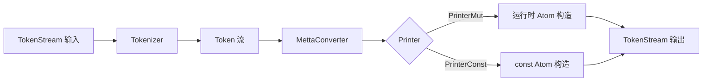
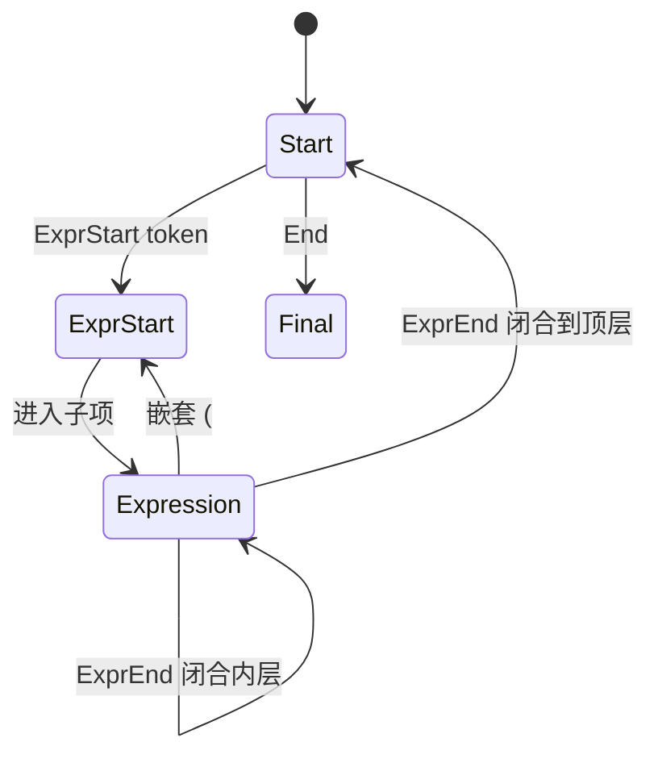

# `hyperon-macros/src/lib.rs` 源码分析报告

**源文件**：`hyperon-macros/src/lib.rs`  
**crate**：`hyperon-macros`（过程宏 crate）

## 1. 文件角色与职责

本文件实现 **MeTTa S-表达式语法 → Rust `Atom` 构造代码** 的编译期展开：

- **`metta!`**：在运行时构造 `Atom`（符号、变量、表达式、部分 grounded 类型），通过生成对 `hyperon_atom`、`hyperon_common` 的调用完成分配与包装。
- **`metta_const!`**：在 **const 上下文** 中构造仅含符号、变量、表达式的 `Atom`；**不支持** 需堆分配的 grounded 值。
- 内部包含 **词法状态机**（`Tokenizer` / `TokenizerState`）、**语法状态机**（`MettaConverter` + `State`），以及两套 **代码生成后端**（`PrinterMut` / `PrinterConst`），共用 `PrinterBase` 拼装 `TokenStream`。

`#[cfg(test)]` 下的 **`print_stream`** 仅用于调试宏输入的 token 流，不属于对外稳定 API。

## 2. 公开 API 一览

| 名称 | 类型 | 说明 |
|------|------|------|
| `metta!` | `#[proc_macro]` | 将输入按 MeTTa 风格解析并展开为 `Atom` 表达式。 |
| `metta_const!` | `#[proc_macro]` | 同上，但使用 `UniqueString::Const`、`new_const`、`CowArray::Literal` 等 const 路径；遇 grounded 则 `panic!`。 |
| `print_stream` | `#[proc_macro]`（`cfg(test)`） | 调试：打印输入 `TokenStream` 的迭代项。 |

其余类型（`Tokenizer`、`MettaConverter`、`Printer*` 等）均为 **crate 私有**。

## 3. 核心数据结构（内部）

| 结构/枚举 | 作用 |
|-----------|------|
| `InternalToken` | 表示括号表达式边界、`TokenTree` 或 token 间的“空格”分界。 |
| `TokenizerState` / `Tokenizer` | 将 `TokenStream` 扁平化为 `Token` 流；识别 `$var`、字面量、`{ ... }` grounded 块、`True`/`False`、带符号数字等。 |
| `GndType` | 整型 / 浮点 / 字符串 / 布尔 grounded 分类。 |
| `Token` | 解析后的逻辑 token：`ExprStart`/`ExprEnd`、符号、变量、各类 grounded、`Gnd(Group)`。 |
| `PrinterBase` | 向 `Vec<(Delimiter, TokenStream)>` 栈式写入，生成 `Atom::Symbol` / `Expression` / `gnd(...)` 等片段。 |
| `PrinterMut` / `PrinterConst` | 实现 `Printer`：`UniqueString::from` vs `UniqueString::Const`；表达式用 `CowArray::from([...])` vs `CowArray::Literal(const { &[...] })`。 |
| `MettaConverter<P: Printer>` | 根据 `Token` 流驱动 `Printer`，维护嵌套深度状态 `State`。 |

## 4. Trait 定义与实现

| Trait | 实现者 | 要点 |
|-------|--------|------|
| `Printer` | `PrinterMut`、`PrinterConst` | 统一接口：`symbol`、`variable`、`bool`/`integer`/`float`/`str`/`gnd`、`expr_*`、`get_token_stream`。 |
| `ToString` | `Token`（部分） | 仅对 `Int`/`Float`/`Str` 有意义；其余分支为 `todo!()`（当前解析路径不依赖完整 `ToString`）。 |

无 `Space` / `SpaceMut` 相关定义（属 `hyperon-space` / `hyperon` lib）。

## 5. 算法要点

1. **括号展开**：`unroll_group` 将 `(...)` 转为 `ExprStart` + 子 token + `ExprEnd`，嵌套递归。
2. **空格检测**：相邻 `InternalToken` 的 span 不连续则插入 `InternalToken::Space`，供状态机区分 `ab` 与 `a b`（符号拼接规则）。
3. **字面量**：依赖 `litrs::Literal::parse` 区分整数、浮点、字符串；布尔为标识符 `True`/`False`。
4. **Grounded（`metta!`）**：`{ ... }` 组展开为 `(&&hyperon_atom::Wrap(( ... ))).to_atom()`，即运行时包装任意 Rust 值为 grounded atom。
5. **表达式与子项**：`MettaConverter` 在 `Expression` 状态下对非 `ExprEnd` 的 token 先写 `expr_delimiter`（逗号分隔子 atom），再递归输出子项；括号匹配错误时 `panic!`。
6. **Const 路径限制**：`PrinterConst` 对 `bool`/`integer`/`float`/`str`/`gnd` 直接 `panic!`，与文档注释一致（const 中不能分配 grounded）。

## 6. 所有权分析

- **过程宏入口**：`TokenStream` 被消费，`Tokenizer` 拥有 `Box<dyn Iterator<Item=InternalToken>>`。
- **生成代码**：`PrinterBase` 在栈上累积 `TokenStream` 片段，最终 **移动** 出单个根 `TokenStream`；不保留对调用方数据的引用。
- **Grounded 组**：`Group` 的内层 stream 被嵌入生成的 `Wrap(( ... ))` 中，由 **展开后的表达式** 在调用点求值，宏本身不持有 `Atom`。

## 7. Mermaid 图

### 宏展开数据流

### 解析与打印状态

## 8. 与 MeTTa 语义的对应关系

| MeTTa / S-expr 写法 | Rust 侧生成语义 |
|---------------------|-----------------|
| `foo`、`+` | `Atom::Symbol` + `UniqueString`（运行时或 const）。 |
| `$x` | `Atom::Variable`。 |
| `(f a b)` | `Atom::Expression`，子项为 `CowArray` 存储的子 `Atom`。 |
| 整型 / 浮点 / 字符串字面量 | `Atom::gnd(Number::Integer/Float)`、`Str::from_str` 等。 |
| `True` / `False` | `gnd(bool::Bool(...))`。 |
| `{ rust_expr }` | 仅 `metta!`：`Wrap` + `to_atom()`，将 Rust 值嵌入 atom 层。 |
| 逗号连接的多子查询 | **不在本文件实现**；由 `hyperon_space::complex_query` 在 **Space::query** 层处理。本宏只构造 **单个** 查询/数据 atom 树。 |

`hyperon` 的 `metta` 子模块大量使用 `metta_const!` 定义类型符号与内建操作符常量（如 `EVAL_SYMBOL`），使 **MeTTa 中的名字与 Rust 中的 `Atom` 常量一一对应**。

## 9. 小结

- `hyperon-macros` 是 **编译期 DSL → `hyperon_atom::Atom` 构造器** 的桥梁：`metta!` 侧重开发便利与 grounded 支持；`metta_const!` 侧重 **零运行时分配** 的符号/结构常量。
- 性能注释已说明：`metta!` 对 grounded 有额外包装成本。
- 错误处理以 **`expect` / `panic!`** 为主，非法 token 或 const 中使用 grounded 会在 **编译或 const 求值** 阶段失败。
