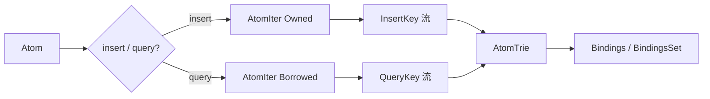

# `index/mod.rs` 源码分析：AtomIndex 与基于 Trie 的索引门面

## 1. 文件角色与职责

`hyperon-space/src/index/mod.rs` 实现 **AtomIndex\<D\>**：在 **DuplicationStrategy**（默认 `NoDuplication`）参数化下，将原子的 **线性 token 序列**（表达式结构 + 叶子原子）插入 **AtomTrie**，并提供：

- `insert` / `remove` / `query` / `iter` / `is_empty`；
- 内部 **AtomIter**：把 `Atom` 展开为 `AtomToken` 流（供插入与查询生成不同 key 类型）；
- 大量单元测试验证单表达式、重复策略、可匹配 Grounded 等行为。

子模块 `storage`、`trie` 在本文件通过 `pub use trie::{...}` 再导出策略类型与常量。

## 2. 公开 API 一览

| 名称 | 可见性 / 类型 | 说明 |
|------|----------------|------|
| `storage` | `pub mod` | Atom 双射存储（见 `atom-storage.md`） |
| `trie` | `pub mod` | Trie 实现（见 `atom-trie.md`） |
| `ALLOW_DUPLICATION` / `NO_DUPLICATION` | `pub const` | 策略单例 |
| `DuplicationStrategy` / `AllowDuplication` / `NoDuplication` | `pub use` | 来自 `trie` |
| `QueryResult` | `pub type` | `Box<dyn Iterator<Item=Bindings>>` |
| `AtomIndex<D>` | `pub struct` | 默认 `D = NoDuplication` |
| `AtomIndex::new()` | `impl AtomIndex` | 默认策略 |
| `AtomIndex<D>::with_strategy` | 方法 | 构造（策略参数仅用于类型，内部 `Default`） |
| `insert` / `query` / `remove` / `iter` / `is_empty` | 方法 | 门面 API |
| `Display` | `impl` | `D: DuplicationStrategy + Display` 时委托给 trie |

非公开：`AtomToken`、`AtomIterState`、`AtomIter`（模块内用于 key 生成）。

## 3. 核心数据结构

### `AtomToken<'a>`

- `Atom(Cow<'a, Atom>)`：序列中的一个叶子 token（符号 / 变量 / Grounded 等）。
- `StartExpr(Option<&'a Atom>, usize)`：子表达式开始；`Option` 在借用路径下携带外层表达式引用，用于查询 key 中的 `StartExpr(atom, size)`。

### `AtomIter` / `AtomIterState`

按 **深度优先** 遍历表达式树：

- 单原子：产出单个 `Atom` token；
- 表达式：先 `StartExpr(子元数)`，再依次产出各子节点；子节点若为表达式则递归同样模式。

**插入路径**使用 `from_atom`（`Cow::Owned`）：对 `Cow::Owned` 的子项会用 `mem::replace(..., PLACEHOLDER)` 取出子原子，避免整树克隆（`PLACEHOLDER` 为 `metta_const!(_)`）。

### `AtomIndex<D>`

- 唯一字段 `trie: AtomTrie<D>`；
- `PartialEq` / `Eq` / `Clone` 等由派生或 trie 决定。

## 4. 特质定义与实现

本文件不定义新 trait；实现要点：

- **`AtomIter: Iterator<Item = AtomToken<'a>>`**：驱动所有 key 序列。
- **`insert`**：`AtomToken` → `InsertKey`（`StartExpr(size)` 或 **拥有** 的 `Atom`）。
- **`query` / `remove`**：`AtomToken` → `QueryKey`（`StartExpr(Some(atom), size)` 或 **借用** 的 `Atom`）。

`atom_token_to_insert_index_key` 与 `atom_token_to_query_index_key` 中的 `panic!` 断言调用路径下 token 形态正确（插入只用 Owned，查询只用 Borrowed）。

## 5. 算法说明

### 查询机制（门面层）

1. `query(atom)`：`AtomIter::from_ref` 生成 `QueryKey` 迭代器；
2. 调用 `self.trie.query(key)`，返回 `BindingsSet`；
3. 包装为 `QueryResult`：`Box::new(...into_iter())`，对外是 **按绑定迭代的惰性迭代器**。

实际合一与 trie 遍历在 `trie.rs` 的 `AtomTrie::query` 中完成。

### Trie 索引（与本文关系）

`AtomIndex` 不负责 trie 节点逻辑，只负责 **把 Atom 编码为键序列**；键序列设计使 **结构相同** 的表达式共享前缀路径，从而加速「可合一」候选的查找。

### `complex_query`

本文件 **不实现** `complex_query`；若某 `Space` 实现内部用 `AtomIndex` 做索引，仍可在 `query` 入口先调用 `hyperon_space::complex_query`（见 `space-traits.md`）。

### 观察者模式

`AtomIndex` 无观察者；若嵌入 `GroundingSpace` 等，由外层 `SpaceCommon` 负责事件。

## 6. 所有权与借用分析

| 场景 | 策略 |
|------|------|
| `insert(atom: Atom)` | 消费整个原子；迭代中 `Owned` 分支可 `replace` 子槽位为占位符，减少克隆 |
| `query(&Atom)` / `remove(&Atom)` | 全程 `Cow::Borrowed`，key 中保留对输入表达式的引用 |
| `iter()` | 返回 `Cow<'_, Atom>` 的 trait object 迭代器，来自 trie 解压 |

**TODO 注释**：考虑是否为「拥有 / 借用」复制两套结构以去掉 `Cow`，属潜在优化点。

## 7. Mermaid：从原子到查询结果

## 8. 与 MeTTa 语义的对应关系

| MeTTa 概念 | 本模块角色 |
|------------|------------|
| **match** | `query` 返回多条 `Bindings`，对应模式与索引中条目的合一结果 |
| **add-atom** | 对应上层空间 `add` 时调用 `insert`（非本文件直接暴露给 MeTTa） |
| **remove-atom** | `remove` 按 **相等** 路径删除一条与给定原子匹配的索引链（与 trie 的 remove 语义一致） |
| **new-space** | 新建含 `AtomIndex` 的空间在更上层；索引本身无「空间句柄」 |

索引对 **带 `CustomMatch` 的 Grounded** 走合一通道，测试 `MatchAsX` 验证了「查询匹配所有条目」与「插入可匹配原子再查询表达式」的行为。

## 9. 小结

`index/mod.rs` 是 **Trie 索引的公共门面**：把超复杂表达式树线性化为 **结构 token + 原子 token**，再交给 `AtomTrie`；通过 **DuplicationStrategy** 控制叶计数（重复插入是否合并）。它与 `lib.rs` 的 `Space` 特质解耦，但常被同一 **空间实现** 组合使用，以加速 MeTTa 风格的模式查询。
