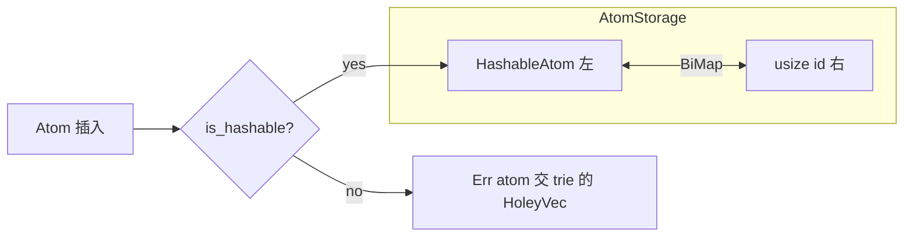

# `index/storage.rs` 源码分析：AtomStorage 双映射

## 1. 文件角色与职责

`storage.rs` 实现 **AtomStorage**：为 **可哈希** 原子维护 **原子 ↔ 数值 id** 的双向映射（`bimap::BiMap`），供 `trie.rs` 中的 `TrieKeyStorage` 将「符号 / 变量 / 特定 Grounded」编码为紧凑的 **Hash 存储型 TrieKey**。不可哈希原子不进入本结构，而落入 `HoleyVec`（在 `trie.rs` 中）。

## 2. 公开 API 一览

| 名称 | 说明 |
|------|------|
| `AtomStorage` | `next_id: usize`，`atoms: BiMap<HashableAtom, usize>` |
| `insert(&mut self, atom: Atom) -> Result<usize, Atom>` | 可哈希则 `Ok(id)`（已存在则返回已有 id）；否则 `Err(atom)` |
| `get_atom(&self, id: usize) -> Option<&Atom>` | 右查左 |
| `get_id(&self, atom: &Atom) -> Option<usize>` | 左查右（仅当 `is_hashable`) |
| `count(&self) -> usize` | 左值个数 |
| `new()` | 仅 `#[cfg(test)]` 测试构造 |
| `Display` | 排序后 `{ id: atom, ... }` 形式（借助 `write_mapping`） |

非公开：`HashableAtom` 枚举，用于查询时借用、存储时拥有。

## 3. 核心数据结构

### `AtomStorage`

- **单调递增 `next_id`**：新原子首次插入时分配新 id；重复插入返回同一 id，保证 trie 边键稳定。
- **BiMap**：O(1) 级别双向查找（具体复杂度取决于 bimap 实现），满足 trie 对 `get_id` / `get_atom_unchecked` 路径的需求。

### `HashableAtom`

- `Query(*const Atom)`：查询用，避免生命周期泄漏到公共 API；**仅**在可证明指向有效 `Atom` 的路径使用（见注释）。
- `Store(Atom)`：实际存入 bimap 的拥有型原子。

`as_atom()` 对 `Query` 使用 `unsafe` 解引用。

## 4. 特质定义与实现

| 特质 | 说明 |
|------|------|
| `Hash` | `Symbol` / `Variable` 委托各自哈希；`Grounded` 用 `DefaultHasher` + `serialize` 写入 u64（可序列化前提下） |
| `PartialEq` / `Eq` | 基于 `as_atom()` 的语义相等 |
| `Display` | `Store` 打印原子；`Query` 打印原子并加 `?` 后缀 |

**可哈希判定 `is_hashable`**：

- `Symbol`、`Variable`：真；
- `Grounded`：**无** `as_match()` **且** `is_serializable` 为真时为真；
- 表达式及其他：假。

`is_serializable` 通过 `NullSerializer` 试调用 `serialize` 推断（注释称此为 workaround）。

## 5. 算法说明

- **插入**：`HashableAtom::Query(&atom)` 查是否已有；无则 `Store(atom)` + 新 id。
- **查询 id**：可哈希时用 `Query` 包装指针查左。
- **Trie 中的角色**：`TrieKeyStorage::add_atom` 在 `insert` 成功时用 `TrieKeyStore::Hash`；失败则用 `HoleyVec` + `TrieKeyStore::Index`。

无显式 **remove** 公共 API；`trie` 中 `remove_key` 仅对 **Index** 存储移除（哈希键移除标为 TODO）。

## 6. 所有权与借用分析

| 点 | 说明 |
|----|------|
| `insert(atom: Atom)` | 消费原子；存入 `Store` |
| `get_id(&Atom)` | 不获取所有权；`Query(*const Atom)` 要求调用方保证指针有效期内原子不变 |
| 与 trie 关系 | trie 持有的是 **TrieKey（id + 存储域）**；Hash 路径下真实 `Atom` 由本存储拥有 |

**安全契约**：`Query` 指针仅用于与刚插入或仍存活的查询参数关联；不应长期悬挂。

## 7. Mermaid

## 8. 与 MeTTa 语义的对应关系

| 概念 | 本模块 |
|------|--------|
| **add-atom**（可哈希部分） | 在索引插入路径上首次出现时分配稳定 id，便于 trie 边共享 |
| **match** | 不直接参与；为查询侧 `get_id` 提供 O(1) 精确键解析 |
| **Grounded 值** | 仅「无 CustomMatch 且可序列化」的 Grounded 进入哈希存储；否则走向量槽，影响匹配性能（见 trie 注释） |

## 9. 小结

`AtomStorage` 是 Trie 的 **哈希侧原子池**：双射保证 id 与原子一一对应，重复插入合并为同一键；通过 **可哈希 / 可序列化** 门槛把「适合结构共享」的原子与需按指针或向量存放的复杂值分开。理解它对解释 **TrieKey 的 Hash vs Index** 分支及性能特征至关重要。
