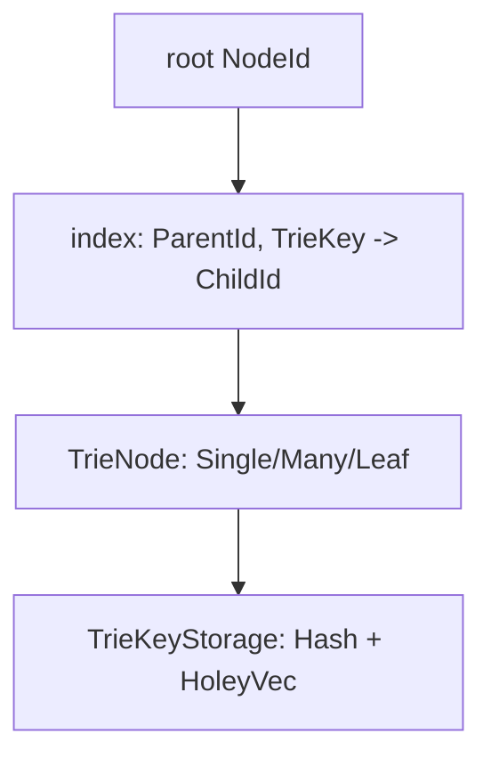
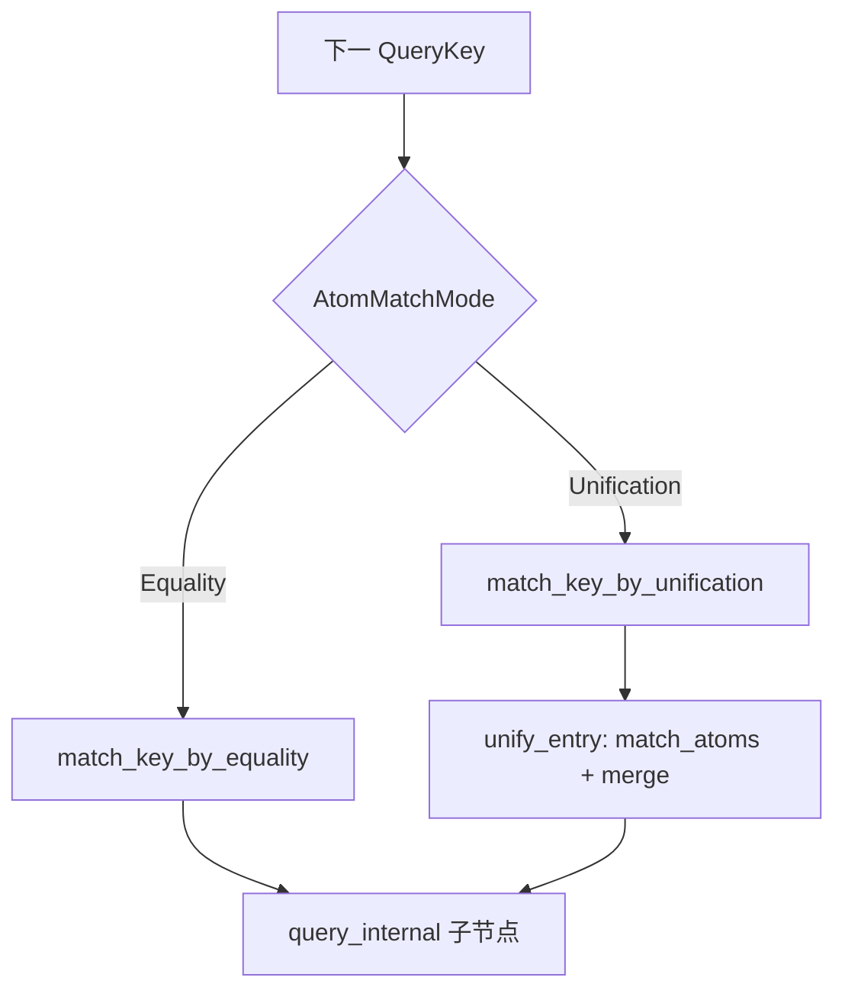

# `index/trie.rs` 源码分析：AtomTrie、Trie 节点与 DuplicationStrategy

## 1. 文件角色与职责

`trie.rs` 实现 **AtomTrie\<D\>**：在 **DuplicationStrategy** 下维护从 **InsertKey/QueryKey 序列** 到叶计数的路径结构，并提供：

- `insert` / `query` → `BindingsSet` / `unpack_atoms` / `remove` / `is_empty`；
- **TrieKey**：压缩为单个 `usize`（存储域、匹配模式、值域）；
- **TrieNode**：`Leaf` / `Single` / `Many` 三级表示，边表放在 `AtomTrie.index: HashMap<(NodeId, TrieKey), NodeId>` 以节省节点体积；
- **TrieKeyStorage**：组合 `AtomStorage`（可哈希原子）与 `HoleyVec<Atom>`（不可哈希原子），并区分 **Equality** vs **Unification** 匹配模式。

## 2. 公开 API 一览

| 名称 | 说明 |
|------|------|
| `DuplicationStrategyImplementor` | `dup_counter_mut(&mut self) -> &mut usize` |
| `DuplicationStrategy` | `Default` + `add_atom` / `remove_atom` 作用于叶实现者 |
| `NoDuplication` | 叶计数恒设为 0/1 |
| `AllowDuplication` | 叶计数 `+1` / `-1` |
| `ALLOW_DUPLICATION` / `NO_DUPLICATION` | 策略常量实例 |
| `InsertKey` | `StartExpr(usize)` / `Atom(Atom)` |
| `QueryKey<'a>` | `StartExpr(&'a Atom, usize)` / `Atom(&'a Atom)` |
| `AtomTrie<D>` | `with_strategy`、`insert`、`query`、`unpack_atoms`、`remove`、`is_empty`、`Display` |

内部类型：`TrieKeyStorage`、`TrieKey`、`TrieKeyStore`、`AtomMatchMode`、`TrieNode`、`TrieNodeKeys`、`TrieNodeAtomIter` 等。

## 3. 核心数据结构

### `AtomTrie<D>`

- `keys: TrieKeyStorage`：Insert/Query 时分配或查找 `TrieKey`；
- `nodes: HoleyVec<TrieNode>`；
- `index: HashMap<(NodeId, TrieKey), NodeId>`：父节点 + 边键 → 子节点；
- `root: NodeId`；
- `_phantom: PhantomData<D>`。

### `TrieNode`

- `Leaf(usize)`：叶计数（由 `D` 维护）；
- `Single(TrieKey)`：单出边；
- `Many(Box<TrieNodeKeys>)`：`equal` 与 `unify` 两个 `SmallVec` 分列 **相等匹配键** 与 **合一匹配键**。

`is_leaf()` 仅当为 `Leaf(0)` 时为真（空 trie）。

### `TrieKey`（私有）

单 `usize` 编码：`TrieKeyStore`（Hash/Index）、`AtomMatchMode`（Equality/Unification）、值（哈希 id 或 `HoleyVec` 下标）；表达式起始键用特殊布局 `is_start_expr()`。

### `TrieKeyStorage`（私有）

- 插入时：`Variable`、`带 CustomMatch 的 Grounded` → **Unification**；普通 `Grounded` 若无 `as_match` 且可哈希 → **Equality**；其余可哈希原子同理；不可哈希则进 `HoleyVec`。
- 查询时：`query_key` 返回 `(AtomMatchMode, Option<TrieKey>, Option<&Atom>)`；非哈希相等键可能 `TrieKey` 为 `None`，需在节点上扫描相等槽。

## 4. 特质定义与实现

| 特质 | 实现者 | 作用 |
|------|--------|------|
| `DuplicationStrategyImplementor` | `TrieNode` | 将策略操作映射到 `leaf_counter_mut` |
| `DuplicationStrategy` | `NoDuplication` / `AllowDuplication` | 控制 `insert_internal` 结尾叶更新与 `remove_internal` 叶递减 |
| `Default` | `AtomTrie` | 创建空根节点 |
| `Display` | `AtomTrie` | 缩进打印 trie 结构 |

## 5. 算法说明

### 插入 `insert_internal`

深度优先沿 key 迭代：每步 `keys.insert_key` 得 `TrieKey`；若 `(node_id, key)` 已有子节点则递归；否则 `new_branch` 创建链。键耗尽时 `D::add_atom(&mut nodes[node_id])` 更新叶计数。

### 查询 `query_internal`

- 无更多 key：返回 `BindingsSet::count(leaf_counter())`（叶计数条「空绑定」结果，支持重复策略）。
- 有 key：`query_key` 分岔：
  - **Equality**：`match_key_by_equality`——若有确定 `TrieKey` 走单分支；否则遍历相等槽中非 `start_expr` 的键，与查询原子 **==** 比较；再对 **Unification** 槽调用 `unify_entry`（`match_atoms` + 递归子 trie + `merge` + 过滤循环绑定）。
  - **Unification**：`match_key_by_unification`——对当前节点 **所有解压出的 (atom, child)** 尝试与查询原子合一（`unpack_atoms_internal` 语义）。

`CachingMapper<VariableAtom, VariableAtom, _>` 在 `unify_entry` 中为条目中的变量生成 **唯一副本**，减少变量名冲突。

`QueryKey::skip_expression`：当当前键为表达式起始且走相等分支时，跳过查询迭代器中该子表达式的剩余 token，以便与索引结构对齐。

### 移除 `remove_internal`

按 **相等** 匹配沿路径查找子节点；递归返回后若子变空叶则删边、`remove_key` 清理存储中的非哈希键（哈希键移除 TODO）。

### `unpack_atoms` / `TrieNodeAtomIter`

DFS 重建表达式：遇 `StartExpr` 压栈 `ExpressionBuilder`；遇叶子原子填入当前层；`count` 归零时组装 `Atom::expr`；叶计数 `repeat_n` 使重复策略下同一原子多次出现。

## 6. 所有权与借用分析

- `query` 接收 `Iterator<Item = QueryKey<'a>>`，查询期间持有对原子的 **借用**，不消费索引内存储。
- `get_atom_unchecked`：`unsafe`，调用方需保证 `TrieKey` 与存储一致。
- `HoleyVec` 存放 **拥有的** 不可哈希原子；与 `AtomStorage` 中的原子共同构成边的「标签」语义。

## 7. Mermaid

### Trie 拓扑（边在外部 HashMap）

### 查询分岔

## 8. 与 MeTTa 语义的对应关系

| 概念 | trie 层体现 |
|------|-------------|
| **match** | `query` 产出多条 `Bindings`，含变量绑定与 `CustomMatch` 合一 |
| **add-atom** | `insert` 增加路径与叶计数 |
| **remove-atom** | `remove` 按相等键路径删除一条 |
| **结构化的表达式** | `StartExpr` + 子键序列对应 MeTTa 表达式树形状 |

代码注释指出：不可哈希又无序列化的 Grounded 留在相等分支会导致性能权衡；建议为这类类型实现序列化以便进入哈希存储。

## 9. 小结

`trie.rs` 是 hyperon-space 索引的 **算法核心**：用 **紧凑 TrieKey** 与 **边外置 HashMap** 平衡内存与速度；用 **Equality / Unification 分桶** 区分精确匹配与模式合一；用 **DuplicationStrategy** 区分集合语义（去重 vs 多重集）。`TODO` 包括：查询返回迭代器、哈希键移除、减少变量替换开销等，均为后续优化点。
