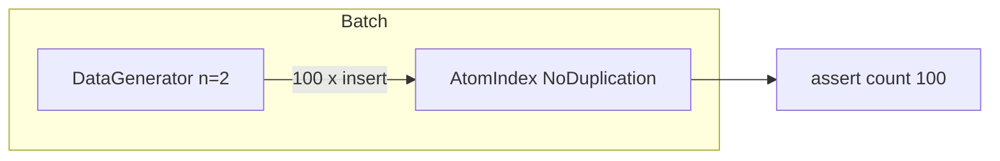

# `benches/atom_index.rs` 源码分析：AtomIndex 基准

## 1. 文件角色与职责

`hyperon-space/benches/atom_index.rs` 是 **Criterion** 基准入口（`harness = false`，见 `Cargo.toml` 中 `[[bench]]`）。当前仅包含一个基准组 **fill**：测量向 **`AtomIndex<NoDuplication>`** 连续 **`insert`** 固定规模（100 条）二维表达式原子的耗时，用于观察索引插入路径在 **无重复合并策略** 下的性能。

## 2. 公开 API 一览

基准 crate 无对外 Rust API；Criterion 宏生成 `main`。

| 符号 | 作用 |
|------|------|
| `criterion_group!(benches, fill)` | 注册 `fill` 基准 |
| `criterion_main!(benches)` | 程序入口 |
| `fill` | `Criterion` 配置与 `bench_function` |

依赖：`criterion`、`hyperon_atom`、`hyperon_space::index::*`。

## 3. 核心数据结构

### `DataGenerator`

- `range: Vec<Atom>`：字符区间内每个字符一个 **符号原子**（`Atom::sym(c.to_string())`）；
- `sequence: usize`：从 `range_size.pow(n)` 递减到 0 的计数器，共生成 `range_size^n` 个组合；
- `atom: Vec<Atom>`：长度 `n` 的 **子表达式分量** 缓冲区，每步按进制分解 `sequence` 填入各槽，产出 `Atom::expr(self.atom.clone())`。

`new(n, range)`：`n` 为表达式元数；`range` 如 `'a'..'k'` 共 10 个符号，则 `n=2` 时 `10^2=100` 条数据，与断言一致。

## 4. 特质定义与实现

`impl Iterator for DataGenerator`：`Item = Atom`，在 `sequence` 归零前每次递减并更新 `atom` 向量，返回一条 **长度为 n 的扁平表达式**（所有子节点均为符号）。

## 5. 算法说明

### 基准逻辑 `fill`

- `bench_function("fill 100", ...)`；
- `iter_batched`：
  - **Setup**：新建 `DataGenerator::new(2, 'a'..'k')` 与 `AtomIndex::<NoDuplication>::new()`；
  - **Routine**：对生成器 `for_each` 每条原子 `idx.insert(a)`，局部计数 `i`，最后 `assert_eq!(i, 100)`；
  - **BatchSize::SmallInput**：提示 Criterion 输入规模小，影响测量策略。

未覆盖：`query`、`remove`、`AllowDuplication`、深层嵌套表达式、Grounded/变量-heavy 负载等。

## 6. 所有权与借用分析

- 生成器在每次 batch setup 时新建，避免跨迭代共享可变状态污染测量；
- `insert` 消费 `Atom`；生成器每轮 `clone` 符号到 `atom` 向量，再 `clone` 整向量建表达式，分配压力较高，基准更偏向「真实插入成本 + 小表达式分配」混合场景。

## 7. Mermaid

## 8. 与 MeTTa 语义的对应关系

| 概念 | 基准对应 |
|------|----------|
| **add-atom** | 反复 `insert`，模拟向知识库/空间批量加入结构化原子 |
| **match** | 未测 |
| **remove-atom** | 未测 |
| **new-space** | 每次 batch 新建空索引 |

该基准反映 **批量构建索引** 成本，对 MeTTa 会话加载、规则库导入等场景有间接参考价值，但 **不能** 代表查询延迟。

## 9. 小结

`atom_index.rs` 提供最小可用的 Criterion **插入吞吐量/延迟** 基准：`DataGenerator` 产生 100 个二元符号表达式，`NoDuplication` 下填满 `AtomIndex`。扩展基准时建议增加 `query` 与不同 `DuplicationStrategy`、表达式深度及混合 token 类型，以更全面贴近 Hyperon 工作负载。
