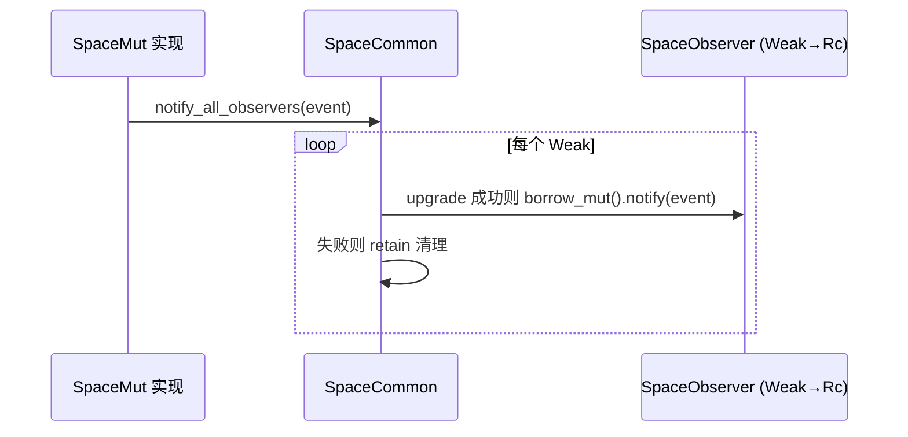
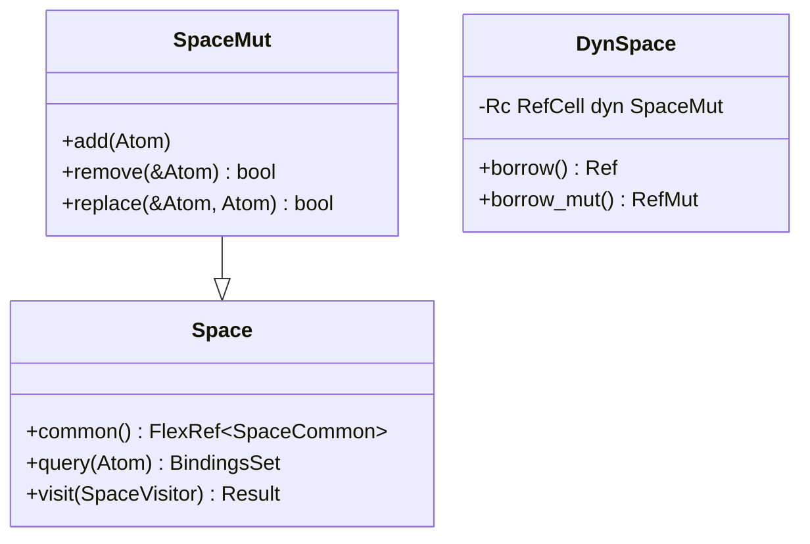

# `lib.rs` 源码分析：Space 特质体系、DynSpace 与观察者

## 1. 文件角色与职责

`hyperon-space/src/lib.rs` 是 **hyperon-space** 箱的根模块：定义「原子空间」的抽象接口与类型化包装，并导出子模块 `index`（Trie 索引实现）。本文件不实现具体空间（如 `GroundingSpace` 在 `hyperon` 中），而是约定：

- 只读查询（`Space`）、可变修改（`SpaceMut`）；
- 空间修改事件的观察者（`SpaceObserver` / `SpaceCommon`）；
- 运行时多态句柄 `DynSpace`（`Rc<RefCell<dyn SpaceMut>>`），并作为 **Grounded** 值参与模式匹配；
- **复合查询** `complex_query`：用逗号算子 `,` 串联子查询并做绑定合并。

## 2. 公开 API 一览

| 名称 | 类型 | 说明 |
|------|------|------|
| `COMMA_SYMBOL` | `const Atom` | 用于拼接子查询的符号（`,`） |
| `ATOM_TYPE_SPACE` | `const Atom` | `DynSpace` 作为 Grounded 时的类型原子 `SpaceType` |
| `SpaceEvent` | `enum` | `Add` / `Remove` / `Replace` 空间变更事件 |
| `SpaceObserver` | `trait` | `notify(&mut self, event: &SpaceEvent)` |
| `SpaceObserverRef<T>` | `struct` | 包装 `Rc<RefCell<T>>`，提供 `borrow` / `borrow_mut` / `into_inner` |
| `SpaceCommon` | `struct` | 观察者列表、`register_observer`、`notify_all_observers` |
| `SpaceVisitor` | `trait` | `accept(&mut self, atom: Cow<Atom>)` |
| `Space` | `trait` | 只读：`common`、`query`、`subst`（默认）、`atom_count`（默认）、`visit`、`as_any` |
| `SpaceMut` | `trait` | 继承 `Space`：`add`、`remove`、`replace`、`as_any_mut` |
| `DynSpace` | `struct` | `Rc<RefCell<dyn SpaceMut>>` 的克隆型句柄 |
| `complex_query` | `fn` | 解析顶层 `,` 表达式并折叠绑定集合 |

另：`impl<T: FnMut(Cow<Atom>)> SpaceVisitor for T` 允许用闭包实现访问器。

## 3. 核心数据结构

### `SpaceEvent`

描述一次空间修改：添加、删除，或「将某原子替换为另一原子」。观察者据此与 MeTTa 层「知识库变更」语义对齐。

### `SpaceCommon`

- `observers: RefCell<Vec<Weak<RefCell<dyn SpaceObserver>>>>`：弱引用避免观察者强持有空间；升级失败时在通知后清理。
- **`Clone` 刻意清空观察者**：避免克隆空间后观察者无法区分事件来自哪个实例（注释中明确说明）。

### `DynSpace`

- 内部 `0: Rc<RefCell<dyn SpaceMut>>`；
- `borrow` / `borrow_mut` 委托给 `RefCell`；
- `common()` 通过 `Ref::map` 从借用的 `SpaceMut` 取出 `FlexRef<SpaceCommon>`；
- **`PartialEq` 按 `RefCell` 指针地址**：同一 `Rc` 克隆相等，不同实例不等；
- 实现 `Grounded` + `CustomMatch`：`match_` 将另一侧原子当作查询，调用 `self.borrow().query(other)` 得到 `MatchResultIter`。

### 与 `AtomIndex` / `AtomTrie` / `AtomStorage` 的关系

本文件不定义索引；`AtomIndex` 等位于 `index` 子模块，可作为某具体 `SpaceMut` 实现的内部加速结构，而 **特质边界** 仍由本文件的 `Space` / `SpaceMut` 描述。

## 4. 特质定义与实现要点

### `Space`

- `common()` → `FlexRef<'_, SpaceCommon>`：与 `hyperon_common::FlexRef` 集成，兼顾共享/独占访问模式。
- `query(&Atom) -> BindingsSet`：由具体空间实现；文档说明可用 `COMMA_SYMBOL` 拼子查询（与 `complex_query` 配合）。
- `subst` 默认实现：`query(pattern)` 后对每条绑定 `apply_bindings_to_atom_move` 到 `template`。
- `visit` 返回 `Result<(), ()>`：`Ok` 表示支持遍历，`Err` 表示未实现。
- `as_any`：向下转型到具体空间类型（与 C API / 动态分发配合）。

### `SpaceMut`

在 `Space` 上增加 `add` / `remove` / `replace`；典型实现应在变更后调用 `common().notify_all_observers(&event)`（示例见 `SpaceObserver` 文档）。

### `SpaceObserver` / `SpaceObserverRef`

注册返回强引用 `Rc<RefCell<T>>`，空间只存 `Weak`；`SpaceObserverRef` 存活期间观察者有效，丢弃后自动失效并被清理。

## 5. 算法说明

### 查询与 `complex_query`

- **单段查询**：`complex_query` 若顶层不是「符号为 `,` 的表达式」，则直接 `single_query(query)`。
- **逗号串联**：`split_expr` 分出算子与参数；对 `args` 做 fold：
  - 累加器初值为 `BindingsSet::single()`（空绑定的一条结果）；
  - 每一步：若上一步结果为空则短路；否则对每条已有绑定 `prev`，将当前子查询原子用 `apply_bindings_to_atom_move` 实例化，再 `single_query`，并对每个 `next` 与 `prev` 做 `merge`，收集为新的 `BindingsSet`。

这与 MeTTa 中「逗号连接多个 match 约束」的语义一致：后一子查询在前一子查询产生的绑定环境下执行。

### 观察者模式

## 6. 所有权与借用分析（`DynSpace`）

| 方面 | 说明 |
|------|------|
| 共享所有权 | `Rc` 允许多个 `DynSpace` 指向同一可变空间 |
| 内部可变性 | `RefCell<dyn SpaceMut>`：运行时借用检查，避免 `&mut self` 与多引用冲突 |
| `'static` 约束 | `DynSpace::new<T: SpaceMut + 'static>`：trait object 不含生命周期参数 |
| 与 `FlexRef` | `common()` 在已持有 `Ref` 时用 `Ref::map` 投影到 `SpaceCommon`，避免额外克隆 |
| 匹配时借用 | `CustomMatch::match_` 中 `self.borrow().query`：单次匹配期间持有只读借用 |

**权衡**：简单、与动态 MeTTa 空间值一致；代价是运行时借用规则与可能的 `RefCell`  panic（重入可变借用时）。

## 7. Mermaid：特质层次与 `DynSpace`

## 8. 与 MeTTa 语义的对应关系

| MeTTa / 概念 | Rust 对应 |
|--------------|-----------|
| **match** / 在空间中匹配模式 | `Space::query`、`DynSpace` 的 `CustomMatch` 委托 `query` |
| **add-atom** | `SpaceMut::add`（实现侧通常发 `SpaceEvent::Add`） |
| **remove-atom** | `SpaceMut::remove` → `Remove` |
| **replace**（若有） | `SpaceMut::replace` → `Replace` |
| **new-space** / 空间值 | `DynSpace::new` 或 `From<T>`，作为 `Grounded` 嵌入原子；类型原子 `ATOM_TYPE_SPACE` |
| **复合查询（`,`）** | `complex_query` + `COMMA_SYMBOL` |

## 9. 小结

`lib.rs` 确立了 Hyperon Rust 引擎中 **空间的契约**：查询返回 `BindingsSet`、变更通过 `SpaceMut`、观测通过 `Weak` 观察者避免循环引用，`DynSpace` 把该契约封装成可在 MeTTa 运行时传递与匹配的 **Grounded 空间值**。`complex_query` 在库层复现了逗号拼接查询的绑定组合逻辑，是连接「表达式语法」与「具体空间实现」的关键辅助函数。
