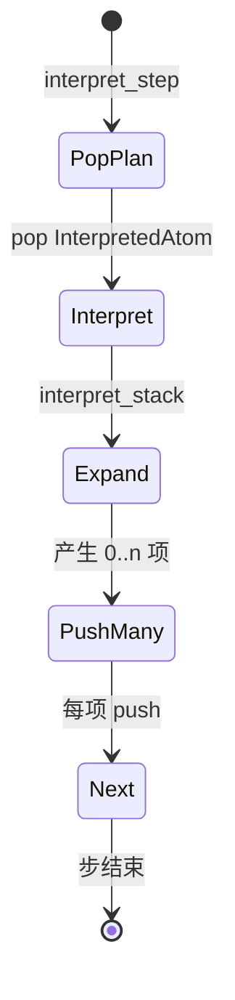
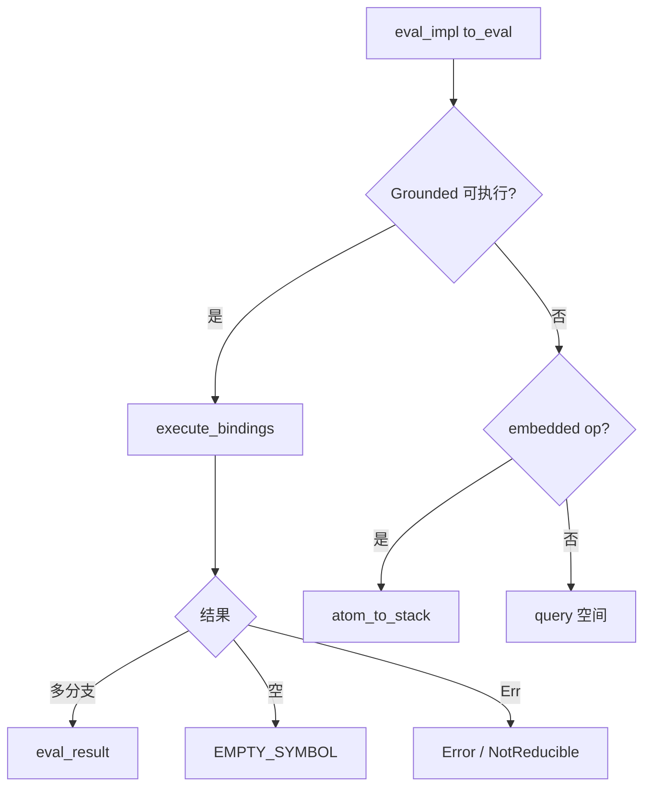
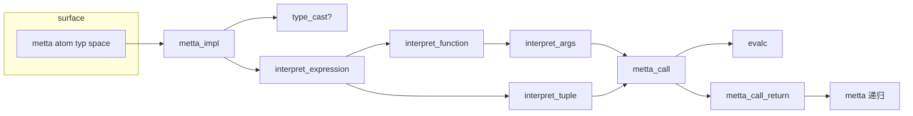

# `lib/src/metta/interpreter.rs` 源码分析报告（最小 MeTTa 解释器核心）

## 1. 文件角色与职责

`interpreter.rs` 实现 **minimal MeTTa** 的 **栈式归约引擎**：把程序表示为嵌套的 **最小指令表达式**（`eval`、`chain`、`unify`、`collapse-bind` 等），通过 **`interpret_step`** 从 `InterpreterState.plan` 取出当前 **解释点**（`InterpretedAtom`），沿 **显式调用栈 `Stack`** 向下展开或经 **`ReturnHandler`** 向上归还，并与 `DynSpace` 上的 **`(= pattern value)` 查询**、**grounded `execute_bindings`**、以及 **`types` 模块的类型驱动 `metta` 路径** 深度交织。参见仓库内 [minimal MeTTa 文档](https://github.com/trueagi-io/hyperon-experimental/blob/main/docs/minimal-metta.md)。

---

## 2. 公开 API 一览

| 名称 | 类型 | 说明 |
|------|------|------|
| `InterpreterState` | `pub struct` | `plan`、`finished`、`context`、`max_stack_depth` |
| `InterpreterState::has_next` | 方法 | `plan` 非空 |
| `InterpreterState::into_result` | 方法 | 仍有计划则 `Err`，否则 `Ok(finished)` |
| `InterpreterState::set_max_stack_depth` | 方法 | 栈深度上限（0 不限制） |
| `InterpreterState::new_finished` | `pub(crate)` | 内部构造已完成状态 |
| `interpret_init` | `fn` | 将 `expr` 包装为初始 `InterpretedAtom` 入 `plan` |
| `interpret_step` | `fn` | 单步归约 |
| `interpret` | `fn` | 循环直至结束 |

---

## 3. 核心数据结构

### 3.1 `ReturnHandler`

```text
fn(Rc<RefCell<Stack>>, Atom, Bindings) -> Option<(Stack, Bindings)>
```

子帧 **`finished`** 后调用：传入 **指向父帧的 `Rc`**、子 **结果 atom**、当前 **Bindings**。返回 `None` 表示 **暂不恢复**（`collapse-bind`：`Rc` 强引用仍 >1 时 `Rc::into_inner` 失败）。

### 3.2 `Stack`

| 字段 | 含义 |
|------|------|
| `prev` | 外层帧；根为 `None` |
| `atom` | 当前处理的表达式（`chain`/`function` 可能含 `%Nested%` 占位） |
| `ret` | 子调用完成后的续体 |
| `finished` | 是否已是值帧 |
| `vars` | 本帧可见 **变量白名单**（归还时裁剪 `Bindings`） |
| `depth` | 栈深度（溢出检测） |

`Rc<RefCell<Stack>>` 的动机（注释）：**`collapse-bind` 多分支共享同一父状态**，子完成时向父中 **追加** `(atom Bindings)`。

### 3.3 `InterpretedAtom(Stack, Bindings)`

计算焦点 + 当前变量绑定。

### 3.4 `InterpreterState::push` 规则

- 若 `prev.is_none() && finished`：`apply_bindings_to_atom_move` 后入 **`finished`**。
- 否则入 **`plan`**。

### 3.5 `Variables(im::HashSet<VariableAtom>)`

**持久集合**：克隆便宜；配合 `Bindings::apply_and_retain` 只保留外层声明的变量，避免内层临时变量绑定泄漏。

---

## 4. Trait 与宏

- `VariableSet for Variables`。
- `match_atom!`：定长 `Atom` 切片模式 + `atom_into_array`。
- `call_native!`：生成 `(call-native …)`，把 `NativeFunc` 嵌进 Atom。

---

## 5. `interpret_step` 与状态机

1. `pop` 一项 `InterpretedAtom`。  
2. `interpret_stack(...)` → `Vec<InterpretedAtom>`。  
3. 逐项 `push`。

**`plan` 为栈（LIFO）**：同一批结果按 `push` 顺序入栈，**后入者先被弹出**。



### 5.1 `interpret_stack` 分支

**A. `stack.finished`**  

- 若 `prev` 为 `None`：返回该项（根值帧，供上层 `push` 转入 `finished`）。  
- 否则：`bindings.apply_and_retain` 仅保留 `outer.vars`；调用 `prev.borrow().ret(prev_rc, atom, bindings)`；`Some` → 新 `InterpretedAtom`，`None` → 空 Vec。

**B. 深度限制**：`max_stack_depth > 0 && depth >= limit` 且当前为 **`metta`** 帧 → `Error … StackOverflow`（注释：计数单位、触发点、嵌套解释器重置等细节以源码为准）。

**C. 按首操作符分派**（见下节）；**默认**：`Stack::finished(prev, atom)`（透明值）。

---

## 6. 各最小指令算法

### 6.1 `eval` / `evalc` / `eval_impl`

- `(eval x)` 使用 `context.space`；`(evalc x space)` 使用 grounded `DynSpace`。  
- 先 `apply_bindings_to_atom_move`。  
- **Grounded 且可执行**：`execute_bindings`；结果与外层 `bindings` 合并；多结果 → 各 `eval_result`。  
  - 空结果列表 → `EMPTY_SYMBOL`（注释讨论应以 `Empty`/`()`/`NotReducible` 区分）。  
  - `Runtime` → `Error`；`NoReduce` / `IncorrectArgument` → `NotReducible`。  
- **否则若 `is_embedded_op`**：`atom_to_stack` 继续展开。  
- **否则**：`query(space, …)`，查询模板 `(= to_eval X)`。  

**`#[cfg(not(feature = "variable_operation"))]`**：操作符为变量的应用式 → 直接 `NotReducible`（热修）。

**`eval_result`**：若结果为 `(function …)`，`function_to_stack` 并 **裁剪 bindings 到 `call_stack.vars`**；否则 `finished` 值帧。

### 6.2 `atom_to_stack`

| 首 op | 动作 |
|--------|------|
| `chain` | `chain_to_stack` |
| `function` | `function_to_stack` |
| `eval` | `from_prev_keep_vars` + `no_handler` |
| `unify` | `unify_to_stack` |
| 其它 | `from_prev_keep_vars` + `no_handler` |

### 6.3 `chain`

**三阶段**：（1）`chain_to_stack` 把真实 `nested` 换出、`ret=chain_ret`，子栈算 `nested`；（2）`chain_ret` 把结果写回 `chain` 的第二槽；（3）顶层 `chain` 再执行：`add_var_binding`、替换 `templ`、`atom_to_stack(templ)`，并把 `vars` 并入子栈父指针。

### 6.4 `function` / `return`

- `function_to_stack`：`ret=function_ret`，子栈解释 `body`。  
- **`return`**：**无**独立 `interpret_stack` 分派；仅在 **`function_ret`** 中匹配 `(return result)`。  
- 否则：若 `is_embedded_op` 则继续嵌套算；否则 `NoReturn` 错误。

`call_ret`：普通 `eval` 调用点完成 → `finished` 到调用者 `prev`。

### 6.5 `collapse-bind`

把 `nested` 移出并 **`Rc` 包父帧**；结果收集在父 `atom` 的第二子 **表达式** 中；每个子完成调用 `collapse_bind_ret`：`nested != EMPTY` 时追加 `(atom Bindings)`；**`Rc::into_inner` 成功** 时组装最终 `finished` 表达式并解出 `Bindings`。同时推入 **`finished(Some(rc), EMPTY_SYMBOL)` 的 dummy** 与真实子栈，配合引用计数 **检测所有分支是否结束**。

### 6.6 `unify`

`(unify atom pattern then else)`：`match_atoms` → merge 外层 bindings → 过滤 `has_loops`；有解则 **then**（应用绑定），否则 **else**（不应用匹配绑定）。

### 6.7 `decons-atom` / `cons-atom`

- `decons-atom`：`(: e Expression)`、`len>0` → `(head (tail…))`。  
- `cons-atom`：头 + 表达式尾拼接。

### 6.8 `superpose-bind`

`(superpose-bind (: list Expression))`：列表元素为 `(atom bindings)`；每项与当前 bindings merge，展开为 **多条 finished 路径**。

### 6.9 `call-native`

`(call-native name func args)`：`func` 为 `NativeFunc`，返回 `Box<dyn Iterator<Item=(Atom, Bindings)>>`；每项 `atom_to_stack(..., call_stack)`。

### 6.10 `context-space`

`(context-space)` → grounded 当前 `DynSpace`。

### 6.11 `metta`（`metta_sym` + `metta_impl` + 辅助 native）

- **`metta_impl`**：按 **期望类型 `typ` 与实际 atom 形态** 分支：变量、`Atom`、元类型精确匹配 → 直接 `return`；符号/grounded/表达式 → 可能 **`type_cast`**（`get_atom_types` + `match_types`）；未求值表达式 → 生成 **`chain(collapse-bind interpret_expression, check_alternatives, return)`** 树。  

- **`interpret_expression`**：查 `op` 类型；全错误 → 返回错误原子；有函数类型 → `check_if_function_type_is_applicable` + `interpret_function` + `metta_call` 链；有元组/`Undefined` → `interpret_tuple` + `metta_call`。  

- **`interpret_tuple`**：空则返回；否则头 `metta(head, %Undefined%, space)`，尾递归 tuple，`cons` 重组（`return_on_error` 处理 `Empty`/错误）。  

- **`interpret_function`**：`metta(op, op_type, space)` + `interpret_args` + `unify (Ok unpacked) / rargs` + `cons` 重建调用。  

- **`interpret_args`**：逐项 `metta`；用 **`eval (IfEqualOp …)`** 判断归约结果是否仍等于原参，以区分 **“保持 Atom 形态”** 与 **“需要深入求值”**；递归组合子为 `chain`/`unify`/`cons`。  

- **`metta_call` / `metta_call_return`**：`evalc` 求 atom；`NotReducible` → 返回原 atom；`Empty`/错误短路；否则对结果再 **`metta(result, typ, space)`**。  

- **`return_on_error`**：`Empty` 或错误 → `return` 短路；否则执行 `then`。  

- **`check_alternatives`**：从 collapse 结果中 **优先非错误**；必要时 `set_evaluated()`。

### 6.12 `is_embedded_op`

判定是否继续走 **结构展开** 而非 `query`：`eval`/`evalc`/`chain`/`unify`/`cons`/`decons`/`function`/`collapse-bind`/`superpose-bind`/`metta`/`context-space`/`call-native`。

---

## 7. 所有权要点

| 点 | 说明 |
|----|------|
| `Rc<RefCell<Stack>>` | **单线程**；`collapse-bind` 共享父帧可变聚合 |
| `Bindings` | 大量 `clone` / `merge` |
| `im::HashSet` | `Variables` 栈间克隆 O(1) 摊销共享 |

---

## 8. Mermaid：eval 主决策



---

## 9. 复杂度与性能

- 单步代价受 **`query` 分支数**、**`match_atoms`**、**`get_atom_types`**（`metta` 路径）支配；最坏 **指数**（非确定叠加）。  
- `collapse-bind` 用 **`Rc` 聚合** 避免复制整棵语法树，但以 **额外同步与 `RefCell`** 为代价。

---

## 10. MeTTa 语义对应

| 语义 | 实现 |
|------|------|
| 规则/等式 | `query` 用 `(= …)` |
| 模式匹配 | `matcher` + `unify` |
| 非确定性 | `plan` 多路径、`BindingsSet`、`collapse`/`superpose` |
| 类型驱动求值 | `metta` 编译出的 `chain` + `call-native` |
| 错误表面 | `Error`、`NotReducible`、`Empty`、`NoReturn`、`StackOverflow` |

---

## 11. 小结

`interpreter.rs` 是 **显式栈 + ReturnHandler + 工作集** 的抽象机：**`eval`** 统一执行与查询；**`chain`** 实现绑定续算；**`function`/`return`** 约束过程返回；**`collapse-bind`/`superpose-bind`** 实现可枚举非确定性；**`metta`** 将 **类型与元类型策略** 编译到同一机器。阅读时应紧扣 **`finished` 冒泡**、**`push` 分流 `finished`/`plan`**、以及 **`collapse_bind_ret` 中 `Rc::into_inner` 的屏障语义**。

---

## 附录 A：`interpret_stack` 伪代码（与源码同构）

```text
interpret_stack(ctx, stack, bindings, limit):
  if stack.finished:
    if stack.prev is None: return [InterpretedAtom(stack, bindings)]
    atom := stack.atom
    bindings.apply_and_retain(atom, |v| outer(prev).vars.contains(v))
    return prev.ret(Rc(prev_frame), atom, bindings)
      .map_or([], |t| [InterpretedAtom(t.0, t.1)])

  if limit hit and top op is METTA_SYMBOL:
    return [finished(Error StackOverflow)]

  switch first child of stack.atom:
    EVAL_SYMBOL      -> eval(ctx, ...)
    EVALC_SYMBOL     -> evalc(...)
    CHAIN_SYMBOL     -> chain(...)
    COLLAPSE_BIND    -> collapse_bind(...)
    UNIFY_SYMBOL     -> unify(...)
    DECONS_ATOM      -> decons_atom(...)
    CONS_ATOM        -> cons_atom(...)
    SUPERPOSE_BIND   -> superpose_bind(...)
    METTA_SYMBOL     -> metta_sym(...)
    CONTEXT_SPACE    -> context_space(...)
    CALL_NATIVE      -> call_native_symbol(...)
    FUNCTION_SYMBOL  -> panic
    default          -> [finished(prev, atom)]
```

---

## 附录 B：`collapse-bind` 内部表示与 `collapse_bind_ret` 逐步语义

1. **入口 `collapse_bind`** 假设栈顶 atom 形态接近 `(collapse-bind NESTED)`（至少两子项）。  
2. 将 **原第二子项** 与临时空 `Expression` 交换：`nested` 被取出；collapse 帧的 children 变为 `(collapse-bind <空expr> …)` 并在实现中 **再 push 一个 grounded `Bindings`**（源码用 `children.push(Atom::value(bindings.clone()))`），使父帧 atom 携带 **入口时的环境快照**。  
3. 父帧 `ret = collapse_bind_ret`，父帧包进 **`Rc<RefCell<>>`**。  
4. 生成两条计划：`InterpretedAtom( finished(rc_parent, EMPTY), bindings)` 与 **`InterpretedAtom( atom_to_stack(nested, Some(rc_parent)), bindings)`**。  
5. **`collapse_bind_ret(stack_rc, nested_atom, b)`**：  
   - 若 `nested_atom != EMPTY`：在父 atom 的 **结果表达式**（原第二槽，现为累加器）中 `push` 一对 `(nested_atom, b)`（经 `atom_bindings_into_atom`）。  
   - 尝试 `Rc::into_inner`：**若仍有其它 `Rc` 克隆存活** → 返回 `None` → 上层得到 **空 Vec**（本分支结束且不立即向上合并）。  
   - **若独占成功**：从父 atom 解出 `( _op, result_expr, saved_bindings_atom )`，`finished` **最终结果** `result_expr`，并 `atom_into_bindings` 恢复 Bindings。

**与测试对应**：`interpret_minimal_metta_smoketest` 中 `(collapse-bind (eval (color)))` 单结果表达式内含多个 `(atom Bindings)` 子项，随后由 `superpose-bind` 展开为多路径。

---

## 附录 C：`check_if_function_type_is_applicable_`（函数类型可应用性）

- 形参来自 `op_type` 中 `->` 后的 **除最后一个返回值外的所有子项**；实参来自表达式 **除第一个操作符外的子项**。  
- **长度校验**：`(arg_types.len() - 2) == (actual_args.len() - 1)`，否则 `IncorrectNumberOfArguments`。  
- 递归遍历每对 `(actual_arg, formal_arg_type)`：  
  - 若形式为 **元类型**（`Atom`/`Symbol`/…）且 `match_meta_types(get_meta_type(actual), formal)`： **不查空间**，直接深入。  
  - 否则：对 `get_atom_types(space, actual_arg)` 的每个候选（含错误类型分支）：  
    - 成功：`match_types(formal, actual_type, bindings)` 得新 bindings，再 **递归剩余参数**。  
    - 失败：构造 `BadArgType`（参数下标由 `expr.children().len() - arg_types.len()` 推算）。  
- **耗尽实参**后：对 **返回类型**与 **期望类型** `expected_type` 做 `match_types`；失败则 `BadType` 错误。

该逻辑与 `types.rs` 的 `check_arg_types_internal` **思想平行**，但此处 **交织了 `metta` 期望类型** 与 **解释器专用错误原子**。

---

## 附录 D：解释器内 `match_types`（与 `types::match_reducted_types` 区分）

- 若任一侧为 `%Undefined%` 或 `Atom` 元类型：返回 **`Ok(once(bindings))`**（宽松匹配）。  
- 否则：`match_atoms(type1, type2)` 后 **flatMap merge 外层 bindings**；若无解返回 **`Err(once(bindings_copy))`** 供 `type_cast` 枚举错误分支。

**注意**：`types.rs` 用 `replace_undefined_types` 将 `%Undefined%` 换为 **`UndefinedTypeMatch` grounded** 再 `match_atoms`；解释器路径用 **显式短路**，二者 **不等价细节** 可能在极角落案例显现，阅读跨模块类型逻辑时应双查。

---

## 附录 E：`metta` 高层数据流（Mermaid）



---

## 附录 F：调试与测试锚点

- `Stack` / `InterpretedAtom` 的 **`Display`** 实现用于 `log::debug!("interpret_step:\n{}", interpreted_atom)`。  
- 模块末尾 `#[cfg(test)]` 覆盖：`eval`/`chain`/`unify`/`cons`/`decons`/`collapse-bind`/`function`、**图灵机 busy beaver** 集成烟测、`metta` 与 `context-space`、**栈溢出/类型错误** 回归等。阅读源码时可 **先读测试用例** 再对照实现分支。
