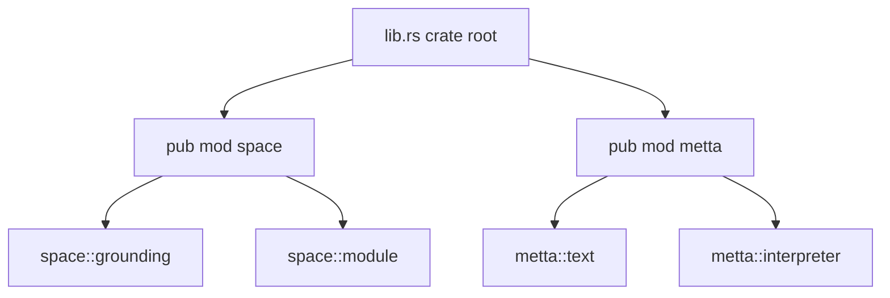

# `lib/src/lib.rs` 源码分析报告

**源文件**：`lib/src/lib.rs`  
**crate**：`hyperon`（面向用户的聚合库）

## 1. 文件角色与职责

`hyperon` lib crate 的 **根入口**，职责极简：

- 在启用 `benchmark` feature 时，打开 **`#![cfg_attr(feature = "benchmark", feature(test))]`**，以便基准测试使用不稳定 `test` API。
- **重新导出** 两个顶级模块：`space` 与 `metta`，作为用户与下游代码的主要入口。

本文件 **不包含** 具体类型实现；实现分布在 `lib/src/space/`、`lib/src/metta/` 等子模块。

## 2. 公开 API 一览

| 项 | 类型 | 说明 |
|----|------|------|
| `space` | `pub mod` | Atom 空间抽象与实现（如 `GroundingSpace`、`ModuleSpace`）。 |
| `metta` | `pub mod` | MeTTa 解释器、文本解析、类型、runner 等与语言相关的 API。 |
| `feature = "benchmark"` | crate 属性 | 条件启用 `feature(test)`。 |

## 3. 核心数据结构

本文件 **无** 独立数据结构，仅模块声明。

## 4. Trait 定义与实现

无。`Space` / `SpaceMut` 等定义在依赖 crate **`hyperon-space`**，具体实现在 `lib/src/space/*` 中针对各结构体 `impl`。

## 5. 算法

无算法逻辑；仅为模块树根节点。

## 6. 所有权分析

无状态；不引入额外所有权模型。

## 7. Mermaid 图

### `hyperon` crate 顶层结构（与本文件相关部分）

## 8. 与 MeTTa 语义的对应关系

- **`metta`**：承载 MeTTa 语言语义（求值、类型、内建符号等），与 `hyperon_macros::metta_const!` 生成的常量_atom 配合使用。
- **`space`**：对应 MeTTa / Hyperon 中的 **知识库 / Atomspace** 概念：存储 atom、执行匹配查询；**GroundingSpace** 是默认的 **内存型** 实现（见专项文档）。

## 9. 小结

`lib.rs` 是 **薄门面**：把 `space` 与 `metta` 暴露为稳定路径 `hyperon::space::*`、`hyperon::metta::*`，并可选为基准测试打开 `test` feature。理解 Hyperon Rust 集成应从此处进入子模块，而非在本文件寻找逻辑。
