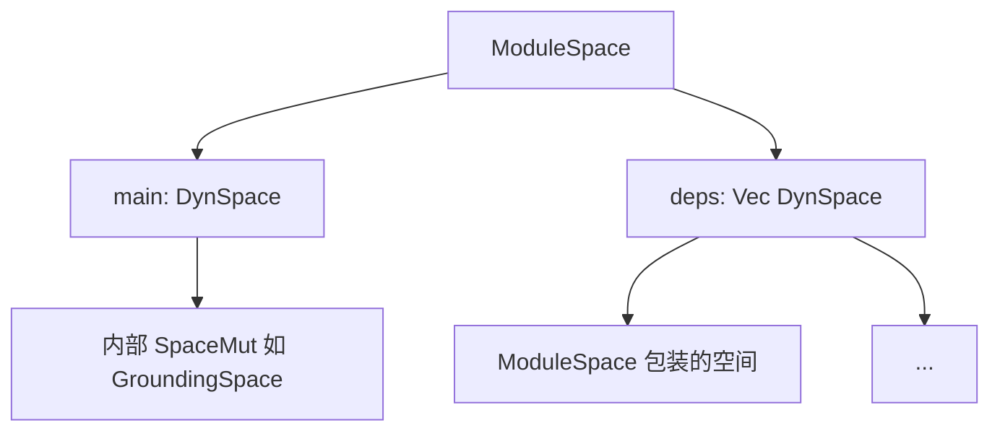
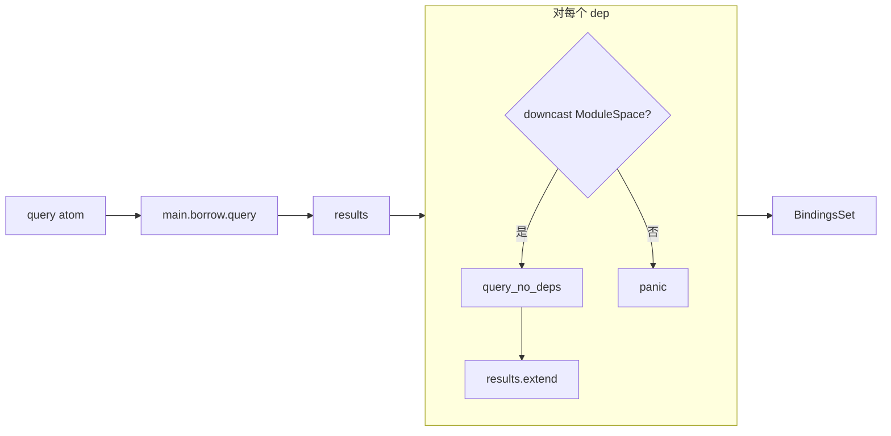

# `lib/src/space/module.rs` 源码分析报告

**源文件**：`lib/src/space/module.rs`  
**类型**：**ModuleSpace** — 以 **`DynSpace` 主空间** 与 **`Vec<DynSpace>` 依赖** 组成的复合空间

## 1. 文件角色与职责

- **查询聚合**：对同一查询，将 **主空间** 的 `BindingsSet` 与 **各依赖空间** 的结果 **合并**（`extend`）。
- **避免依赖递归**：依赖项若为嵌套的 `ModuleSpace`，通过 **`query_no_deps`** 只查其 **主空间**，防止依赖链上重复展开子依赖（见下文算法）。
- **变更委托**：`SpaceMut` 的 `add` / `remove` / `replace` **仅作用于 `main`**，**不写入 `deps`**。
- **`Space::common` / `atom_count` / `visit`**：均 **委托给 `main`**，即观察者、遍历、原子计数与 **主空间** 一致，依赖空间在此文件中 **不参与** 遍历与计数。

## 2. 公开 API 一览

| 名称 | 签名（摘要） | 说明 |
|------|----------------|------|
| `ModuleSpace` | `struct { main: DynSpace, deps: Vec<DynSpace> }` | 复合空间。 |
| `new` | `DynSpace -> Self` | 仅主空间，无依赖。 |
| `main` | `&self -> DynSpace` | 克隆 `Rc` 句柄返回。 |
| `query` | `&Atom -> BindingsSet` | `complex_query` + `single_query`（与 GroundingSpace 同模式）。 |
| `add_dep` | `&mut self, DynSpace` | 追加依赖（通常为包在 `ModuleSpace::new(...).into()` 中的子模块空间）。 |
| `deps` | `&self -> &Vec<DynSpace>` | 只读访问依赖列表。 |
| `impl Space` | — | 见下节。 |
| `impl SpaceMut` | — | 全部转发到 `main.borrow_mut()`。 |
| `Display` / `Debug` | — | 基于 `main` 格式化。 |

**非公开**：`single_query`、`query_no_deps`。

## 3. 核心数据结构

| 字段 | 类型 | 说明 |
|------|------|------|
| `main` | `DynSpace` | `Rc<RefCell<dyn SpaceMut>>`；唯一被 **修改** 与 **common/visit/atom_count** 委托的目标。 |
| `deps` | `Vec<DynSpace>` | 只参与 **查询结果合并**；必须是 **可 downcast 为 `ModuleSpace`** 的实现（否则 `panic!`）。 |

## 4. Trait 定义与实现

### `Space`

| 方法 | `ModuleSpace` 行为 |
|------|---------------------|
| `common()` | `self.main.common()` — 与主空间共享观察者注册点。 |
| `query` | `ModuleSpace::query` → `complex_query` + `single_query`。 |
| `atom_count` | `self.main.borrow().atom_count()` — **不含 deps**。 |
| `visit` | `self.main.borrow().visit(v)` — **不遍历 deps**。 |
| `as_any` | `self`。 |

### `SpaceMut`

| 方法 | 行为 |
|------|------|
| `add` / `remove` / `replace` | `self.main.borrow_mut()....` — **仅主空间**。 |
| `as_any_mut` | `self`。 |

### 设计含义

- **依赖空间**在此文件中视为 **只读查询扩展**：不把多个空间的 atom 合并为一个索引，而是 **查询时多路合并绑定集**。
- **`common` 挂在 main**：对 `ModuleSpace` 注册观察者只会收到 **对 main 的修改** 事件；deps 内 atom 变化若需观察，需在各自 `DynSpace` 上单独注册。

## 5. 算法

### 5.1 `single_query`

1. `results = self.main.borrow().query(query)` — 主空间完整查询（**已含** 主空间若自身为嵌套结构时的逻辑；此处主空间常为 `GroundingSpace`）。
2. 对每个 `dep in deps`：  
   - `dep.borrow().as_any().downcast_ref::<ModuleSpace>()`  
   - 若成功：`results.extend(space.query_no_deps(query))`  
   - 若失败：**`panic!("Only ModuleSpace is expected inside dependencies collection")`**

**`query_no_deps`**：仅 `self.main.borrow().query(query)` — **不递归 deps**，用于防止依赖图中 **重复扫描**  transitive 依赖。

### 5.2 `query` 与 `complex_query`

- 与 `GroundingSpace` 相同：顶层 **`,`（COMMA_SYMBOL）** 时，由 `complex_query` 做 **绑定传递与 merge**；每个子查询仍进入上述 `single_query`，从而在 **每一步合取** 上合并 main + 所有 deps 的 **单段匹配结果**。

### 5.3 模块“依赖解析”语义（Rust 侧）

- **不是** 包管理器式拓扑排序；**是** 运行时在 **`deps` 向量顺序** 上依次 **追加查询结果**。
- **类型约束**：依赖必须是 **`ModuleSpace`**（动态下转型），保证可调用 `query_no_deps`；混合其他 `SpaceMut` 类型当前 **不被支持**。
- **传递依赖**：`query_no_deps` 只查 **`dep.main`**，**不会** 再并入 `dep.deps`。因此 **孙模块** 中的 atom 不会仅因挂在子 `ModuleSpace` 的 `deps` 里就进入上层查询；上层必须在 **`deps` 中显式列出** 所需模块（或把子图摊平到 `main`）。

## 6. 所有权分析

| 点 | 说明 |
|----|------|
| `DynSpace` | 共享所有权（`Rc`），`clone()` 为 **浅克隆** 句柄。 |
| `query` | `borrow()` 只读；合并产生新 `BindingsSet`。 |
| `add_dep` | 移动/克隆 `DynSpace` 进 `Vec`；所有权归 `ModuleSpace`。 |
| `SpaceMut` | `borrow_mut()` 要求运行时无别名冲突；与 `Rc<RefCell<...>>`  usual 规则一致。 |

## 7. Mermaid 图

### 结构关系

### `single_query` 数据流

## 8. 与 MeTTa 语义的对应关系

| 概念 | 本实现 |
|------|--------|
| **多上下文 / 导入模块可见性** | 查询时 **主模块 + 依赖模块** 的断言 **一并匹配**，类似在 **联合知识库** 上做合取查询。 |
| **合取 `,`** | 与 `GroundingSpace` 一致，由 **`complex_query`** 定义；`ModuleSpace` 在 **每个子查询** 上扩展 **多空间并集式** 的 `BindingsSet`。 |
| **仅主空间可写** | 对应常见语义：**当前模块工作区** 可改，**依赖库** 只读参与推理（Rust 侧由 API 固定为只改 `main`）。 |

测试 `complex_query_two_subspaces`：`main` 为空 `GroundingSpace`，依赖两个 `ModuleSpace` 包装的 grounding 数据，验证 **跨空间变量统一**（`,` 连接的两个模式分别在 dep A / dep B 中得到绑定并 merge）。

## 9. 小结

- **ModuleSpace** 是 **轻量组合子**：**查询 = 主空间结果 ∪ 各依赖（ModuleSpace）的“无依赖查询”结果**；**写入与元数据 = 仅主空间**。
- **强假设**：`deps` 中动态类型必须是 **`ModuleSpace`**，否则 panic — 这是当前实现的硬约束。
- 与 **GroundingSpace** 配合时，典型用法是 **main = 本地 GroundingSpace**，**deps = 其他模块封装的 ModuleSpace**，从而在保持 **索引局部性** 的同时做 **联邦式查询**。
