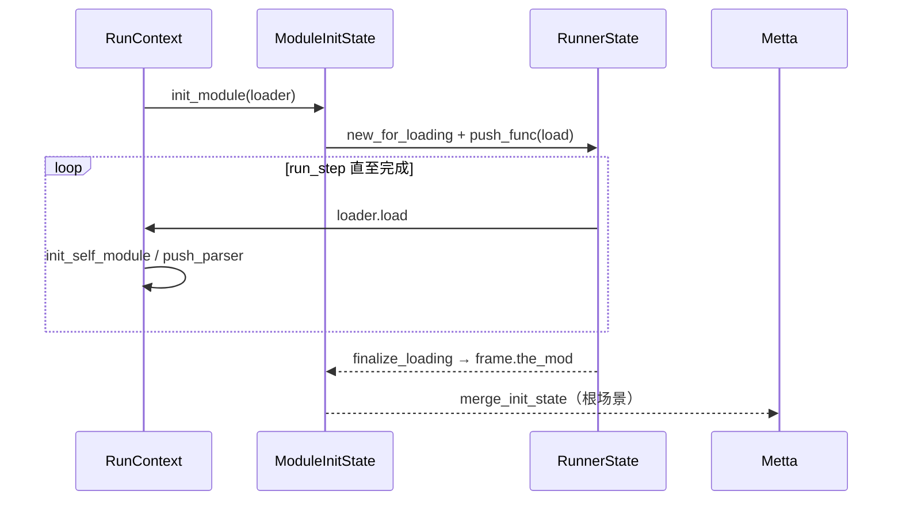
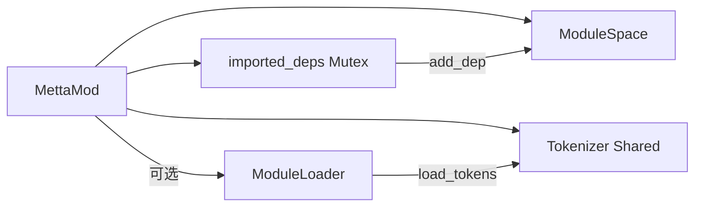

# `lib/src/metta/runner/modules/mod.rs` 源码分析报告（MettaMod 与 ModuleLoader）

**源文件**：`lib/src/metta/runner/modules/mod.rs`  
**模块**：`crate::metta::runner::modules`（已加载模块、初始化状态与加载器 trait）

## 1. 文件角色

本文件定义 **运行器中“模块”这一核心抽象**：

- **`ModId`**：模块的稳定句柄（含 `TOP`、`INVALID` 及加载过程中使用的 **相对 ID** 编码）。
- **`MettaMod`**：单个已加载模块：**模块路径名**、**资源目录**、包装为 `ModuleSpace` 的 **`DynSpace`**、**共享 `Tokenizer`**、**已导入依赖表**、可选 **`ModuleLoader`**（用于资源与 token 导出）。
- **`ModuleInitState` / `ModuleInitFrame`**：在 **模块尚未提交到 runner** 前，暂存多帧子模块、子树名称与（pkg_mgmt 下）描述符映射；与 `RunnerState` 协作完成 **惰性合并**。
- **`ModuleLoader` trait**：以 **`RunContext`** 为入口的 **可插拔加载**；支持资源读取、（pkg_mgmt）`prepare` 与 `pkg_info`、**向导入方注册 tokenizer**（`load_tokens`）。
- **`Resource` / `ResourceKey`**：加载器侧资源抽象。

子模块 **`mod_names`** 的名称树类型在此 **再导出**（`pub(crate)` / `pub` 视符号而定）。

## 2. 公开 API 一览

| 符号 | 可见性 | 说明 |
|------|--------|------|
| `ModId` | `pub` | `pub struct ModId(pub usize)`；`INVALID`、`TOP`、`new_relative`（crate 内）、`is_relative` 等。 |
| `MettaMod` | `pub` | 模块主体；`path` / `name` / `space` / `tokenizer` / `resource_dir` / `get_resource` / `contains_imported_dep`；`#[cfg(pkg_mgmt)] pkg_info`。 |
| `ModuleLoader` | `pub trait` | `Debug + Send + Sync`；`load`、`get_resource`、`load_tokens`；条件默认 `prepare` / `pkg_info`。 |
| `Resource` | `pub enum` | `File(BufReader<File>)` / `Bytes(Cursor<Vec<u8>>)`；实现 `Read`。 |
| `ResourceKey` | `pub enum` | `MainMettaSrc`、`Version`、`Authors`、`Description`、`Custom(&str)`。 |
| `TOP_MOD_NAME` 等 | `pub` | 自 `mod_names` 再导出。 |
| `ModuleInitState` 等 | `pub(crate)` | 与 runner 内部协作，不对外稳定承诺。 |

## 3. 核心数据结构

- **`ModId(usize)`**  
  - `TOP = 0` 与 `Vec` 下标约定一致。  
  - **相对 ID**：最高位置位，`get_idx_from_relative` 取帧索引；用于 **`ModuleInitState` 栈** 在合并前引用“尚未分配最终 ID”的模块。
- **`MettaMod`**  
  - `mod_path`：完整路径，如 `top:pkg:sub`。  
  - `space`：先可选将底层 `GroundingSpace` 命名，再 **`DynSpace::new(ModuleSpace::new(...))`**。  
  - `imported_deps: Mutex<HashMap<ModId, DynSpace>>`：与 `ModuleSpace` 中依赖子空间 **同步**。  
  - `loader: Option<Box<dyn ModuleLoader>>`：加载完成后挂上，供 **`get_resource`** 与 **`load_tokens`**。
- **`ModuleInitState`**：`None` | `Root(Rc<RefCell<ModuleInitStateInsides>>)` | `Child(同)`。  
  - `ModuleInitStateInsides`：`frames: Vec<ModuleInitFrame>`、`module_descriptors`（pkg_mgmt）。  
- **`ModuleInitFrame`**：`new_mod_name`、`the_mod: Option<Rc<MettaMod>>`、`sub_module_names: ModNameNode`（加载期子树）。

## 4. Trait 实现

| 实现 | 说明 |
|------|------|
| `ModId: Default` | 默认为 `INVALID`。 |
| `ModuleLoader` | 对象安全扩展点；宿主/Rust/Python 等可实现并 `Box` 传入。 |
| `Resource: From<File>` / `From<Vec<u8>>` | 便于构造。 |
| `Resource: Read` | 统一读取接口。 |

## 5. 算法与关键流程

1. **`MettaMod::new_with_tokenizer`**  
   - 包装 `ModuleSpace`；若 `no_stdlib` 为 false，则在 **corelib/stdlib 已就绪** 时调用 **`import_all_from_dependency`** 拉入标准库（`stdlib` 模块名特例跳过 corelib 链）。  
2. **`import_dependency_as`**  
   - 以 **`&name` 或 `&模块名`** 形式向 tokenizer 注册 **grounded space 原子**，指向依赖空间。  
3. **`import_item_from_dependency_as`**  
   - 优先 **移植 tokenizer 中精确匹配的构造器**；否则在依赖空间 **`interpret`** 解析 `from_name`，将原子加入本模块 space，并按需注册别名 tokenizer。  
4. **`import_all_from_dependency`**  
   - 去重后 **`insert_dep`**：在 `ModuleSpace` 添加依赖子空间，并记录 `imported_deps`；若有 **`loader`** 则调用 **`load_tokens`** 导出词法。  
5. **`ModuleInitState::init_module`**（与 runner 协同）  
   - pkg_mgmt 下可先 **`loader.prepare`**。  
   - 构造 **`RunnerState::new_for_loading`**，在 context 中 **`push_func` 调用 `loader.load`**，循环 **`run_step`** 至完成，**`finalize_loading`** 后把 **`the_mod` 写入 frame** 并 **`set_loader`**。  
6. **`init_self_module`（frame）**  
   - 新建 `Tokenizer` 与 `MettaMod`，并在子树 **`update("top", self_mod_id)`** 登记自身（供名称解析）。  
7. **`add_module_to_name_tree`（frame）**  
   - 仅允许 **相对于当前加载模块路径** 的子名；用 **`mod_name_remove_prefix`** 防止向父级或其他分支越权加载（注释讨论过设计取舍）。  
8. **根 `init_module` 结束**（runner `mod.rs`）  
   - **`merge_init_state`** 将帧与名称子树并入全局 runner（见 runner 报告）。

## 6. 所有权分析

- **`MettaMod`** 通常以 **`Rc<MettaMod>`** 存于 runner 的 `Vec`；**单模块内** `tokenizer` 与 `space` 为 **共享句柄**（`Shared<Tokenizer>`、`DynSpace`）。  
- **`imported_deps`** 与 **`ModuleSpace`**：依赖空间 **克隆** 入表；`remap_imported_deps` 在合并后 **重写键** 而保留 `DynSpace` 值。  
- **`ModuleInitState` 的 `Rc<RefCell<...>>`**：**加载过程** 允许多处共享同一初始化会话；**`decompose`** 仅允许在 **`Root`** 上执行（`Child` 为只读参与）。  
- **`ModuleLoader`** 为 **`Box<dyn ModuleLoader + Send + Sync>`**：加载闭包在 **`RunContext`** 中执行，完成后 loader 存于模块（**堆分配、独占**）。

## 7. Mermaid 示意图

### 7.1 模块加载与合并（概念）

### 7.2 MettaMod 依赖导入

## 8. 与 MeTTa 语言的对应关系

| MeTTa / 用户概念 | 实现映射 |
|------------------|----------|
| 模块命名空间路径 | `mod_path` + `ModNameNode` 子树；`self:` 相对当前加载模块。 |
| `import!` 引入整个依赖空间 | `import_all_from_dependency` + `ModuleSpace` 组合。 |
| 从依赖导入符号/操作符 | `import_item_from_dependency_as`（tokenizer 或解释得到的原子）。 |
| 子模块 | loader 内 `RunContext::load_module_direct` 等，名称挂在 **当前 frame 的 `sub_module_names`**，合并后进全局树。 |
| 模块资源（源码、版本等） | `ResourceKey` + `get_resource`；pkg 元数据 `PkgInfo`（pkg_mgmt）。 |

## 9. 小结

`modules/mod.rs` 将 **“模块 = 空间 + 分词器 + 依赖组合 + 可选加载器”** 落实为 **`MettaMod`**，并通过 **`ModuleInitState` 分层帧** 与 **`ModuleLoader` trait** 把 **加载副作用** 约束在 **`RunContext` 执行循环** 内，最后由 runner **`merge_init_state`** **原子式** 提交到全局模块表与名称树。`import_*` 系列函数是 MeTTa **`import!` 语义** 的 Rust 侧核心支撑；单元测试覆盖了 **层次路径**、**相对子模块** 与 **load_tokens 时机**（如 issue 982 场景）。
