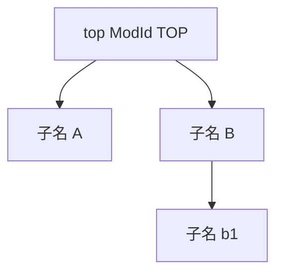
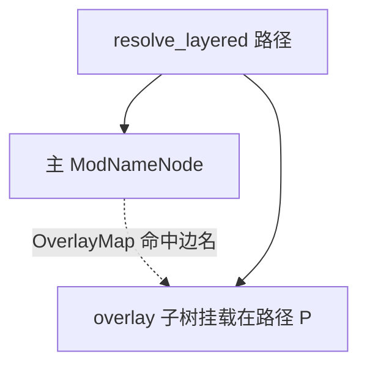

# `lib/src/metta/runner/modules/mod_names.rs` 源码分析报告（模块名路径与名称树）

**源文件**：`lib/src/metta/runner/modules/mod_names.rs`  
**模块**：`crate::metta::runner::modules::mod_names`（`ModNameNode` 与路径规范化）

## 1. 文件角色

本文件实现 **模块路径字符串** 的约定与 **低开销的名称解析树**：

- 常量 **`TOP_MOD_NAME`**（`"top"`）、**`SELF_MOD_NAME`**（`"self"`）、分隔符 **`MOD_NAME_SEPARATOR`**（`':'`）。
- **`ModNameNode`**：`mod_id` + 可选子节点 **`HashMap<String, ModNameNode>`**，用于从 **`top:...:leaf`** 形式路径映射到 **`ModId`**。
- **分层解析（layered）**：在模块 **尚未注册到全局树** 的加载阶段，将 **多个子树** 叠加到主树上做 **`resolve_layered` / `parse_parent_layered_mut`**，供 `ModuleInitState` 使用。
- 辅助函数：**路径规范化**、**前缀剥离**、**分解/组合路径**（部分 API 供 `pkg_mgmt` 使用）、**合法名字检查**、**树形 Display**（`ModNameNodeDisplayWrapper`）。

## 2. 公开 API 一览

| 符号 | 可见性 | 说明 |
|------|--------|------|
| `TOP_MOD_NAME` / `SELF_MOD_NAME` / `MOD_NAME_SEPARATOR` | `pub` | 路径约定常量。 |
| `ModNameNode` | `pub(crate)` | 名称树节点；`top`/`new`/`add`/`update`/`merge_subtree_into`/各类 `resolve`/`parse_*`/`visit_mut`。 |
| `ModNameNodeDisplayWrapper` | `pub(crate)` | 参数化 `Display`，用于 `display_loaded_modules`。 |
| `normalize_relative_module_name` | `pub(crate)` | 相对当前 `base_path` 规范化为以 `top` 开头的绝对路径。 |
| `mod_name_from_path` 等 | `pub(crate)` | 路径片段工具。 |
| `#[cfg(pkg_mgmt)] decompose_name_path` / `compose_name_path` 等 | `pub(crate)` | 包管理路径拆分/拼接；`module_name_is_legal` / `module_name_make_legal` 为 `pub`（部分 `allow(dead_code)`）。 |

## 3. 核心数据结构

- **`ModNameNode`**  
  - `mod_id: ModId`：该节点对应模块（根节点通常为 `ModId::TOP`）。  
  - `children: Option<HashMap<String, ModNameNode>>`：**懒分配**子表。  
- **`OverlayMap<'a>`**（私有）  
  - `SmallVec` 存储 `(父节点指针, 子边名, subtrees 索引)`，实现 **多子树挂载在同一父边上的叠加**。  
  - `get` 通过 **`ptr::eq`** 比较父节点地址与边名，选择 **进入哪棵 overlay 子树**。

## 4. Trait 实现

| 实现 | 说明 |
|------|------|
| `ModNameNode: Clone, Debug, Default` | 深拷贝子树；`Default` 用于派生场景。 |
| `ModNameNodeDisplayWrapper: Display` | 树形 ASCII（`├─` `└─`）输出。 |
| `ModNameNode: Display` | 委托到以 `SELF_MOD_NAME` 为根的 wrapper。 |

## 5. 算法要点

1. **路径解析（`parse_parent_generic`）**  
   - 按 `:` 分段；**段名为 `top` 且位于开头** 时跳过（`top` 可省略的等价性）。  
   - 每步：查 **`OverlayMap`** 是否要求 **切换到某 overlay 子树根**；否则 **`get_child`** 下降。  
   - 返回 **父节点 + 最后一段本地名**（或 layered 变体中的子树索引信息）。  
2. **`resolve` / `name_to_node`**  
   - 空名或 `top` → 根节点。  
   - 否则 `build_overlay_map` 后 **`parse_parent_layered_internal`** 循环，直到落在主树或某 overlay。  
3. **`update` / `add` / `merge_subtree_into`**  
   - `update`：解析父节点后 **创建或更新叶子** `mod_id`；禁止非法段名（`top`/`self`/空）。  
   - `add`：等价于 **`merge_subtree_into` 单子节点**。  
   - **`merge_subtree_into_layered`**：在 layered 父解析下 **挂整棵子树**（用于 `merge_init_state`）。  
4. **`normalize_relative_module_name`**  
   - `self:` → 接到 `base_path`；`top:` → 规范为 `top:rest`；否则 **相对 `base_path` 拼接**。  
5. **`decompose_name_path` / `compose_name_path`**（pkg_mgmt）  
   - 借助 **`parse_parent_generic` 回调** 收集各段组件；组合时总以 `top` 起头。  
6. **`name_to_node_mut`**  
   - 当前实现 **`panic`**，注释说明需 **Polonius / Rust 2024** 借用检查；保留为未来启用。

## 6. 所有权分析

- **`ModNameNode` 拥有子树**：`HashMap` **拥有** 子 `ModNameNode`；`clone()` **复制整棵树**（加载合并时注意性能，通常子树规模可控）。  
- **`resolve_layered` 借用** `subtrees: &[(&str, SelfRefT)]`：**不取得子树所有权**，仅通过 **`Borrow<ModNameNode>`** 读取。  
- **`OverlayMap` 存 `*const ModNameNode`**：仅在 **单次解析调用栈** 内有效，依赖 **解析期间树结构不变**；属于 **性能向的临时索引**，不跨线程暴露。  
- **`parse_parent_layered_mut`**：通过 **`build_overlay_map`（不可变遍历）+ 最后 `parse_parent_mut` 落在目标子树根** 规避部分借用冲突，实现 **在 layered 场景下对子树的可变修改**。

## 7. Mermaid 示意图

### 7.1 单层名称树

### 7.2 Layered 解析（概念）

## 8. 与 MeTTa 语言的对应关系

| 约定 | 含义 |
|------|------|
| `top` | 运行器顶层模块；路径中可省略开头的 `top`。 |
| `self` | 当前模块路径别名；`self:child` 表示 **相对当前模块的私有子模块命名空间**。 |
| `:` | 模块层级分隔，对应文件系统/包路径的逻辑嵌套。 |
| 加载期名称树 | `ModuleInitFrame::sub_module_names` 与 runner 全局树 **`resolve_layered`** 叠加，使 **未提交的子模块** 仍可按路径解析。 |

## 9. 小结

`mod_names.rs` 为 Hyperon runner 提供 **统一、可测试的模块路径模型** 与 **可叠加的名称树**，核心复杂度在 **`parse_parent_generic` + `OverlayMap`** 的 **主树/加载子树** 联合解析。`ModNameNodeDisplayWrapper` 改善调试体验。注意：源码中 **`module_name_make_legal` 的字符过滤条件** 有一处 `the_char != '_'` 与注释意图（仅保留字母数字与 `-`、`_`）不一致，若依赖该函数做规范化，建议在上游仓库中 **复核逻辑**。
