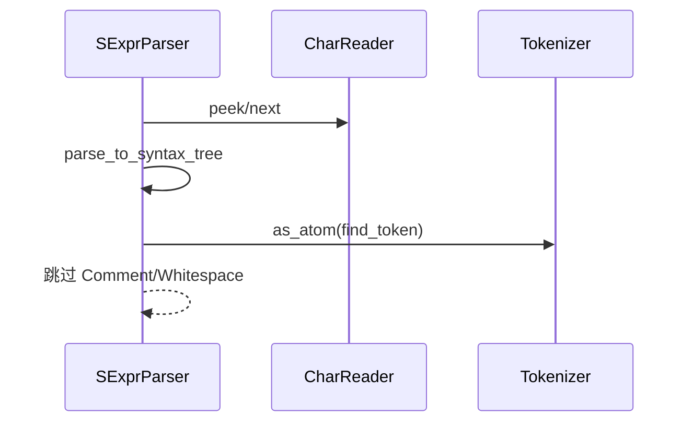
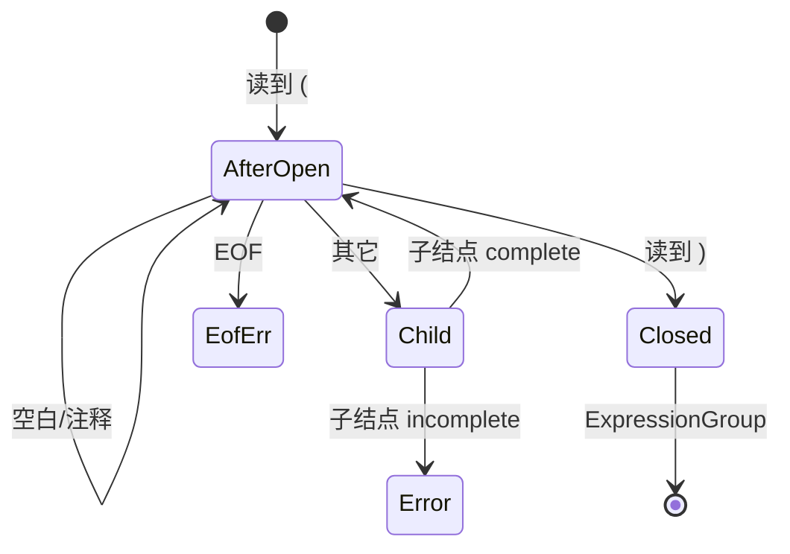

# `lib/src/metta/text.rs` 源码分析报告

## 1. 文件角色与职责

`text.rs` 提供 MeTTa 源码的 **S 表达式级词法/语法分析**：

- **`Tokenizer`**：用正则注册 **从字符串到 `Atom` 的构造器**（含可失败构造），供标识符/数字等 **非默认符号** 解析。
- **`SExprParser`**：在字符流上驱动 **递归下降**，先建成 **`SyntaxNode` 语法树**，再经 `as_atom` 转为 `Atom`。
- **`CharReader`**：统一 `Read` / `&str` / `String` 等输入为 **带字节索引的 UTF-8 字符迭代**。
- **`Parser` trait**：抽象“下一个待执行原子”，便于 `runner` 对 **文本或原子切片** 统一驱动。

## 2. 公开 API 一览

| 名称 | 类型 | 说明 |
|------|------|------|
| `Tokenizer` | `struct` | 正则 → `AtomConstr` 列表 |
| `Tokenizer::new/register_* /move_front/move_back/find_token/remove_token` | 方法 | 注册与查找 token 构造器 |
| `SyntaxNodeType` | `enum` | 语法结点类别 |
| `SyntaxNode` | `struct` | 范围、子结点、文本、错误信息、完成标志 |
| `SyntaxNode::as_atom` | 方法 | 语法树 → `Result<Option<Atom>>` |
| `SyntaxNode::visit_depth_first` | 方法 | 后序 DFS 遍历 |
| `Parser` | `trait` | `next_atom(&mut self, &Tokenizer) -> Result<Option<Atom>>` |
| `SExprParser<R>` | `struct` | 主解析器 |
| `SExprParser::new` | 构造 | `Into<CharReader<R>>` |
| `SExprParser::parse` | 方法 | 跳过注释/空白，直到产出一个 `Atom` 或 EOF |
| `SExprParser::parse_to_syntax_tree` | 方法 | 公开底层：产出一个 `SyntaxNode` 或 `None` |
| `CharReader` | `struct` | 字符流 + `peek`/`next`/`last_idx` |

`impl Parser for &[Atom]`：从切片依次取出原子，**忽略 tokenizer**。

## 3. 核心数据结构

### 3.1 `Tokenizer`

- `tokens: Vec<TokenDescr>`，每项含 `Regex` 与 `Rc<AtomConstr>`，`AtomConstr = dyn Fn(&str) -> Result<Atom, String>`。
- **`find_token`**：从 **向量尾部向前** 找第一个 **整串匹配**（`find_at` 且 `start==0 && end==len`）。后注册规则 **覆盖** 先注册规则。

### 3.2 `SyntaxNode`

- `node_type: SyntaxNodeType`
- `src_range: Range<usize>`：**字节** 偏移（与 UTF-8 多字节字符兼容测试一致）
- `sub_nodes`, `parsed_text`, `message`, `is_complete`

**`as_atom` 规则摘要**：

- 未完成 → `Err(message)`
- `Comment` / `Whitespace` / 裸 `(` `)` → `Ok(None)`（由上层循环跳过）
- `VariableToken` → `Atom::var`（**不含 `$` 前缀**的体在 `parse_variable` 中已处理）
- `WordToken` / `StringToken` → `tokenizer.find_token` 或默认 `Atom::sym`
- `ExpressionGroup` → 递归子结点，收集 `Some` 子原子为 `Atom::expr`

### 3.3 `SExprParser<R>`

- 唯一字段 `it: CharReader<R>`。

### 3.4 `CharReader<R>`

- `chars: R`，`idx: usize`（已消费字节数），`next: (Option<(usize, Result<char>)>, usize)` 缓存 **下一字符及宽度**。
- `peek` 不前进；`next` 前进并更新 `idx`。

## 4. Trait 定义与实现

| Trait | 实现者 | 说明 |
|--------|--------|------|
| `Debug` | `TokenDescr` | 打印 regex 与 `Rc` 指针 |
| `Parser` | `SExprParser<R>` | 委托 `parse` |
| `Parser` | `&mut dyn Parser` | 对象安全转发 |
| `Iterator<Item=io::Result<char>>` | `CharReader<R>` | 仅产出字符（丢弃索引） |
| `From<R: Read>` 等 | `CharReader` | 多种输入适配 |

## 5. 算法详解（解析状态机）

### 5.1 顶层 `parse`

循环：

1. `parse_to_syntax_tree()?`
2. `None` → `Ok(None)`（EOF）
3. `Some(node)` → `node.as_atom(tokenizer)?`；若 `None`（注释/空白）则 **继续循环**，否则返回 `Some(atom)`。

### 5.2 `parse_to_syntax_tree`（首字符分派）

| 首字符 | 动作 |
|--------|------|
| `;` | `parse_comment`：吞到换行 |
| 空白 | 单字符 `Whitespace` 结点 |
| `$` | `parse_variable`：体中遇 `#` 报错并吞掉剩余输入 |
| `(` | `parse_expr` |
| `)` | 构造 `ErrorGroup`：`Unexpected right bracket` + `LeftoverText` 吞到 EOF |
| 其它 | `parse_token` → 字符串或 word |

### 5.3 `parse_expr`

- 压入 `OpenParen`，跳过 `(`。
- 循环 `peek`：
  - `;` → 注释子结点
  - 空白 → `Whitespace` 单字符结点
  - `)` → `CloseParen`，构建 **`ExpressionGroup`** 返回
  - 否则递归 `parse_to_syntax_tree`；若子结点 `!is_complete` → 包装 **`ErrorGroup`** 上浮；若 `None` → **意外结束** 错误
- EOF → `Unexpected end of expression`

### 5.4 `parse_string`

- 起始 `"`；支持 `\\`, `\"`, `\'`, `\n\r\t`, `\xHH`（**仅接受 ≤0x7F**）, `\u{...}`（十六进制最多 8 位，花括号语法）。
- 错误路径返回 **`is_complete = false`** 的结点，消息区分 **未闭合、非法转义** 等。

### 5.5 `parse_word`

- 读到空白、`(`、`)`、`;` 为止。

### 5.6 `Tokenizer` 合并语义

- `move_back(self, from)`：`self.tokens.append(from.tokens)` → **from 的规则先被尝试**（因 `find_token` 从末尾扫）。
- `move_front`：通过 **交换式** 把 from 挪到前部再 `move_back`，注释说明 **实际尝试顺序** 与命名相反，易踩坑。

## 6. 执行流

## 7. 所有权分析

- `TokenDescr.constr` 为 `Rc<AtomConstr>`：**共享** 构造闭包，克隆 `Tokenizer` 成本低。
- `SyntaxNode` 拥有子结点 `Vec`；`as_atom` 时 **消费性** 不移动整棵树（借用子结点递归）。
- 字符串错误路径中 `parse_leftovers` **读完输入**，避免半解析状态泄漏。

## 8. Mermaid：表达式解析状态机

## 9. 复杂度与性能

- 单文件线性扫描：\(O(n)\) 字符，`parse` 多次跳过空白/注释可能多遍扫描同一前缀，但每字符仍常数摊销。
- `find_token`：最坏 \(O(k \cdot |s|)\)`，`k` 为规则数；规则多时可能成为热点。
- 正则 **全串锚定** 避免前缀误匹配。

## 10. 与 MeTTa 语义的对应

- S 表达式即 MeTTa **表面语法**；`$var` 对应 **模式变量**。
- 字符串字面量保留 **外层引号** 在 `WordToken` 默认路径中作为 **符号名**（测试 `metta_atom("\"te st\"")` 期望符号含引号）；具体显示层由运行时处理。
- `Tokenizer` 扩展点是 **宿主嵌入字面量**（数字、自定义 grounded）的桥梁，与 **纯符号** 的默认路径分离。

## 11. 小结

`text.rs` 将 **词法（可插拔）** 与 **语法（固定 S-exp）** 分离：`SyntaxNode` 保留 **源码范围** 与 **错误恢复** 信息，`Tokenizer` 决定 **词素如何变成 Atom**。实现上需注意 **`move_front`/`move_back` 与匹配优先级**、**`find_token` 全串匹配**、以及 **变量名中 `#` 保留** 等细节。
