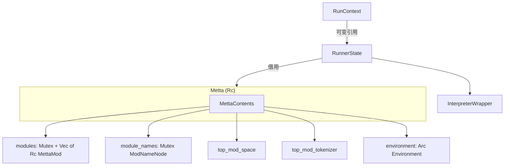

# `lib/src/metta/runner/mod.rs` 源码分析报告（MeTTa Runner 核心）

**源文件**：`lib/src/metta/runner/mod.rs`  
**模块**：`crate::metta::runner`（MeTTa 执行器、运行态与解释循环）

## 1. 文件角色

本文件实现 **MeTTa 运行器（Runner）的完整栈**：对外可见的 `Metta` 句柄、`RunnerState` 单趟执行状态、`RunContext`（供模块加载与 grounded 操作使用的运行时视图）、以及解释器包装层（`InterpreterWrapper`、`InputStream`、`MettaRunnerMode`）。同时 **再导出** `Environment` / `EnvBuilder`、`stdlib`、条件编译下的 `pkg_mgmt` 等。

文件顶部模块文档概括了 **Environment → Metta → RunnerState → ModuleDescriptor / MettaMod → RunContext** 的分层关系；代码中仍保留若干 **TODO**（例如未来用 delegate 替代逐步 `run_step` 的公开 API、清理 `RunContext` 的全局 hack）。

## 2. 公开 API 一览

| 符号 | 类别 | 说明 |
|------|------|------|
| `pub mod modules` | 子模块 | 模块加载、`MettaMod`、`ModuleLoader` 等。 |
| `pub use environment::{Environment, EnvBuilder}` | 再导出 | 运行环境配置。 |
| `pub mod stdlib` | 子模块 | 标准库加载器（含 `CoreLibLoader`）。 |
| `#[cfg(feature = "pkg_mgmt")] pub mod pkg_mgmt` | 条件子模块 | 包管理与路径加载。 |
| `Metta` | `struct`（`Clone`, `Debug`, `PartialEq`） | 运行器句柄，内部 `Rc<MettaContents>`。 |
| `Metta::new` / `new_with_stdlib_loader` / `new_core` | 构造 | 完整初始化、自定义 stdlib、无库裸核。 |
| `Metta::load_module_direct` / `load_module_alias` / `display_loaded_modules` | 模块 | 顶层加载与别名；打印已加载模块树。 |
| `#[cfg(feature = "pkg_mgmt")] Metta::load_module_at_path` 等 | 条件 API | 自路径加载、按描述符查找模块。 |
| `Metta::environment` / `space` / `tokenizer` / `settings` | 访问器 | 环境、顶层空间/分词器、pragma。 |
| `Metta::run` / `run_in_module` / `evaluate_atom` | 执行 | 解析器驱动执行、指定模块执行、单原子求值。 |
| `PragmaSettings` | `struct` | 基于 `Shared<HashMap<String, Atom>>` 的全局 pragma。 |
| `RunnerState` | `struct` | 单次运行状态（`new`, `new_with_parser`, `new_with_atoms`, `run_step`, `run_to_completion` 等）。 |
| `RunContext` | `struct` | 运行中回调上下文：`push_parser` / `push_atoms` / `push_func`、`init_self_module`、模块加载与 `import_*` 等。 |

`MettaContents` 及多数合并/索引逻辑为 `pub(crate)` 或私有，供 runner 与 `modules` 子模块协作。

## 3. 核心数据结构

- **`Metta(Rc<MettaContents>)`**：运行器为 **引用计数共享**；`PartialEq` 按 `Rc` 指针相等比较。
- **`MettaContents`**（`Debug`，非 `Clone`）：  
  - `modules: Mutex<Vec<Rc<MettaMod>>>`：已加载模块表，`ModId` 与 `Vec` 下标对应。  
  - `module_names: Mutex<ModNameNode>`：按 **模块名路径** 解析 `ModId`。  
  - `#[cfg(pkg_mgmt)] module_descriptors`：`ModuleDescriptor → ModId`。  
  - `top_mod_space` / `top_mod_tokenizer`：顶层模块空间与分词器的 **快速克隆访问**（避免每次公开 API 都锁模块表）。  
  - `corelib_mod` / `stdlib_mod`：`OnceLock<ModId>`，延迟记录已加载的核心/标准库。  
  - `settings: PragmaSettings`，`environment: Arc<Environment>`。  
  - **`context: Arc<Mutex<Vec<...>>>`**：用于将当前 `RunContext` 暴露给 grounded 操作（见下文所有权分析）。
- **`RunnerState<'m, 'i>`**：持有 `&'m Metta`、`mod_id`、可选 `mod_ptr`、`ModuleInitState`、`InterpreterWrapper<'i>`。
- **`RunContext<'a, 'input>`**：对 `RunnerState` 字段的 **可变借用视图**，不单独拥有长生命周期数据。
- **`InterpreterWrapper<'i>`**：`mode`（`ADD` / `INTERPRET` / `TERMINATE`）、`input_src`（解析器与 `FnOnce` 队列）、可选 `InterpreterState`、`results: Vec<Vec<Atom>>`。
- **`InputStream` / `InputSource` / `Executable`**：异构输入源；支持 **内联函数** 作为一步操作（模块加载路径依赖于此）。

## 4. Trait 实现

| 实现 | 说明 |
|------|------|
| `Metta: PartialEq` | `Rc::ptr_eq` 判断是否为同一运行器实例。 |
| `RunnerState: Debug` | 仅输出 `mode` 与 `interpreter_state` 摘要。 |
| `RunContext: Debug` | 空结构体风格摘要。 |

本文件不定义新的公开 trait；`Parser` 等来自其他模块。

## 5. 算法与执行流程

1. **`Metta::new_with_stdlib_loader`**：`new_core` → 加载 `corelib` → 加载或别名 `stdlib` → `load_builtin_mods` → 用 `RunnerState` 在顶层 **import** corelib/stdlib → 若环境配置了 `init.metta` 则 `metta.run(...)`。
2. **`Metta::new_core`**：创建 `GroundingSpace`（若未提供 space）、`Environment`、`ModNameNode::top()`，构造 `MettaMod::new_with_tokenizer` 作为 **`TOP_MOD_NAME`** 并入 `Vec`（断言 `ModId::TOP`）。
3. **`merge_init_state`**：将 `ModuleInitState` 中多帧子模块 **批量并入** runner：为每帧 `add_module`，建立 `old ModId → new ModId` 映射，对子树 `visit_mut` 重写 `mod_id`，`merge_subtree_into` 合并名称树，`remap_imported_deps` 修正依赖表。
4. **`RunnerState::run_in_context`**：组装 `RunContext`，执行闭包前后 **push/pop** 全局 context 栈（hack）。
5. **`RunContext::step`（核心循环）**：  
   - 若存在未完成的 `InterpreterState`：`interpret_step` 推进，结束则结果入 `results`，遇 error atom 则 `TERMINATE`。  
   - 否则从 `InputStream::next_op` 取下一项：`Executable::Func` 直接调用；`Executable::Atom` 在 `ADD` 模式下 **加入当前模块 space**（可选类型检查），在 `INTERPRET` 模式下构造 `interpret_init`（可包一层 `metta` 解释调用），`!` 符号切换模式等。  
6. **`init_module`（经 `RunContext` / `ModuleInitState`）**：根初始化完成后 `swap` 出 `ModuleInitState` 并 `merge_init_state` 提交到 runner。

常量 **`EXEC_SYMBOL`**（`!`）驱动「先加规则、再解释」的两阶段语义。

## 6. 所有权与并发分析

- **`Metta` 克隆成本低**：多句柄共享同一块 `MettaContents`（`Rc`）。跨线程使用需自行保证（本设计以 **单线程 / 主线程 runner** 为主）。
- **`MettaContents` 内部**：模块表与名称树用 **`Mutex`** 保护；`PragmaSettings` 用 **`Shared`**（内部可变性）存 pragma；`Environment` 为 **`Arc`** 共享。
- **`RunContext` 生命周期**：仅存在于 `run_in_context` 调用栈内；**不**由外部拥有。
- **已知技术债**：`context` 字段配合 **`unsafe { transmute(&mut context) }`** 将 `&mut RunContext` 转为 `'static` 供他处访问；注释明确 **多线程并发会导致 UB**。这是典型的「全局 TLS 式 context」与 Rust 生命周期冲突的权宜之计。

## 7. Mermaid 示意图

### 7.1 对象关系（简化）



### 7.2 `step` 分支（概念）

```mermaid
stateDiagram-v2
  [*] --> HasInterp: interpreter_state 存在
  HasInterp --> StepInterp: has_next
  StepInterp --> HasInterp
  HasInterp --> CollectResult: 完成
  CollectResult --> Terminate: 含错误
  CollectResult --> [*]: 继续
  [*] --> NextOp: 无 interpreter
  NextOp --> Func: Executable::Func
  NextOp --> Atom: Executable::Atom
  Atom --> ADD: 加入 space
  Atom --> INTERPRET: interpret_init
  NextOp --> Terminate: 无更多输入
```

## 8. 与 MeTTa 语言的对应关系

| MeTTa / 用户可见行为 | 实现要点 |
|----------------------|----------|
| 顶层脚本与 `!` 求值 | `MettaRunnerMode` 在 `ADD` 与 `INTERPRET` 间切换；`!` 触发解释路径。 |
| 模块路径如 `outer:inner` | 由 `ModNameNode` + `ModuleInitState` 分层解析（本文件调用 `normalize_relative_module_name` 等）。 |
| `import!` / 空间组合 | 通过 `RunContext::import_*` 委托到 `MettaMod`（`modules` 子模块）。 |
| `pragma!` / `type-check` 等 | `PragmaSettings` + `type_check_is_enabled` / `max-stack-depth` / `interpreter`（如 `bare-minimal`）。 |
| `init.metta` | 在 `new_with_stdlib_loader` 末尾根据 `Environment::initialization_metta_file_path` 执行。 |

## 9. 小结

`mod.rs` 是 Hyperon MeTTa **运行时的心脏**：以 **`Rc` + 互斥锁** 管理模块集合与命名空间，以 **`RunnerState` + `RunContext` + `InterpreterWrapper`** 驱动 **解析 → 加原子 / 解释** 循环，并与 **`ModuleInitState` 合并协议** 衔接 **惰性提交** 的多子模块加载。公开 API 已覆盖常见宿主嵌入场景；注释中已规划 **delegate 式调试/执行** 与 **移除 `RunContext` 全局 hack** 的后续演进方向。
