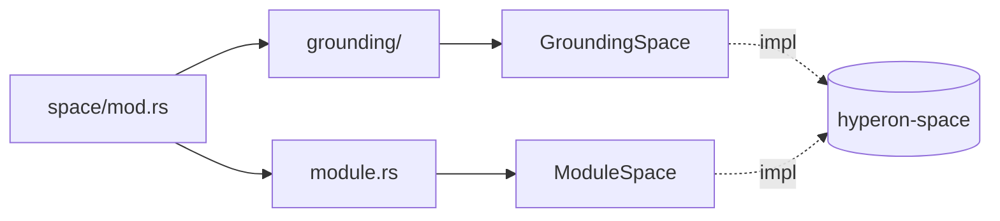

# `lib/src/space/mod.rs` 源码分析报告

**源文件**：`lib/src/space/mod.rs`  
**模块**：`hyperon::space`

## 1. 文件角色与职责

`hyperon` crate 中 **Space（原子空间）** 子树的 **模块根**：

- 模块级文档说明：**Space 是可存储 atom 并支持搜索查询的执行单元**；本模块用于容纳 **多种 Space 实现**。
- 通过 **`pub mod grounding`** 与 **`pub mod module`** 暴露当前仓库中的两类实现入口：
  - **`grounding`**：**GroundingSpace**，**主要的内存型 Space 实现**（含 grounded atom、索引与观察者）。
  - **`module`**：**ModuleSpace**，在 **主空间 + 依赖空间** 上组合查询的复合空间。

本文件 **无** 代码逻辑，仅组织子模块与文档。

## 2. 公开 API 一览

| 项 | 类型 | 说明 |
|----|------|------|
| `grounding` | `pub mod` | `GroundingSpace` 等（见 `grounding/mod.rs`）。 |
| `module` | `pub mod` | `ModuleSpace`（见 `module.rs`）。 |

> **注意**：`Space`、`SpaceMut`、`DynSpace`、`complex_query` 等 **trait 与算法** 定义在依赖 **`hyperon-space`**，由子模块 `use` 后间接服务于用户；本 `mod.rs` 未再导出它们，使用者通常通过 `hyperon_space` 或具体类型方法接触。

## 3. 核心数据结构

无本地类型定义。

## 4. Trait 定义与实现

无。`Space` / `SpaceMut` 的契约见 `hyperon-space/src/lib.rs`；`GroundingSpace` 与 `ModuleSpace` 分别在各自文件中 `impl`。

## 5. 算法

无。查询组合（如 `,` 连接子查询）在 **`hyperon_space::complex_query`** 中实现，由具体 `Space::query` 调用。

## 6. 所有权分析

无额外所有权设计。

## 7. Mermaid 图

### `hyperon::space` 模块布局

## 8. 与 MeTTa 语义的对应关系

- **Space** 对应运行时 **上下文中的 atom 存储与匹配**（MeTTa 程序里的 “空间” / 知识库）。
- **GroundingSpace**：存放 **grounded** 与普通符号结构，支持 **模式匹配查询**（与 MeTTa 规则、统一、`, ` 合取查询语义衔接）。
- **ModuleSpace**：对应 **分模块可见性 / 多空间联合推理** 的 Rust 侧近似：主空间写操作，查询时 **并入依赖空间结果**（详见 `module-space.md`）。

## 9. 小结

`space/mod.rs` 是 **实现分类索引**：把内存实现（`grounding`）与模块组合实现（`module`）并列导出。阅读 Space 相关行为应进入 **`grounding/mod.rs`**、**`module.rs`** 及 **`hyperon-space`** 核心 trait 定义。
