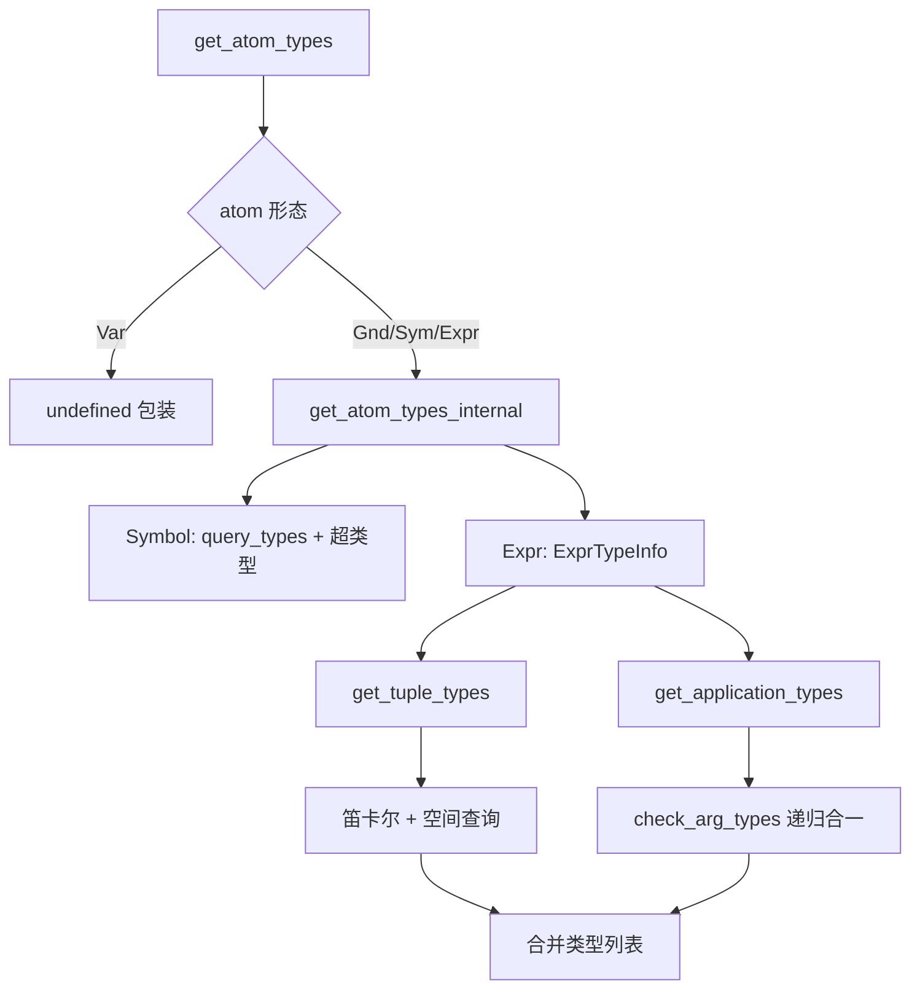
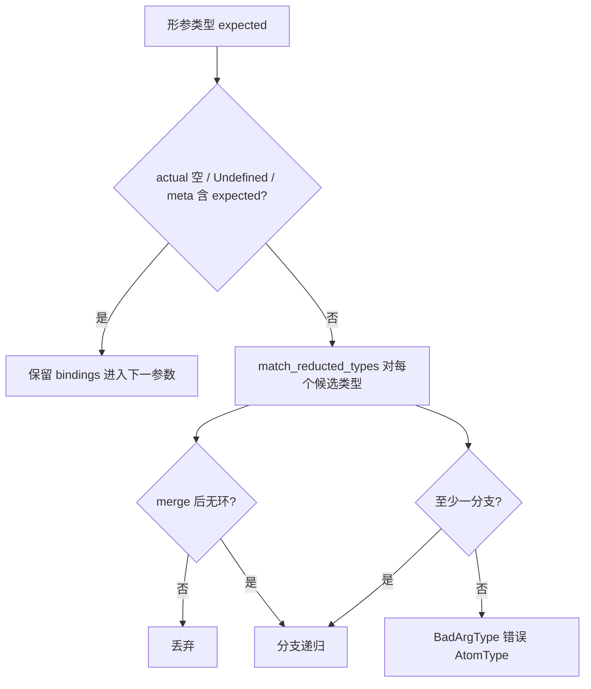

# `lib/src/metta/types.rs` 源码分析报告

## 1. 文件角色与职责

`types.rs` 实现 **基于 AtomSpace 的 MeTTa 类型系统客户端逻辑**：从空间中查询 `(: a A)`、`(:< S T)`，推导表达式作为 **元组** 与 **函数应用** 时的可能类型，构造 **类型错误** 原子（与 `mod.rs` 中 `BadArgType` 等配合），并向解释器提供 `get_atom_types`、`check_type`、`validate_atom`、`match_reducted_types` 等 API。模块顶部文档说明了 **五类元类型**（`Atom`/`Symbol`/`Variable`/`Grounded`/`Expression`）与 **`%Undefined%` 的匹配语义**。

## 2. 公开 API 一览

| 名称 | 类型 | 说明 |
|------|------|------|
| `AtomType` | `struct` | 包装“类型原子 + 是否为函数类型 + 值/应用/错误”三类信息 |
| `is_func` | `fn` | 判断 `Atom` 是否为 `(-> …)` 形函数类型 |
| `get_atom_types` | `fn` | 在给定 `DynSpace` 下返回某 `atom` 的可能 `AtomType` 列表；无则 `%Undefined%` |
| `match_reducted_types` | `fn` | 对两类型做匹配，产生 `Bindings` 迭代器（将 `%Undefined%` 特殊处理） |
| `check_type` | `fn` | 布尔：元类型匹配或存在与期望类型合一的成功分支 |
| `get_meta_type` | `fn` | 返回语法层面的元类型原子（`Symbol`/`Variable`/…） |
| `validate_atom` | `fn` | `get_atom_types_internal` 结果是否 **全部为有效**（无 `ApplicationError`） |

## 3. 核心数据结构

### 3.1 `AtomType`

字段：

- `typ: Atom`：类型表达式本身。
- `is_function: bool`：缓存 `is_func(&typ)`。
- `info: TypeInfo`：`Application` | `ApplicationError { error }` | `Value`。

工厂与查询：`undefined()`、`value`、`application`、`error`；`is_error`、`is_valid`、`is_function`、`is_application`、`as_atom`、`into_atom`、`get_error`、`into_error`、`into_atom_or_error` 等。

**语义**：同一 `typ` 可对应“作为值具有该类型”“作为应用结果具有该类型”“类型检查失败并携带 `Error` 表达式”三种情况，便于调用方区分 **合法应用** 与 **静态可报告错误**。

### 3.2 `TypeInfo`（私有枚举）

区分 **普通值类型**、**函数应用成功**、**应用失败（内含完整 `Error` 原子）**。

### 3.3 `ExprTypeInfo`（私有）

对表达式 `(op arg1 … argn)`：

- `op_value_types`：`op` 的 **非函数** 类型候选。
- `op_func_types`：`op` 的 **函数** 类型候选（`is_function()`）。
- `arg_types`：每个参数的 `get_atom_types_internal` 结果向量。

`arity()` = `arg_types.len() + 1`（含操作符位置）。

### 3.4 `TupleIndex<'a>`（私有）

在 **笛卡尔积** 上迭代：对 `op` 的每个 value 类型与每个参数的每个类型组合，生成一个 **元组类型** `Expression([t0, t1, …])`。使用 `index` / `max` 数组做 **\(O(1)\) 递增** 的组合枚举。

## 4. Trait 定义与实现

| Trait | 实现者 | 说明 |
|--------|--------|------|
| `Display` | `AtomType` | 调试输出：`typ(` + 可选 `A`/`E` + `)` |
| `Display` | `UndefinedTypeMatch` | 输出 `%Undefined%` |
| `Grounded` | `UndefinedTypeMatch` | `type_()` → `Type` |
| `CustomMatch` | `UndefinedTypeMatch` | 与任意 `Atom` 匹配成功并返回空 `Bindings`（用于将 `%Undefined%` 视为可匹配任意类型） |

`UndefinedTypeMatch` 仅在 `replace_undefined_types` 中临时替换树中的 `%Undefined%` 叶子，以复用 `matcher::match_atoms`。

## 5. 算法详解

### 5.1 空间查询辅助

- `typeof_query(atom, typ)` → `(: atom typ)`。
- `isa_query(sub, sup)` → `(:< sub sup)`。
- `query_has_type` / `query_super_types`：对 `DynSpace` 做 `query`，再用 `apply_bindings_to_atom_move` 取出变量 `X` 的绑定。
- `add_super_types`：自某下标起 BFS/递归式扩展 **传递闭包**（子类型链），去重后加入列表。

### 5.2 `get_atom_types_internal`

分情形：

| Atom 形态 | 行为 |
|-----------|------|
| `Variable` | 返回空向量（无空间绑定；外层 `get_atom_types` 会变为 `undefined()`） |
| `Grounded` | `gnd.type_()`，若为 `%Undefined%` 则空；否则 `value(make_variables_unique(...))` |
| `Symbol` | `query_types` → 各 `value` |
| 空 `Expression` | 空（注释说明理想为 unit `(->)`，尚未接好） |
| 非空 `Expression` | `ExprTypeInfo::new` → `get_tuple_types` + `get_application_types` 合并 |

### 5.3 元组类型 `get_tuple_types`

- 若 `TupleIndex::new` 成功：枚举所有笛卡尔积，构造 `Atom::expr(v)`，再 `query_types(space, atom)` 合并空间中对该 **整体表达式** 的直接断言，再 `add_super_types`。
- 映射为 `AtomType::value`。

### 5.4 函数应用类型 `get_application_types`

对每个 `op` 的函数类型 `fn_type`：

- `get_arg_types` 拆出 `(expected_args..., ret)`（`->` 为头）。
- `meta_arg_types`：每个实际参数对应 `[get_meta_type(arg), Atom]`，即 **允许 `Atom` 或具体元类型** 的特殊判断（与解释器“元类型参数不先求值”一致）。
- `check_arg_types`：逐参数递归合一。

### 5.5 `check_arg_types` / `check_arg_types_internal`

三参数并行递归：`actual`（每参数多个可能类型向量）、`meta`（每参数的元类型信息）、`expected`（形参类型列表）。

对当前参数：

- 若 `actual` 为空、或期望为 `%Undefined%`、或期望出现在 `meta` 中：视为 **自动通过**，绑定不变。
- 否则：对 `actual` 中每个候选 `typ`，`match_reducted_types(typ.as_atom(), expected)`，与当前 `bindings` **merge**，过滤 `has_loops`。
- 若无任何合法匹配：对每个 actual 类型生成 `BadArgType` 错误（带参数下标）。
- 耗尽参数时：`AtomType::application(apply_bindings_to_atom_move(ret_typ, &bindings))`。

### 5.6 `match_reducted_types`

`replace_undefined_types` 后调用 `matcher::match_atoms`。使 `%Undefined%` 在结构匹配中 **像通配符** 一样成功。

### 5.7 `check_type` / `validate_atom`

- `check_type`：`check_meta_type`（`Atom` 或精确元类型）或 `get_matched_types` 非空。
- `validate_atom`：`get_atom_types_internal` 的每个结果 `is_valid()`。

### 5.8 `match_types`（`interpreter.rs` 亦逻辑相关）

在解释器的 `type_cast` 路径中复用类似思想：`types.rs` 以查询为主；合一细节在解释器内另有 `match_types` 处理 `Atom` 与 `%Undefined%` 与 `Atom` 元类型。

## 6. 执行流（类型查询）

## 7. 所有权分析

- 大量使用 `Atom::clone()`、`apply_bindings_to_atom_move`（消费 + 绑定应用）。
- `DynSpace` 通过 `borrow()` 读空间；无 `Rc<RefCell<>>` 出现在本文件。
- `UndefinedTypeMatch` 为零大小 grounded，用于匹配时 **临时** 替换，不长期持有。

## 8. Mermaid：类型检查合一

## 9. 复杂度与性能

- `get_atom_types_internal` 对表达式最坏 **指数级**：元组笛卡尔积为 \(\prod_i |T_i|\)，再乘函数类型分支数。
- `add_super_types` 可能因类型格深度多次扫描；注释标 `FIXME: ineffective`。
- 查询为空间实现决定；本模块假设 `query` 合理实现。

## 10. 与 MeTTa 语义的对应

- `(: a A)`：Horn/逻辑编程式 **类型事实**。
- `(:< A B)`：**子类型**；与 `check_type` 传递性一致。
- `(-> A B C)`：柯里化函数类型在存储中为 **扁平** `->` 链；`is_func` 仅要求首子为 `->` 且长度 > 1。
- 元类型参数：与 minimal MeTTa 中 **不对 `Atom` 元类型参数做求值** 的设计对齐（见模块注释与测试 `get_atom_types_function_call_meta_types`）。

## 11. 小结

`types.rs` 将 **类型即 Atom** 的理念落到实现：通过 **空间查询 + 结构匹配（matcher）** 完成 **依赖类型与参数化类型** 的合一，并用 `AtomType` 区分 **成功应用类型** 与 **可序列化错误**。主要复杂度来自 **表达式同时可能是元组与函数应用** 的双重解读；代码中 TODO/FIXME 亦指出 **类型变量环境** 与 **空表达式 unit** 等待完善。
