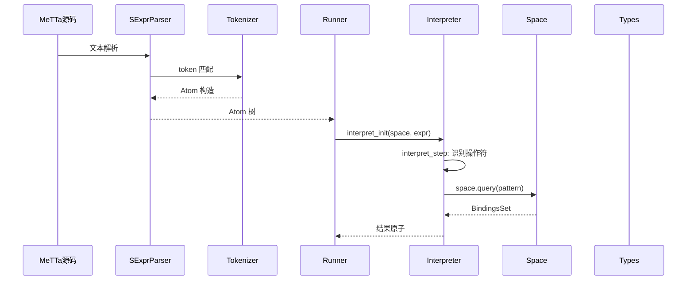

# 生成代码文档

> **所属项目**：OpenCog Hyperon (hyperon-experimental)
> **提示词编号**：00（主提示词）
> **版本**：0.2.10
> **项目根目录**：`d:\dev\hyperon-experimental`
> **提示词目录**：`project_docs/prompt/`
> **文档输出目录**：`project_docs/output/`
> **关联文件**：
> - [01_single_file_rust.md](./01_single_file_rust.md) — Rust 单文件分析提示词
> - [02_single_file_python.md](./02_single_file_python.md) — Python 单文件分析提示词
> - [03_single_file_metta.md](./03_single_file_metta.md) — MeTTa 单文件分析提示词
> - [SOURCE_FILE_TODOLIST.md](./SOURCE_FILE_TODOLIST.md) — **源码文件进度跟踪清单**（219 个文件）

## 项目名称：OpenCog Hyperon (hyperon-experimental) 源码注解与在线文档生成

---

## 一、总体目标

生成一套完整的、多维度的源码分析文档，并将其构建为一个美观、快速、易于导航的在线技术文档网站。文档应全面覆盖项目的**理论背景（AGI/知识表示/类型论/非确定性计算）**、**MeTTa语言设计哲学与语义**、**技术架构**、**Python实现细节**，并提供详尽的源码注释。最终交付物包括：完整的Markdown源码文档，以及基于成熟静态站点生成器构建的可在线访问的网站。

**项目简介：** OpenCog Hyperon 是 OpenCog 的全新一代实现，核心是一种名为 **MeTTa (Meta Type Talk)** 的 AI 编程语言。MeTTa 是一种基于原子空间（AtomSpace）的元语言，具有模式匹配、非确定性求值、类型推导、知识图谱操作、向后链推理等独特能力。它被设计为通用人工智能（AGI）系统的核心编程语言。

**项目位置：** `d:\dev\hyperon-experimental`
**提示词目录：** `project_docs/prompt/`
**生成的文档项目存放位置：** `project_docs/output/`

**文档范围：** 本文档覆盖项目的**全部实现层**，包括：**Rust 核心引擎**（`hyperon-atom`/`hyperon-common`/`hyperon-space`/`hyperon-macros`/`lib`/`c`/`repl` 共 7 个 Rust crate，约 85 个 `.rs` 文件）、**Python 实现层**（`python/` 目录下的 `hyperon` 包）、**MeTTa 语言层**（`.metta` 文件）以及 **C API 绑定层**（`c/` 目录）。需要对 Rust 底层实现的编译、解释、执行的每一个细节进行全面深入的分析。

---

## 二、详细任务分解

### 第一章：项目全面分析

深入分析 hyperon-experimental 项目的源码，理解其整体设计、模块划分、核心流程，形成技术架构文档。分析应包括但不限于：

- 项目功能全景图（语言解释器、知识空间、模式匹配引擎、类型系统、模块系统、Python互操作）
- 核心执行流程（从 MeTTa 源码文本 → S表达式解析 → Atom构建 → 求值/归约 → 结果返回）
- 数据流转路径（Python层 → hyperonpy C绑定 → 核心引擎 → 回调Python grounded函数）
- 关键算法与实现策略（模式匹配算法、非确定性求值模型、类型推导与检查）
- 外部依赖与集成方式（hyperonpy原生模块、CMake/Conan构建链、SingularityNET集成、DAS分布式原子空间）
- 性能与扩展性考量（自定义Space实现、grounded操作的执行模型、状态管理）

### 第二章：文档结构组织

按照以下章节结构组织Markdown文档，确保逻辑清晰、层次分明：

#### 2.1 项目概述

简要介绍项目目标、主要功能、适用场景、版本信息及开发背景。包含：
- OpenCog Hyperon 在 AGI 研究中的定位
- MeTTa 语言的设计动机与目标（替代经典 OpenCog Atomese）
- 与 SingularityNET 生态的关系
- 当前开发状态（pre-alpha）与路线图

#### 2.2 项目背景

##### 2.2.1 理论背景

本项目深植于多个理论领域，文档需详细阐述以下理论及其在项目中的具体体现：

**A. 通用人工智能（AGI）理论**
- AGI 的定义与研究范式
- OpenCog 认知架构的核心思想（AtomSpace 作为统一知识表示层）
- 元认知（Metacognition）与元学习（Meta-learning）在 MeTTa 元语言设计中的体现
- 认知协同（Cognitive Synergy）概念及其在多推理引擎集成中的作用

**B. 知识表示与推理（KR&R）**
- 超图（Hypergraph）作为知识表示基础结构
  - 超图 vs 普通图 vs 属性图的对比
  - 在 MeTTa AtomSpace 中的具体表现形式
- 模式匹配（Pattern Matching）理论
  - 合一（Unification）算法原理
  - 在 MeTTa `match` / `unify` 操作中的实现
- 推理方法
  - 向前链推理（Forward Chaining）
  - 向后链推理（Backward Chaining）—— 重点阐述，MeTTa 核心能力
  - 概率逻辑网络（PLN - Probabilistic Logic Networks）
  - 在 MeTTa 中的实现方式（通过 `=` 定义规则 + `match` 进行查询）

**C. 类型论与编程语言理论（PLT）**
- 依赖类型系统（Dependent Types）在 MeTTa 中的应用
  - `d1_gadt.metta`、`d3_deptypes.metta` 等示例分析
- 广义代数数据类型（GADTs）
- 高阶函数（Higher-order Functions）
  - `d2_higherfunc.metta` 示例分析
- 柯里-霍华德同构（Curry-Howard Correspondence）—— 类型即命题
  - `d4_type_prop.metta` 示例分析
- 归约语义（Reduction Semantics）
  - MeTTa 的 `eval` / `chain` / `function` / `return` 归约模型
- 非确定性计算模型
  - MeTTa 的非确定性求值语义（一个表达式可产生多个结果分支）
  - `superpose` / `collapse` 操作的理论基础

**D. 元编程（Metaprogramming）**
- MeTTa 作为元语言的设计理念（"Meta Type Talk"）
- 代码即数据（Homoiconicity）—— 原子表达式既是程序也是数据
- 自省与自修改能力（通过 `&self` 空间操作自身知识库）
- MeTTa 自引导（Self-hosting）目标：用 MeTTa 写 MeTTa 解释器（`minimal-metta.md`）

**E. 分布式知识管理**
- 分布式原子空间（DAS - Distributed AtomSpace）架构
- 知识图谱存储与查询
- 模块化知识组织（MeTTa 模块系统）

##### 2.2.2 核心技术栈

| 层级 | 技术 | 选型理由 |
|------|------|---------|
| 核心引擎 | Rust（通过 `hyperonpy` 暴露） | 高性能、内存安全、零成本抽象 |
| Python绑定 | `hyperonpy`（pybind11 + C API） | Python 生态融合、易于扩展 |
| Python包 | `hyperon`（atoms/base/runner/ext/stdlib） | 面向用户的高级 API |
| 语言前端 | S-表达式解析器 + Tokenizer | Lisp 传统、homoiconicity |
| 构建系统 | CMake + Conan + setuptools | 跨平台原生扩展构建 |
| 文档 | MkDocs + Material 主题 | Python 生态、简洁易用 |
| CI/CD | GitHub Actions | 自动化测试与发布 |

##### 2.2.3 MeTTa 语言核心概念

这是本项目最独特的部分，需**单独成章深入阐述**：

**A. 原子（Atom）模型**
- 四种基本原子类型：
  - `SymbolAtom`：命名概念（如 `True`、`Plato`、`if`）
  - `VariableAtom`：变量占位符（如 `$x`、`$result`）
  - `ExpressionAtom`：复合表达式（S-表达式，如 `(+ 1 2)`）
  - `GroundedAtom`：宿主语言对象（Python函数、值、空间等）
- 元类型（Metatype）体系
- 原子的类型标注（`(:` 表达式）与类型推导

**B. 原子空间（AtomSpace / Space）**
- Space 作为知识库/程序上下文的统一抽象
- `&self` —— 当前模块的自引用空间
- 空间操作：`add-atom`、`remove-atom`、`get-atoms`、`match`
- 自定义 Python Space（`AbstractSpace` 子类化）
- GroundingSpace vs 自定义空间

**C. 求值模型**
- S-表达式解析流程
- `eval` 指令：单步归约
- `chain` 指令：顺序求值与变量绑定
- `function` / `return`：包装求值直到返回
- `unify`：双向匹配
- 非确定性求值：多分支并行展开
- `superpose` / `collapse`：非确定性结果的展开与收集
- `let` / `let*`：局部变量绑定
- `if` / `case`：条件分支

**D. Grounding 机制**
- Python 对象如何成为 MeTTa 原子
- `OperationAtom`：可执行操作（函数调用）
- `ValueAtom`：值封装
- `unwrap` 机制：自动将 MeTTa 原子解包为 Python 值
- grounded 函数的 `execute` / `match_` / `serialize` / `copy` 契约
- `@register_atoms` / `@register_tokens` 装饰器的模块发现机制

**E. 模块系统**
- `import!` 操作与模块名解析
- 模块名路径层级（`top:mod1:sub_a`）
- Python 模块（`.py`）的自动发现与加载
- MeTTa 模块（`.metta`）的加载
- `&self` 在模块上下文中的含义
- 内置模块：`corelib`、`stdlib`、`random`、`fileio`、`json`、`catalog`、`das`

**F. 状态管理**
- `new-state` / `get-state` / `change-state!` 操作
- `StateMonad` 类型与类型安全的状态修改
- `bind!` 与解析时 token 替换

**G. 标准库（stdlib）**
- 内置操作完整清单（`stdlib.metta` 中定义的所有操作）
- 算术、逻辑、比较、集合操作
- 数学函数（三角函数、对数、幂等）
- 字符串操作
- 空间操作
- 类型操作（`get-type`、`check-type`、`validate-atom`）
- 文档系统（`@doc`、`@desc`、`@params`、`@return`、`help!`）

##### 2.2.4 相关领域知识

- **人工智能**：符号主义 AI vs 连接主义 AI，MeTTa 作为神经符号（Neuro-Symbolic）桥梁的潜力
- **区块链/去中心化 AI**：SingularityNET 平台，去中心化 AI 服务市场，`snet_io` 扩展
- **认知科学**：认知架构（Cognitive Architecture），NARS、AIXI 等 AGI 方法的对比

#### 2.3 整体架构介绍

##### 2.3.1 需求分析

**功能需求：**
- MeTTa 语言的完整解释执行
- Python API 嵌入使用
- 命令行 REPL 与脚本执行（`metta-py` 命令）
- 模块系统与包管理
- 可扩展的 grounding 机制
- 自定义 Space 实现
- 标准库与内置操作

**非功能需求：**
- 性能：核心引擎 Rust 实现，Python 层为轻量包装
- 可扩展性：通过 `@register_atoms`/`@register_tokens` 装饰器扩展
- 可嵌入性：`MeTTa` 类可在任意 Python 应用中实例化
- 跨平台：Windows/Linux/macOS + Docker 支持

##### 2.3.2 技术分析

分析技术选型的原因、优缺点、替代方案对比：
- 为何选择 S-表达式而非其他语法（与 Lisp 传统的关系、homoiconicity 的优势）
- 为何核心用 Rust 而非纯 Python（性能、内存安全）
- 为何使用 pybind11 + C API 二层绑定而非直接 PyO3
- Tokenizer 的正则表达式驱动设计 vs 传统词法分析器

##### 2.3.3 实现方案分析

从代码层面描述如何实现需求：
- Python 包 `hyperon` 的分层架构（`atoms.py` → `base.py` → `runner.py` → `ext.py` → `stdlib.py`）
- `hyperonpy` 原生模块作为 Python 与核心引擎的桥梁
- Grounded 回调机制（核心引擎调用 Python 函数的方式）
- 模块发现与加载流程（Python `.py` 模块 vs MeTTa `.metta` 模块）

##### 2.3.4 架构图表

使用 Mermaid 生成以下图表并嵌入文档：

1. **总体架构图**：展示 MeTTa语言 → Python hyperon包 → hyperonpy (pybind11) → C API (hyperonc) → Rust Core (7 crates) 的完整分层关系
2. **MeTTa 程序执行流程图**：从源码文本到最终结果的完整流程
   - 文本 → `SExprParser` → `Tokenizer` → `Atom` 树 → `Metta::run` → `RunnerState` → `InterpreterState` → 归约循环 → 结果
3. **原子类型体系图**：Rust 层 `Atom` 枚举（4 个变体 + trait 体系）与 Python 层类层次的对应关系
4. **空间（Space）架构图**：Rust `Space`/`SpaceMut`/`DynSpace` trait → `GroundingSpace`/`ModuleSpace` → C API `space_t` → Python `AbstractSpace`/`SpaceRef`
5. **Grounding 机制时序图**：展示 Python grounded 函数如何被 MeTTa 调用（Python → C callback → Rust `CustomExecute::execute()` → 结果返回）
6. **模块加载流程图**：`import!` → Rust `RunContext::load_module()` → `ModuleLoader` trait → `MettaMod` 创建 → token 注册 → 空间合并
7. **Bindings 与模式匹配流程图**：Rust `match_atoms()` 的递归分支与 `Bindings::merge()` 过程
8. **非确定性求值分支图**：`InterpreterState.plan` 的分支管理，`superpose-bind` 的展开与 `collapse-bind` 的 `Rc<RefCell<Stack>>` 共享收集
9. **Runner 状态机图**：`RunnerState` → `InterpreterWrapper` → `InterpreterState` 的状态转换
10. **标准库操作分类图**：按功能分类的所有 stdlib 操作（Rust `stdlib/*.rs` + MeTTa `stdlib.metta`）

#### 2.4 项目源码注释

##### 2.4.1 模块划分

将项目源码划分为以下主要模块，每个模块建立单独文档：

**Rust 核心引擎层：**

| 模块 | 路径 | 文件数 | 职责 |
|------|------|-------|------|
| 通用工具库 | `hyperon-common/src/` | 12 | MultiTrie、HoleyVec、UniqueString、共享指针等基础设施 |
| 原子类型与匹配 | `hyperon-atom/src/` | 10 | Atom ADT、模式匹配/合一引擎、序列化、grounded类型 |
| 空间抽象与索引 | `hyperon-space/src/` | 4 | Space trait、DynSpace、AtomIndex Trie索引、观察者模式 |
| 过程宏 | `hyperon-macros/src/` | 1 | `metta!` / `metta_const!` 编译期原子构造宏 |
| MeTTa 解释器 | `lib/src/metta/` | 4 | interpreter.rs（归约引擎）、types.rs（类型系统）、text.rs（解析器）、mod.rs（常量） |
| 空间实现 | `lib/src/space/` | 2 | GroundingSpace（内存空间）、ModuleSpace（复合空间） |
| Runner系统 | `lib/src/metta/runner/` | 4 | Metta runner、RunnerState、RunContext、Environment |
| 模块系统 | `lib/src/metta/runner/modules/` | 2 | MettaMod、ModuleLoader、模块名树 |
| 标准库实现 | `lib/src/metta/runner/stdlib/` | 9 | 所有 grounded 操作的 Rust 实现 |
| 内置模块 | `lib/src/metta/runner/builtin_mods/` | 6 | random/fileio/json/catalog/das/skel |
| 包管理 | `lib/src/metta/runner/pkg_mgmt/` | 4 | 目录/Git/托管 Catalog、模块描述符 |
| C API绑定 | `c/src/` | 7 | FFI 导出层，Rust → C ABI |
| REPL | `repl/src/` | 4 | 交互式终端、语法高亮、Python/Rust双模式 |

**Python 层：**

| 模块 | 路径 | 职责 |
|------|------|------|
| 核心原子层 | `python/hyperon/atoms.py` | Atom 类型体系、Grounded对象、Bindings、操作原子 |
| 基础设施层 | `python/hyperon/base.py` | Space 抽象、Parser/Tokenizer、底层解释器 |
| 运行器层 | `python/hyperon/runner.py` | MeTTa 类、RunnerState、Environment、模块加载 |
| 扩展机制层 | `python/hyperon/ext.py` | `@register_atoms`/`@register_tokens`/`@grounded` 装饰器 |
| 标准库层 | `python/hyperon/stdlib.py` | 文本操作、Python互操作、正则匹配、数据结构桥接 |
| 类型转换层 | `python/hyperon/conversion.py` | `ConvertingSerializer`，跨语言值转换 |
| 模块引用层 | `python/hyperon/module.py` | `MettaModRef` 模块引用封装 |
| CLI入口 | `python/hyperon/metta.py` | 命令行入口，`metta-py` 命令实现 |
| 包初始化 | `python/hyperon/__init__.py` | 公共导出与版本管理 |
| py_ops扩展 | `python/hyperon/exts/py_ops/` | 算术运算、布尔运算、类型定义 |
| agents扩展 | `python/hyperon/exts/agents/` | Agent 框架、事件总线 |
| snet_io扩展 | `python/hyperon/exts/snet_io/` | SingularityNET 服务调用接口 |

**MeTTa 语言层：**

| 模块 | 路径 | 职责 |
|------|------|------|
| MeTTa标准库 | `lib/src/metta/runner/stdlib/stdlib.metta` | MeTTa 语言标准库定义（~1400行） |
| 内置模块 | `lib/src/metta/runner/builtin_mods/*.metta` | random/fileio/json/catalog/das |
| 测试套件 | `python/tests/` | 单元测试与功能测试 |
| MeTTa示例脚本 | `python/tests/scripts/*.metta` | 语言特性示例与测试 |
| 沙箱实验 | `python/sandbox/` | PyTorch/NumPy/SQL/神经空间等实验性集成 |

##### 2.4.2 每个模块的完整文件列表

列出该模块包含的所有源码文件，并简要说明每个文件的作用。例如：
- `atoms.py`：原子类型体系核心，定义 Atom/SymbolAtom/VariableAtom/ExpressionAtom/GroundedAtom 及 Bindings/BindingsSet
- `base.py`：基础设施层，定义 AbstractSpace/GroundingSpace/SpaceRef/Tokenizer/SExprParser/Interpreter

##### 2.4.3 模块级图表

为每个模块提供架构图、流程图、关系图等，使用 Mermaid，细化模块内部结构。重点模块：
- `atoms.py` 的类继承与组合关系图
- `runner.py` 的 MeTTa 类初始化流程图
- `ext.py` 装饰器到模块发现的调用链图
- `stdlib.py` 注册的所有操作分类图

##### 2.4.4 每个文件的详细注释

**文件头部总结：**
- 该文件实现的功能
- 实现原理与整体思路
- 关键设计决策与注意事项
- 对 `hyperonpy` 原生模块的依赖关系
- 与其他模块的交互关系

**函数/方法注释：**
- 功能描述
- 参数（类型、含义、是否为MeTTa原子或Python原生值）
- 返回值（类型、含义）
- 异常情况（`NoReduceError`、`MettaError`、`IncorrectArgumentError`）
- 实现原理与关键代码段解释
- 与核心引擎交互的方式（哪些调用会穿透到 `hyperonpy`）

**行级注释：**
- 对复杂的原子构造与转换逻辑进行逐行注释
- 对回调函数（`_priv_call_*`）的调用时机和参数传递进行详细说明
- 对 Bindings 的 merge/push/iterate 操作的语义进行解释

#### 2.5 MeTTa 语言专题文档

这是本项目文档的**独特核心部分**，需要专门的深度文档：

##### 2.5.1 MeTTa 语言教程

基于 `python/tests/scripts/` 下的示例文件，组织为渐进式教程：

| 阶段 | 示例文件 | 涵盖概念 |
|------|---------|---------|
| 入门：符号与表达式 | `a1_symbols.metta` | 基本原子、表达式、求值 |
| 入门：OpenCog风格 | `a2_opencoggy.metta` | 知识表示、声明式编程 |
| 入门：双向规则 | `a3_twoside.metta` | 等式、模式匹配基础 |
| 进阶：链式求值 | `b0_chaining_prelim.metta` | chain 操作预备知识 |
| 进阶：等式链 | `b1_equal_chain.metta` | 函数定义与调用链 |
| 进阶：向后链推理 | `b2_backchain.metta` | 推理、递归、知识查询 |
| 进阶：直接求值 | `b3_direct.metta` | 直接执行模式 |
| 进阶：非确定性 | `b4_nondeterm.metta` | 多结果分支、superpose |
| 进阶：类型初步 | `b5_types_prelim.metta` | 类型标注、类型检查 |
| Grounding | `c1_grounded_basic.metta` | Python grounded 函数 |
| 空间操作 | `c2_spaces.metta` | 多空间、空间查询 |
| PLN推理 | `c3_pln_stv.metta` | 概率逻辑、真值 |
| 类型系统：GADT | `d1_gadt.metta` | 广义代数数据类型 |
| 类型系统：高阶 | `d2_higherfunc.metta` | 高阶函数、函数类型 |
| 类型系统：依赖类型 | `d3_deptypes.metta` | 依赖类型 |
| 类型系统：类型命题 | `d4_type_prop.metta` | Curry-Howard 对应 |
| 类型系统：自动类型 | `d5_auto_types.metta` | 类型推导 |
| 知识库操作 | `e1_kb_write.metta` | 原子增删改 |
| 状态管理 | `e2_states.metta` | State monad |
| 模式匹配状态 | `e3_match_states.metta` | 状态与匹配结合 |
| 模块系统 | `f1_imports.metta` | import、模块依赖 |
| 文档系统 | `g1_docs.metta` | @doc 内嵌文档 |

##### 2.5.2 MeTTa 语言规范

基于 `docs/metta.md` 和 `docs/minimal-metta.md` 整理：
- 完整的语法 BNF 定义
- 最小指令集（eval, chain, unify, cons-atom, decons-atom, etc.）
- 求值语义的形式化描述
- 类型系统规则
- 错误处理模型（Error/Empty/NotReducible）

##### 2.5.3 标准库完整参考

基于 `stdlib.metta` 生成每个内置操作的参考文档：
- 操作名称与签名
- 功能描述
- 参数说明
- 返回值说明
- 使用示例
- 注意事项

##### 2.5.4 Python-MeTTa 互操作指南

详细说明如何在 Python 中使用 MeTTa，以及如何扩展 MeTTa：
- `MeTTa` 类的完整使用方法（`run`、`evaluate_atom`、`parse_all`、`register_token`、`register_atom`）
- 如何创建 `OperationAtom`（Python 函数 → MeTTa 操作）
- 如何创建 `ValueAtom`（Python 值 → MeTTa 数据）
- `unwrap` 机制详解
- 如何实现自定义 `AbstractSpace`
- 如何编写 Python MeTTa 扩展模块（`@register_atoms`/`@register_tokens`）
- `RunnerState` 的增量执行模式
- `Environment` 的配置与定制

#### 2.6 Rust 底层核心引擎深度分析

这是本项目文档的**技术核心部分**，需要对 Rust 实现的每一层、每一个关键数据结构和算法进行深入到源码级的完整分析。项目的 Rust 工作空间包含 7 个 crate，共约 85 个 `.rs` 文件。

##### 2.6.1 Rust Workspace 总览

**Workspace 结构（`Cargo.toml` 根配置）：**
- 版本：`0.2.10`，Rust edition 2021，resolver 2
- 7 个 workspace members 及其依赖关系图（使用 Mermaid 绘制）

| Crate | 包名 | 类型 | 核心职责 |
|-------|------|------|---------|
| `hyperon-common` | `hyperon-common` | lib | 基础数据结构与工具库（MultiTrie、HoleyVec、UniqueString、共享指针等） |
| `hyperon-atom` | `hyperon-atom` | lib | 原子（Atom）ADT定义、模式匹配/合一引擎、序列化、grounded类型基础 |
| `hyperon-space` | `hyperon-space` | lib | 空间（Space）trait定义、DynSpace、AtomIndex Trie索引、观察者模式 |
| `hyperon-macros` | `hyperon-macros` | proc-macro | `metta!` / `metta_const!` 过程宏，编译期构造 Atom |
| `lib` | `hyperon` | lib | **MeTTa 解释器核心**：interpreter、types、runner、stdlib、模块系统、环境、包管理 |
| `c` | `hyperonc` | cdylib+staticlib | C API 导出层（FFI），供 Python pybind11 调用 |
| `repl` | `metta-repl` | bin | 交互式 REPL 实现（rustyline + 可选 Python 集成） |

**Feature 门控体系：**
- `default = ["pkg_mgmt", "das"]`
- `pkg_mgmt`：启用包管理（xxhash、serde、semver）
- `das`：分布式原子空间（metta-bus-client）
- `git`：Git 仓库模块支持（git2 + vendored-libgit2）
- `variable_operation`、`online-test`、`benchmark`

##### 2.6.2 `hyperon-common` crate —— 基础数据结构库

**文件清单（12 个 `.rs` 文件）：**

| 文件 | 核心类型/功能 | 详细说明 |
|------|-------------|---------|
| `lib.rs` | `CachingMapper<K,V,F>` | 带记忆化的映射器，用于变量重命名等场景 |
| `collections.rs` | `Equality`, `ListMap`, `VecDisplay` | 自定义相等性的列表映射、向量显示格式化 |
| `unique_string.rs` | `UniqueString` | 字符串驻留（interning）：`Const(&'static str)` 编译期常量 或 `Store(Arc<ImmutableString>, u64)` 运行期去重，全局去重表 |
| `immutable_string.rs` | `ImmutableString` | 不可变字符串：`Literal` 静态引用 或 `Allocated` 堆分配 |
| `flex_ref.rs` | `FlexRef<'a, T>` | 统一 `&T` 和 `RefCell::Ref<'a, T>` 的智能引用 |
| `reformove.rs` | `RefOrMove<T>` | 同时接受拥有值和借用引用的参数类型 |
| `holeyvec.rs` | `HoleyVec<T>` | 带空洞（holes）的稀疏向量，被 `Bindings` 使用，支持高效的变量绑定存储 |
| `shared.rs` | `LockBorrow`, `LockBorrowMut` | 统一 `Arc<Mutex<T>>`、`Rc<RefCell<T>>`、`&T` 的借用接口 |
| `multitrie.rs` | `MultiTrie` | **多值 Trie 树**——支持通配符和括号化子键的核心索引结构，详述其插入/查询/删除算法 |
| `owned_or_borrowed.rs` | `OwnedOrBorrowed<'a, T>` | 拥有或借用的统一枚举 |
| `vecondemand.rs` | `VecOnDemand<T>` | 按需分配的延迟向量 |
| `assert.rs` | `compare_vec_no_order`, `VecDiff` | 测试辅助：无序向量比较 |

**需深入分析的重点：**
- `MultiTrie` 的完整数据结构设计与算法复杂度分析
- `UniqueString` 的全局驻留表实现与线程安全性
- `HoleyVec` 如何为 `Bindings` 提供高效的稀疏变量映射

##### 2.6.3 `hyperon-atom` crate —— 原子 ADT 与模式匹配引擎

**文件清单（10 个 `.rs` 文件）：**

**A. 原子类型系统 (`lib.rs`) —— 全面深入分析**

这是整个项目的数据模型基石，需逐一分析：

- **`Atom` 枚举**：四个变体 `Symbol(SymbolAtom)` / `Variable(VariableAtom)` / `Expression(ExpressionAtom)` / `Grounded(Box<dyn GroundedAtom>)`
  - 构造器：`Atom::sym(name)`, `Atom::var(name)`, `Atom::expr(children)`, `Atom::value(v)`, `Atom::gnd(v)`
  - `as_gnd()` / `as_gnd_mut()` 向下转型机制
  - 所有 `TryFrom` 实现的完整列表与使用场景
- **`SymbolAtom`**：内部为 `UniqueString`，`name() -> &str`
- **`VariableAtom`**：`name + numeric id`，`new()` / `new_const()` / `new_id()` / `parse_name()` / `make_unique()`，全局 `NEXT_VARIABLE_ID` 原子计数器
- **`ExpressionAtom`**：`CowArray<Atom>` 子节点，`evaluated` 标记，`is_plain` / `children()` / `children_mut()` / `into_children()` / `set_evaluated()` / `is_evaluated()`
- **`make_variables_unique(atom) -> Atom`**：通过 `CachingMapper` 对原子树中的所有变量进行唯一化重命名
- **Grounded 类型体系**（详细展开每个 trait）：
  - `GroundedAtom`（object-safe trait）：`eq_gnd`, `clone_gnd`, `as_any_ref`, `as_any_mut`, `type_`, `serialize`, `as_grounded`; `downcast_ref` / `downcast_mut` 扩展方法
  - `Grounded` trait：`type_()` 返回 MeTTa 类型原子，`as_execute()` → `Option<&dyn CustomExecute>`，`as_match()` → `Option<&dyn CustomMatch>`，`serialize()` 序列化
  - `CustomExecute` trait：`execute(&self, args: &[Atom]) -> Result<Vec<Atom>, ExecError>`，`execute_bindings()` 默认委托
  - `CustomMatch` trait：`match_(&self, other: &Atom) -> MatchResultIter`
  - `AutoGroundedType` marker trait：`'static + PartialEq + Clone + Debug` 的 blanket impl
  - `CustomGroundedType` marker trait：`AutoGroundedType + Display + Grounded`
  - 内部包装器 `AutoGroundedAtom<T>` / `CustomGroundedAtom<T>` 的实现机制
- **`ExecError` 枚举**：`Runtime(String)` / `NoReduce` / `IncorrectArgument`
- **`rust_type_atom::<T>()`**：将 Rust 类型名映射为符号原子
- **`match_by_equality` / `match_by_string_equality`**：默认 grounded 匹配辅助函数
- **`ConvertingSerializer<T>`**：通过序列化路径从 grounded atom 中提取特定类型值
- **宏**：`expr!` 和 `sym!` 的展开规则与 `Wrap<T>` 内部机制

**B. 模式匹配引擎 (`matcher.rs`) —— 核心算法深度分析**

这是 MeTTa 语言的**核心引擎之一**，需对算法进行数学级别的分析：

- **`Bindings` 数据结构**：
  - 内部表示：变量等式组 + 变量赋值（`HoleyVec` + `HashMap`）
  - `resolve(&var) -> Option<Atom>`：变量解析（含循环检测）
  - `add_var_equality(var1, var2)`：添加变量等价关系
  - `add_var_binding(var, atom)`：绑定变量到原子
  - `merge(other) -> BindingsSet`：合并两个绑定集（**关键算法**，可能产生多个结果）
  - `narrow_vars(vars)`：将绑定限制到指定变量集合
  - `convert_var_equalities_to_bindings()`：将等式关系转换为显式绑定
  - `has_loops()`：循环检测
  - `rename_vars()`：变量重命名
  - `apply_and_retain(&mut atom, predicate)`：应用绑定并保留匹配谓词的变量
- **`BindingsSet`**：`SmallVec<[Bindings; 1]>`（小优化：单个绑定无堆分配）
  - `empty()` / `single()` / `count()` / `merge()` / `push()` / `drain()`
- **`match_atoms(left, right) -> BindingsSet`**：**完整的合一算法实现**
  - Symbol 匹配 Symbol：名称相等
  - Variable 匹配任意：创建绑定
  - Expression 匹配 Expression：递归子元素匹配并 merge 绑定
  - Grounded 匹配：委托给 `CustomMatch::match_()` 或默认相等性
  - 详述算法复杂度和边界情况处理
- **`match_atoms_recursively`**：深层递归匹配
- **`apply_bindings_to_atom_move` / `apply_bindings_to_atom_mut`**：将绑定应用到原子树
- **`atoms_are_equivalent`**：原子等价性判断（忽略变量命名）
- **`MatchResultIter`**：`Box<dyn Iterator<Item = Bindings>>`

**C. 原子迭代 (`iter.rs`)**
- `Atom::iter()` / `iter_mut()`：深度优先遍历
- `AtomIter` / `AtomIterMut`：带 `filter_type()` 的类型过滤迭代器

**D. 子表达式处理 (`subexpr.rs`)**
- `SubexprStream`：带可插拔 `WalkStrategy` 的子表达式遍历器
  - `FIND_NEXT_SIBLING_WALK`：兄弟节点遍历
  - `BOTTOM_UP_DEPTH_WALK`：自底向上深度遍历
  - `TOP_DOWN_DEPTH_WALK`：自顶向下深度遍历
- `split_expr(expr) -> (op, args_iter)`：表达式分割

**E. 序列化 (`serial.rs`)**
- `Serializer` trait：`serialize_bool` / `serialize_i64` / `serialize_f64` / `serialize_str`
- `NullSerializer`、`String` / `Vec<u8>` 的 blanket impl
- `ConvertingSerializer` 的类型提取机制

**F. Grounded 基本类型 (`gnd/`)**
- `gnd/mod.rs`：`GroundedFunction` + `GroundedFunctionAtom<T>` 的 `Rc` 包装实现
- `gnd/str.rs`：`Str` 类型，`ATOM_TYPE_STRING`，`ImmutableString` 内部存储
- `gnd/number.rs`：`Number` 枚举（`Integer(i64)` / `Float(f64)`），`ATOM_TYPE_NUMBER`，自动类型提升
- `gnd/bool.rs`：`Bool` 类型，`ATOM_TYPE_BOOL`，`True`/`False` 显示

##### 2.6.4 `hyperon-space` crate —— 空间抽象与索引引擎

**文件清单（5 个 `.rs` 文件，含 bench）：**

**A. 空间核心抽象 (`lib.rs`) —— 全面分析**

- **常量**：`COMMA_SYMBOL`（查询连接符）、`ATOM_TYPE_SPACE`
- **`SpaceEvent` 枚举**：`Add(Atom)` / `Remove(Atom)` / `Replace(Atom, Atom)` —— 观察者模式事件
- **`SpaceObserver` trait** + **`SpaceObserverRef<T>`**：弱引用观察者列表，`register_observer()` / `notify_all_observers()`
- **`SpaceCommon`**：所有 Space 实现共享的观察者管理基础设施
- **`SpaceVisitor` trait**：`accept(Cow<Atom>)` 访问者模式，blanket impl for `FnMut`
- **`Space` trait**（**核心接口**）：
  - `common() -> FlexRef<SpaceCommon>`
  - `query(&Atom) -> BindingsSet` —— **核心查询接口**
  - `subst(pattern, template) -> Vec<Atom>` —— 默认实现基于 query + apply_bindings
  - `atom_count() -> Option<usize>`
  - `visit(&dyn SpaceVisitor)` —— 遍历空间中的所有原子
  - `as_any() -> &dyn Any`
- **`SpaceMut` trait**（继承 `Space`）：
  - `add(Atom)` / `remove(&Atom) -> bool` / `replace(&Atom, Atom) -> bool`
  - `as_any_mut() -> &mut dyn Any`
- **`DynSpace`**：`Rc<RefCell<dyn SpaceMut>>` —— 动态分发的空间引用
  - 实现 `Grounded` trait（可作为 MeTTa grounded atom 使用）
  - 实现 `CustomMatch`（`match_()` 委托给 `query()`）
- **`complex_query(space, query_atom)`**：处理逗号分隔的复合查询（通过 `split_expr` 拆解，逐项查询并 merge `BindingsSet`）

**B. AtomIndex Trie 索引 (`index/`)**

- **`index/mod.rs`** → **`AtomIndex<D: DuplicationStrategy>`**：
  - 基于 Trie 的原子索引，内部对原子进行 tokenization（`AtomIter` / `AtomToken`）
  - `insert()` / `query()` / `remove()` / `iter()` 完整接口
  - 查询时如何利用 Trie 结构进行高效的模式匹配
- **`index/trie.rs`**：
  - `DuplicationStrategy` trait + `NoDuplication` / `AllowDuplication` 策略
  - `AtomTrie` 内部 Trie 节点结构
  - 键的编码规则（如何将原子表达式线性化为 Trie 路径）
- **`index/storage.rs`**：
  - `AtomStorage`：原子存储层，使用 bimap 对可哈希原子（符号、变量、部分可序列化 grounded）进行 ID 映射
  - 不可哈希原子使用 `HoleyVec` 存储

##### 2.6.5 `hyperon-macros` crate —— 过程宏

**文件（1 个 `.rs`）：**

- **`metta!` 宏**：在编译期解析 MeTTa S-表达式语法的 token stream，生成 `hyperon_atom` 构造器调用
  - 字面量 → `Number` / `Str` / `Bool` grounded atom
  - `$var` → `VariableAtom`
  - `{ ... }` → `Wrap` + `to_atom()`
  - 括号 → `ExpressionAtom::new(CowArray::from([...]))`
- **`metta_const!` 宏**：编译期常量版本，仅支持 `Symbol` / `Variable` / `Expression`（`UniqueString::Const` + `CowArray::Literal`），不支持 grounded 值
- 详述宏展开过程和类型推导

##### 2.6.6 `hyperon` (lib) crate —— MeTTa 解释器核心（重点分析）

这是整个项目最大最关键的 crate（34 个 `.rs` 文件），包含完整的 MeTTa 语言实现。

**A. MeTTa 语言常量与基础 (`metta/mod.rs`)**
- 所有 MeTTa 类型常量的定义（使用 `sym!` 宏）：
  - `ATOM_TYPE_UNDEFINED` (`%Undefined%`)、`ATOM_TYPE_TYPE` (`Type`)、`ATOM_TYPE_ATOM` (`Atom`)
  - `ATOM_TYPE_SYMBOL` / `ATOM_TYPE_VARIABLE` / `ATOM_TYPE_EXPRESSION` / `ATOM_TYPE_GROUNDED`
  - `ATOM_TYPE_BOOL` / `ATOM_TYPE_NUMBER` / `ATOM_TYPE_STRING`
- 操作符号常量：
  - `ARROW_SYMBOL` (`->`)、`HAS_TYPE_SYMBOL` (`:`)、`SUB_TYPE_SYMBOL` (`:<`)
  - `EVAL_SYMBOL` / `EVALC_SYMBOL` / `CHAIN_SYMBOL` / `UNIFY_SYMBOL`
  - `CONS_ATOM_SYMBOL` / `DECONS_ATOM_SYMBOL` / `FUNCTION_SYMBOL` / `RETURN_SYMBOL`
  - `COLLAPSE_BIND_SYMBOL` / `SUPERPOSE_BIND_SYMBOL` / `METTA_SYMBOL`
  - `CONTEXT_SPACE_SYMBOL` / `CALL_NATIVE_SYMBOL`
  - `ERROR_SYMBOL` / `EMPTY_SYMBOL` / `NOT_REDUCIBLE_SYMBOL`
- `UNIT_ATOM` / `UNIT_TYPE`
- 辅助函数：`error_atom()`, `atom_is_error()`, `atom_error_message()`

**B. S-表达式解析器 (`metta/text.rs`) —— 词法与语法分析**

完整解析管线分析：

- **`Tokenizer`**：
  - 正则表达式注册机制：`register_token(regex, constructor_fn)`
  - `find_token(token_str) -> Option<Atom>`：按注册顺序匹配，首个命中的正则对应的构造函数生成原子
  - 内置 token 匹配优先级与自定义 token 的交互
- **`SyntaxNode` / `SyntaxNodeType`**：
  - 具体语法树（CST）节点类型：`Comment` / `VariableToken` / `StringToken` / `WordToken` / `OpenParen` / `CloseParen` / `Whitespace` / `ExpressionGroup` / `ErrorGroup` / `LeftoverGroup`
  - `as_atom(&Tokenizer) -> Option<Atom>`：CST 到 Atom 的转换
  - `unroll()`：获取叶子节点
- **`Parser` trait**：`next_atom(&Tokenizer) -> Option<Result<Atom, String>>`
- **`CharReader`**：字符级读取抽象
- **`SExprParser`**：
  - 内部状态机的完整描述
  - 字符串字面量解析（转义处理）
  - 变量解析（`$` 前缀）
  - 表达式括号匹配
  - 错误恢复策略
  - 注释处理（`;` 行注释）
  - `!` 前缀的处理逻辑
- Grounded 字面量的解析路径：`Tokenizer.find_token()` → `gnd::*` 构造函数

**C. 解释器核心 (`metta/interpreter.rs`) —— 归约引擎深度分析**

这是 MeTTa 语言执行的**心脏**，约 2170 行代码，需进行最深入的分析：

- **核心数据结构**：
  - `Stack`：嵌套操作的调用栈帧
    - `prev: Option<Rc<RefCell<Self>>>`：父栈帧（`Rc<RefCell>` 支持 `collapse-bind` 多分支共享）
    - `atom: Atom`：当前栈帧正在处理的原子
    - `ret: ReturnHandler`：返回处理器函数指针
    - `finished: bool`：是否已完成
    - `vars: Variables`：当前作用域内的变量集合（使用 `im::HashSet` 持久化集合）
    - `depth: usize`：栈深度
  - `ReturnHandler`：`fn(Rc<RefCell<Stack>>, Atom, Bindings) -> Option<(Stack, Bindings)>` —— 嵌套操作完成时的回调
  - `InterpretedAtom(Stack, Bindings)`：带绑定的栈帧对
  - `InterpreterContext { space: DynSpace }`：解释器上下文
  - `InterpreterState`：
    - `plan: Vec<InterpretedAtom>`：待求值的替代方案列表（非确定性分支）
    - `finished: Vec<Atom>`：已完成的结果列表
    - `max_stack_depth: usize`：最大栈深度限制

- **执行主循环**：
  - `interpret_init(space, expr) -> InterpreterState`：初始化，将原始原子压入 plan
  - `interpret_step(state) -> InterpreterState`：**单步执行**，从 plan 弹出一个 InterpretedAtom，调用 `interpret_stack`，将结果推回 plan 或 finished
  - `interpret(space, expr) -> Result<Vec<Atom>, String>`：阻塞执行到完成
  - 非确定性执行模型：plan 中可能包含多个分支，每个分支独立推进

- **`interpret_stack` 函数 —— 指令分发器**（详细分析每条指令）：
  - **`eval`**：单步求值
    - 纯 MeTTa 表达式：在空间中查找 `(= <atom> <var>)` 匹配
    - Grounded 函数调用：调用 `CustomExecute::execute()`
    - 无匹配时返回 `NotReducible`
    - 返回处理器如何将结果推回栈
  - **`evalc`**：在指定空间上下文中求值（类似 `eval` 但空间参数化）
  - **`chain`**：顺序求值与变量绑定 `(chain <eval-expr> <var> <body>)`
    - 先求值 `<eval-expr>`，将结果绑定到 `<var>`，然后求值 `<body>`
  - **`unify`**：双向匹配 `(unify <a> <b> <success> <failure>)`
    - 调用 `match_atoms(a, b)`，成功则求值 success 分支，失败则 failure
  - **`cons-atom` / `decons-atom`**：表达式的构造与解构
  - **`function` / `return`**：求值包装——重复求值直到结果变为 `(return <value>)`
  - **`collapse-bind`**：收集所有非确定性分支的结果
    - **关键实现细节**：所有替代方案共享同一个 `Rc<RefCell<Stack>>` 实例，当某个分支完成时修改共享状态
  - **`superpose-bind`**：将表达式展开为多个非确定性分支
  - **`metta`**：完整的 MeTTa 语义求值（参数求值 + 函数应用 + 类型检查）
    - 应用序求值 vs 正规序求值
    - 类型检查与参数类型匹配
    - 元类型（`Atom`、`Expression` 等）参数的特殊处理（不求值）
  - **`context-space`**：返回当前上下文空间
  - **`call-native`**：调用原生 Rust 函数

- **`eval` 函数的完整执行路径**：
  - 表达式拆分（`split_expr`）
  - 操作符类型判断（grounded vs 纯 MeTTa）
  - Grounded 执行：`CustomExecute::execute()` 或 `execute_bindings()`
  - 纯 MeTTa 求值：空间查询 `(= <pattern> <var>)` → 变量绑定 → 结果展开
  - 类型检查集成
  - 错误处理（`ExecError::Runtime` → `(Error ...)` 原子）

- **栈深度限制与溢出处理**：
  - 仅在 `metta` 指令处检查深度（而非每条最小指令）
  - `collapse`/`case`/`superpose` 等操作创建新的嵌套解释器栈（深度重新计数）

- **架构图表需求**：
  - `interpret_step` 的完整状态转换图
  - `eval` 指令的决策树图
  - `collapse-bind` 的分支共享示意图
  - 非确定性求值的分支展开与收集时序图
  - `metta` 指令中参数求值到函数应用的完整流程图

**D. 类型系统 (`metta/types.rs`) —— 完整分析**

MeTTa 的类型系统不是编译期静态类型系统，而是运行时基于空间查询的动态类型检查：

- **类型查询机制**：
  - `typeof_query(atom, typ)` → `(: atom typ)` 模式
  - `isa_query(sub, super)` → `(:< sub super)` 子类型关系
  - `query_has_type(space, atom, typ) -> BindingsSet`
  - `query_super_types(space, sub) -> Vec<Atom>`：递归查找超类型
  - `add_super_types`：传递闭包计算（递归展开所有超类型链）
- **`AtomType` 枚举**：
  - `Specific(Atom)`：具体类型
  - `Undefined`：未定义类型（`%Undefined%`）
  - `TypeError { ... }`：类型错误
  - 详述 `AtomType` 的合并、比较、转换逻辑
- **`get_atom_types(space, atom) -> Vec<AtomType>`**：
  - 对 Symbol：查询空间中的类型声明
  - 对 Variable：返回 Undefined（变量无固有类型）
  - 对 Expression：分析函数类型签名，递归检查参数类型，推导返回类型
  - 对 Grounded：调用 `Grounded::type_()` 获取自声明类型
- **`check_type(space, atom, expected_type) -> bool`**：
  - 类型检查算法的完整流程
  - `%Undefined%` 的特殊处理（通过 `UndefinedTypeMatch` grounded matcher 实现通配匹配）
  - 函数类型的参数匹配 `(-> arg1_t arg2_t ... ret_t)`
  - 参数化类型的匹配（如 `(List Number)`）
- **`validate_atom(space, atom) -> bool`**：完整表达式的类型验证
- **`get_meta_type(atom) -> Atom`**：根据原子变体返回元类型
- **`match_reducted_types`**：类型匹配中的归约与 `%Undefined%` 替换
- **`check_arg_types` / `check_arg_types_internal`**：函数应用的参数类型逐一检查算法

**E. GroundingSpace 实现 (`space/grounding/mod.rs`)**

- **`GroundingSpace<D: DuplicationStrategy>`**：
  - 内部结构：`AtomIndex<D>` + `SpaceCommon` + 可选名称
  - `query(query_atom) -> BindingsSet`：复合查询处理（`complex_query` + `single_query`）
  - `single_query`：对 AtomIndex 执行匹配查询，将结果绑定限制到查询变量
  - `add` / `remove` / `replace`：原子增删改 + 观察者通知
  - 复制策略（`NoDuplication` vs `AllowDuplication`）

**F. ModuleSpace (`space/module.rs`)**
- **`ModuleSpace`**：模块级复合空间
  - `main: DynSpace`：模块自身空间
  - `deps: Vec<DynSpace>`：依赖模块的空间
  - `query` 合并主空间和依赖空间的查询结果
  - 变更操作仅影响 `main` 空间

**G. Runner 系统 (`metta/runner/`) —— 完整运行时分析**

- **`Metta` 结构体**（Runner 核心）：
  - `MettaContents`：模块表（`Vec<MettaMod>`）、模块名树（`ModNameNode`）、顶层空间/Tokenizer、corelib/stdlib ModId、pragma 设置、环境
  - 构造流程：`new()` / `new_with_stdlib_loader()` → 创建环境 → 注册模块格式 → 加载 `CoreLibLoader` → 加载内置模块 → 导入 corelib/stdlib
  - `run(program_text) -> Vec<Vec<Atom>>`：解析 + 执行主入口
  - 模块加载：`load_module_direct()` / `load_module_at_path()` / `load_module_alias()`
- **`RunnerState`**：
  - 增量执行状态机
  - `step()` / `is_complete()` / `current_results()`
  - 解释器包装器（`InterpreterWrapper`）的工作方式
- **`RunContext`**：
  - 运行上下文，供 grounded 操作访问
  - `init_self_module()` / `get_metta()` / `get_space()` / `get_tokenizer()`
  - `load_module()` / `register_token()` / `register_atom()`
  - `import_dependency()` / `push_parser()`
- **`PragmaSettings`**：
  - `type-check` 开关
  - `interpret` 控制

**H. 环境系统 (`metta/runner/environment.rs`)**
- **`Environment`**：
  - `config_dir` / `cache_dir` / `working_dir`
  - 内嵌默认 MeTTa 代码（`init.default.metta`、`environment.default.metta`）
  - `FsModuleFormat` 注册（`.metta` 文件格式）
  - `pkg_mgmt` 集成（目录/Git/托管 Catalog）
- **`EnvBuilder`**：流式构建 API

**I. 模块系统 (`metta/runner/modules/`)**
- **`MettaMod`**：
  - `path: Option<PathBuf>`：模块文件路径
  - `resource_dir: Option<PathBuf>`：资源目录
  - `space: DynSpace`（`ModuleSpace` 包装）
  - `tokenizer: Shared<Tokenizer>`
  - `imported_deps: HashMap<ModId, ...>`：导入的依赖
  - 创建、加载、导入的完整生命周期
- **`ModId`**：模块 ID（`Vec<MettaMod>` 的索引）
- **`ModuleLoader` trait**：`load(&self, context: &mut RunContext, descriptor: ModuleDescriptor)`
- **`ModuleInitState`**：模块初始化状态机（加载帧）
- **`ModNameNode`** 树 (`mod_names.rs`)：
  - 模块名层级树结构
  - `TOP_MOD_NAME` (`"top"`) / `SELF_MOD_NAME` (`"self"`) / `MOD_NAME_SEPARATOR` (`':'`)
  - `normalize_relative_module_name()`：相对模块名解析
  - 遍历、查找、插入算法

**J. 标准库实现 (`metta/runner/stdlib/`) —— 逐操作分析**

每个 grounded 操作都需要完整分析其 `execute()` 实现：

| 文件 | 核心操作 | 关键实现细节 |
|------|---------|-------------|
| `core.rs` | `PragmaOp`, `NopOp`, `SealedOp`, `EqualOp`, `IfEqualOp`, `MatchOp`, `MettaOp` | 模式匹配、类型转换、解释器调用、switch/case 实现 |
| `atom.rs` | `unique-atom`, `union-atom`, `intersection-atom`, `get-type`, `get-metatype` | 集合操作（`atoms_are_equivalent` + `MultiTrie`）、类型查询 |
| `arithmetics.rs` | `+`, `-`, `*`, `/`, `%`, 比较运算、布尔运算 | `Number` 类型的类型提升、整数/浮点分派 |
| `math.rs` | `pow-math`, `sqrt-math`, `sin-math`, `cos-math` 等全部数学函数 | 三角函数、对数、取整、NaN/Inf 检测 |
| `string.rs` | `println!`, `format-args`, 字符串排序/格式化 | `Str` 类型操作、`atom_to_string` |
| `debug.rs` | `TraceOp`, `assertEqual`, `assertEqualToResult` 等测试辅助 | 调试输出、断言比较 |
| `space.rs` | `NewSpaceOp`, `StateAtom`, `add-atom`, `remove-atom`, `get-atoms`, `match` | `DynSpace` 创建、`StateAtom` 的 `StateMonad` 类型安全实现、`new-state`/`get-state`/`change-state!` |
| `module.rs` | `ImportOp`, 模块导入操作 | `RunContext` 交互、模块名解析 |
| `package.rs` | `RegisterModuleOp`, `GitModuleOp` | 包管理集成、Git 模块加载 |

- **`grounded_op!` 宏**：标准化的 grounded 操作定义模式
- **`stdlib/mod.rs` 中的 `interpret` 辅助函数**：将表达式包装为 `(metta <expr> %Undefined% <space>)` 并驱动解释器
- **`register_all_corelib_tokens`**：所有核心库 token 的注册流程
- **`CoreLibLoader`**：`ModuleLoader` 实现，加载 `stdlib.metta` 源码

**K. 内置模块 (`metta/runner/builtin_mods/`)**

| 模块 | 文件 | 提供的 Grounded 类型/操作 |
|------|------|-------------------------|
| `random` | `random.rs` | `RandomGenerator` 状态对象、随机数生成操作 |
| `fileio` | `fileio.rs` | `FileHandle` 文件句柄、`file-open!`/`file-read!/file-write!` |
| `json` | `json.rs` | JSON 解析/生成操作（`serde_json` 集成） |
| `catalog` | `catalog.rs` | 模块目录管理操作（pkg_mgmt feature） |
| `das` | `das.rs` | DAS 分布式原子空间客户端（metta-bus-client） |
| `skel` | `skel.rs` | 模块骨架模板 |

每个模块都实现 `ModuleLoader` trait，包含 MeTTa 源码（`include_str!`）+ Rust grounded 操作。

**L. 包管理系统 (`metta/runner/pkg_mgmt/`) —— feature-gated**

- **`ModuleCatalog` trait**：模块目录查询接口
- **`DirCatalog`**：基于文件系统目录的模块查找
- **`LocalCatalog`**：本地缓存的模块目录
- **`FsModuleFormat`** trait：文件系统模块格式识别（`.metta` 文件识别）
- **`ManagedCatalog`**：受管理的模块目录（`UpdateMode` 更新策略）
- **`CachedRepo`** (`git_cache.rs`)：Git 仓库本地克隆缓存
- **`GitCatalog`** (`git_catalog.rs`)：基于 Git 仓库的模块目录
- Semver 版本解析与模块描述符（`ModuleDescriptor`）

##### 2.6.7 `hyperonc` crate —— C API 绑定层

**文件清单（7 个 `.rs` 文件）：**

这是连接 Rust 核心与 Python/C 外部世界的 FFI 层，需要分析每个 `#[no_mangle]` 导出函数：

| 文件 | 导出的 C API 函数族 |
|------|-------------------|
| `atom.rs` | `atom_sym`, `atom_expr`, `atom_var`, `atom_gnd`, `atom_bool`, `atom_int`, `atom_float`, `atom_clone`, `atom_free`, `atom_eq`, `atom_to_str`, `atom_get_name`, `atom_get_metatype`, `atom_get_type`, `atom_match_atom`, `atom_iterate`, `atom_gnd_serialize`; `atom_vec_*` 向量操作; `bindings_*` / `bindings_set_*` 绑定操作; `exec_error_*` |
| `space.rs` | `space_new`, `space_free`, `space_clone_handle`, `space_eq`, `space_get_payload`, `space_add`, `space_remove`, `space_replace`, `space_query`, `space_subst`, `space_atom_count`, `space_iterate`, `grounding_space_new` |
| `metta.rs` | `tokenizer_*`, `sexpr_parser_*`, `syntax_node_*`, `metta_new`, `metta_free`, `metta_run`, `metta_evaluate_atom`, `metta_load_module_*`, `runner_state_*`, `run_context_*`; 所有 MeTTa 类型常量 (`ATOM_TYPE_*`, `EMPTY_ATOM`, `UNIT_ATOM` 等) 的 C 导出 |
| `serial.rs` | `serializer_api_t`, `serial_result_t` 序列化适配器 |
| `module.rs` | `metta_mod_ref_t`, `module_loader_t`, `CModuleLoader` —— C 端模块加载器接口 |
| `util.rs` | `cstr_as_str`, `str_as_cstr`, buffer writers, 日志函数 |
| `lib.rs` | 模块声明与 re-export |

**关键分析点：**
- 生命周期管理：owned (`atom_t`) vs borrowed (`atom_ref_t`) 的 FFI 安全策略
- 回调机制：`gnd_t` 中的函数指针如何桥接 C/Python 的 grounded 对象
- 类型映射：Rust `Atom` ↔ C `atom_t` ↔ Python `CAtom` 的完整转换链
- 内存安全：`free` 函数族、引用计数、所有权转移规则

##### 2.6.8 `metta-repl` crate —— REPL 实现

**文件清单（4 个 `.rs` 文件）：**

| 文件 | 职责 |
|------|------|
| `main.rs` | CLI 入口（`clap` 参数解析）、批处理 vs 交互模式分支、`ctrlc` 中断处理 |
| `metta_shim.rs` | **`MettaShim`** —— 双模式实现：`#[cfg(feature = "python")]` 使用 PyO3 嵌入 Python 解释器（`py_shim.py`），否则直接使用 Rust `Metta` runner |
| `config_params.rs` | `ReplParams`（配置路径、历史文件）、`builtin_init_metta_code()`、pragma 名称（`CFG_PROMPT` 等）、默认 `repl.default.metta` |
| `interactive_helper.rs` | `ReplHelper`：rustyline 的 completer/hinter/highlighter/validator 实现、基于 `SyntaxNodeType` 的 ANSI 语法着色 |

##### 2.6.9 Rust 底层分析的专用架构图表

使用 Mermaid 生成以下 Rust 专用图表：

11. **Rust Workspace Crate 依赖图**：7 个 crate 之间的依赖关系
12. **Atom ADT 类型层次图**：`Atom` 枚举 → 4 个变体 → trait 体系（`Grounded`/`CustomExecute`/`CustomMatch`/`GroundedAtom`）
13. **模式匹配算法流程图**：`match_atoms()` 的递归分支与绑定合并过程
14. **解释器 Stack 帧结构图**：`Stack` → `ReturnHandler` → 嵌套帧的 `Rc<RefCell<>>` 共享关系
15. **interpret_step 主循环状态机**：`plan` → pop → `interpret_stack` → 指令分发 → push 回 plan/finished
16. **eval 指令完整执行路径**：表达式拆分 → grounded vs 纯 MeTTa 分支 → 空间查询 → 绑定展开 → 返回处理
17. **类型检查流程图**：`get_atom_types()` → `check_type()` → `check_arg_types()` 的递归调用链
18. **Space trait 层次图**：`Space` / `SpaceMut` / `DynSpace` / `GroundingSpace` / `ModuleSpace` 的继承与组合关系
19. **模块加载完整时序图**：`import!` → `RunContext::load_module()` → `ModuleLoader::load()` → `MettaMod` 创建 → token 注册 → 空间合并
20. **C API FFI 桥接图**：Rust 类型 → C ABI 类型 → pybind11 → Python 类型的完整转换链
21. **AtomIndex Trie 索引结构图**：原子如何 tokenize 为 Trie 键、查询时如何遍历
22. **Runner 初始化序列图**：`Metta::new()` → Environment → CoreLibLoader → builtin_mods → corelib/stdlib import 的完整启动流程

#### 2.7 实验性集成文档

基于 `python/sandbox/` 下的实验项目，分别说明：

| 集成 | 目录 | 说明 |
|------|------|------|
| PyTorch 集成 | `sandbox/pytorch/` | 将 PyTorch 张量/函数作为 grounded atom 嵌入 MeTTa |
| NumPy 集成 | `sandbox/numpy/` | NumPy 数组作为 MeTTa 原子 |
| SQL 空间 | `sandbox/sql_space/` | 基于 PostgreSQL 的自定义 Space 实现 |
| 神经空间 | `sandbox/neurospace/` | 结合 LLM 的查询增强 Space |
| BHV 绑定 | `sandbox/bhv_binding/` | 超维度计算向量绑定 |
| Jetta 编译器 | `sandbox/jetta/` | MeTTa 到底层代码的编译实验 |
| MORK 客户端 | `sandbox/mork/` | HTTP 微服务集成 |

### 第三章：在线文档站点构建

#### 3.1 技术选型

**推荐方案：VitePress**

选型理由：
- Vue 生态，构建速度极快（Vite 驱动）
- 原生支持 Markdown 扩展（Mermaid 图表、代码高亮、数学公式）
- 内置全文搜索、暗色主题切换、响应式设计
- 活跃的社区和丰富的文档
- 支持自定义主题与组件
- 易于部署到 GitHub Pages / Netlify / Vercel

**备选方案：MkDocs Material（项目已有基础配置）**

如决定沿用项目现有的 MkDocs 配置（`mkdocs.yml` 已存在），则需：
- 升级 Material 主题配置
- 添加 Mermaid 插件
- 配置数学公式支持（KaTeX/MathJax）
- 增强搜索功能
- 优化导航结构

#### 3.2 站点结构设计

```
首页
├── 快速开始
│   ├── 安装指南
│   ├── 第一个 MeTTa 程序
│   └── Python API 快速入门
├── MeTTa 语言
│   ├── 语言概述
│   ├── 渐进式教程（a1→g1）
│   ├── 语言规范
│   ├── 标准库参考
│   ├── 最小指令集
│   └── 非确定性求值
├── 理论背景
│   ├── AGI 与认知架构
│   ├── 知识表示与超图
│   ├── 类型论与 MeTTa
│   ├── 模式匹配与合一
│   ├── 推理方法（前向链/后向链/PLN）
│   └── 元编程与自引导
├── 架构设计
│   ├── 整体架构
│   ├── 执行流程
│   ├── 原子类型体系
│   ├── 空间（Space）架构
│   ├── 模块系统
│   └── 架构图表集
├── Python API
│   ├── hyperon.atoms 模块
│   ├── hyperon.base 模块
│   ├── hyperon.runner 模块
│   ├── hyperon.ext 模块
│   ├── hyperon.stdlib 模块
│   ├── hyperon.conversion 模块
│   └── hyperon.module 模块
├── 扩展开发
│   ├── 编写 Python 扩展
│   ├── 自定义 Space 实现
│   ├── Grounded 操作开发
│   └── 模块打包与发布
├── 实验性集成
│   ├── PyTorch 集成
│   ├── NumPy 集成
│   ├── SQL 空间
│   ├── 神经空间
│   └── 其他实验
├── Rust 底层引擎
│   ├── Workspace 总览与 Crate 依赖
│   ├── hyperon-common：基础数据结构
│   │   ├── MultiTrie 详解
│   │   ├── UniqueString 字符串驻留
│   │   └── HoleyVec 稀疏向量
│   ├── hyperon-atom：原子类型系统
│   │   ├── Atom ADT 完整分析
│   │   ├── Grounded trait 体系
│   │   ├── 模式匹配引擎（matcher.rs）
│   │   ├── 子表达式处理
│   │   └── 内置 grounded 类型（Number/Str/Bool）
│   ├── hyperon-space：空间抽象与索引
│   │   ├── Space/SpaceMut/DynSpace trait
│   │   ├── AtomIndex Trie 索引
│   │   └── 复合查询机制
│   ├── hyperon-macros：过程宏
│   ├── 解释器核心（interpreter.rs）
│   │   ├── Stack 帧结构与调用链
│   │   ├── interpret_step 主循环
│   │   ├── 每条最小指令详解（eval/chain/unify/...）
│   │   ├── 非确定性分支管理
│   │   └── collapse-bind 共享状态机制
│   ├── 类型系统（types.rs）
│   │   ├── 运行时类型查询
│   │   ├── 类型检查算法
│   │   └── 参数类型验证
│   ├── 解析器（text.rs）
│   │   ├── Tokenizer 正则注册机制
│   │   ├── SExprParser 状态机
│   │   └── CST 到 Atom 转换
│   ├── Runner 系统
│   │   ├── Metta 结构体与生命周期
│   │   ├── RunnerState 增量执行
│   │   └── RunContext 运行上下文
│   ├── 模块系统
│   │   ├── MettaMod 模块结构
│   │   ├── ModuleLoader trait
│   │   └── 模块名树与名称解析
│   ├── 标准库 Rust 实现
│   │   ├── 核心操作（core.rs）
│   │   ├── 原子操作（atom.rs）
│   │   ├── 算术运算（arithmetics.rs）
│   │   ├── 数学函数（math.rs）
│   │   ├── 空间操作与状态（space.rs）
│   │   ├── 字符串操作（string.rs）
│   │   ├── 调试与测试（debug.rs）
│   │   └── 模块与包管理（module.rs/package.rs）
│   ├── 内置模块 Rust 实现
│   ├── 包管理系统（pkg_mgmt）
│   ├── C API 绑定层
│   │   ├── FFI 类型映射
│   │   ├── 生命周期与内存管理
│   │   └── 回调机制
│   └── REPL 实现
├── Python 源码注解
│   ├── atoms.py 详解
│   ├── base.py 详解
│   ├── runner.py 详解
│   ├── ext.py 详解
│   ├── stdlib.py 详解
│   ├── conversion.py 详解
│   ├── MeTTa 标准库详解（stdlib.metta）
│   └── 内置模块详解
├── 测试与质量
│   ├── 测试架构
│   ├── Python 测试说明
│   └── MeTTa 脚本测试说明
└── 开发指南
    ├── 环境搭建
    ├── 构建流程
    ├── 贡献指南
    └── 发布流程
```

#### 3.3 站点功能要求

- 支持 Mermaid 图表渲染
- 支持数学公式（LaTeX/KaTeX）
- 支持 MeTTa 语法高亮（自定义 TextMate grammar，详见 3.7）
- 全文搜索（标题 + 内容）
- 明暗主题切换
- 响应式设计，移动端友好
- 侧边栏导航 + 页内目录（TOC 深度至 h3）
- "在 GitHub 上编辑"链接
- 页面加载速度优化（首屏 < 2s，Lighthouse Performance > 90）
- 代码块支持复制按钮与行号显示
- 页面底部上一页/下一页导航
- 面包屑导航（Breadcrumb）

#### 3.4 输出项目目录布局规格

生成的文档项目（`project_docs/output/`）必须遵循以下目录结构：

```
project_docs/output/
├── package.json                    # 依赖与脚本
├── .gitignore
├── README.md                       # 项目说明、本地预览、构建部署
├── scripts/
│   ├── start.sh                    # Linux/macOS 一键启动
│   ├── start.bat                   # Windows 一键启动
│   └── generate-sidebar.js         # 侧边栏自动生成脚本
├── docs/
│   ├── .vitepress/
│   │   ├── config.ts               # VitePress 主配置
│   │   ├── theme/
│   │   │   ├── index.ts            # 自定义主题入口
│   │   │   ├── style.css           # 自定义样式（品牌色、字体等）
│   │   │   └── components/         # 自定义 Vue 组件（如 MeTTa Playground）
│   │   └── metta.tmLanguage.json   # MeTTa 语法高亮定义
│   ├── index.md                    # 首页（Hero + Features）
│   ├── guide/                      # 快速开始
│   │   ├── installation.md
│   │   ├── first-metta-program.md
│   │   └── python-quickstart.md
│   ├── metta-lang/                 # MeTTa 语言
│   │   ├── overview.md
│   │   ├── tutorial/               # 渐进式教程（每个脚本一篇）
│   │   │   ├── a1-symbols.md
│   │   │   ├── a2-opencoggy.md
│   │   │   └── ...
│   │   ├── specification.md        # 语言规范
│   │   ├── stdlib-reference.md     # 标准库参考
│   │   ├── minimal-instructions.md # 最小指令集
│   │   ├── nondeterminism.md       # 非确定性求值
│   │   └── semantics/              # 全链路语义分析（第八章内容）
│   │       ├── basic-syntax.md
│   │       ├── functions-equations.md
│   │       ├── type-system.md
│   │       ├── minimal-instructions.md
│   │       ├── pattern-matching.md
│   │       ├── nondeterminism.md
│   │       ├── control-flow.md
│   │       ├── space-operations.md
│   │       ├── state-management.md
│   │       ├── arithmetic-logic.md
│   │       ├── math-functions.md
│   │       ├── string-operations.md
│   │       ├── atom-operations.md
│   │       ├── module-system.md
│   │       ├── doc-system.md
│   │       ├── debug-test.md
│   │       ├── package-management.md
│   │       └── python-interop.md
│   ├── theory/                     # 理论背景
│   │   ├── agi-cognitive.md
│   │   ├── knowledge-representation.md
│   │   ├── type-theory.md
│   │   ├── pattern-matching-unification.md
│   │   ├── reasoning.md
│   │   └── metaprogramming.md
│   ├── architecture/               # 架构设计
│   │   ├── overview.md
│   │   ├── execution-flow.md
│   │   ├── atom-type-system.md
│   │   ├── space-architecture.md
│   │   ├── module-system.md
│   │   └── diagrams.md             # 架构图表集
│   ├── python-api/                 # Python API
│   │   ├── atoms.md
│   │   ├── base.md
│   │   ├── runner.md
│   │   ├── ext.md
│   │   ├── stdlib.md
│   │   ├── conversion.md
│   │   └── module.md
│   ├── extension-dev/              # 扩展开发
│   │   ├── python-extension.md
│   │   ├── custom-space.md
│   │   ├── grounded-ops.md
│   │   └── module-packaging.md
│   ├── experiments/                # 实验性集成
│   │   ├── pytorch.md
│   │   ├── numpy.md
│   │   ├── sql-space.md
│   │   ├── neurospace.md
│   │   └── others.md
│   ├── rust-engine/                # Rust 底层引擎
│   │   ├── workspace-overview.md
│   │   ├── hyperon-common/
│   │   │   ├── overview.md
│   │   │   ├── multitrie.md
│   │   │   ├── unique-string.md
│   │   │   └── holeyvec.md
│   │   ├── hyperon-atom/
│   │   │   ├── atom-adt.md
│   │   │   ├── grounded-traits.md
│   │   │   ├── matcher.md
│   │   │   ├── subexpr.md
│   │   │   └── builtin-types.md
│   │   ├── hyperon-space/
│   │   │   ├── space-traits.md
│   │   │   ├── atom-index.md
│   │   │   └── complex-query.md
│   │   ├── hyperon-macros.md
│   │   ├── interpreter/
│   │   │   ├── stack-frames.md
│   │   │   ├── interpret-step.md
│   │   │   ├── instructions.md
│   │   │   ├── nondeterminism.md
│   │   │   └── collapse-bind.md
│   │   ├── type-system/
│   │   │   ├── runtime-query.md
│   │   │   ├── check-algorithm.md
│   │   │   └── arg-validation.md
│   │   ├── parser/
│   │   │   ├── tokenizer.md
│   │   │   ├── sexpr-parser.md
│   │   │   └── cst-to-atom.md
│   │   ├── runner/
│   │   │   ├── metta-struct.md
│   │   │   ├── runner-state.md
│   │   │   └── run-context.md
│   │   ├── modules/
│   │   │   ├── metta-mod.md
│   │   │   ├── module-loader.md
│   │   │   └── mod-name-tree.md
│   │   ├── stdlib-rust/
│   │   │   ├── core.md
│   │   │   ├── atom-ops.md
│   │   │   ├── arithmetics.md
│   │   │   ├── math.md
│   │   │   ├── space-state.md
│   │   │   ├── string.md
│   │   │   ├── debug.md
│   │   │   └── module-package.md
│   │   ├── builtin-mods.md
│   │   ├── pkg-mgmt.md
│   │   ├── c-api/
│   │   │   ├── ffi-types.md
│   │   │   ├── lifecycle.md
│   │   │   └── callbacks.md
│   │   └── repl.md
│   ├── python-source/              # Python 源码注解
│   │   ├── atoms.md
│   │   ├── base.md
│   │   ├── runner.md
│   │   ├── ext.md
│   │   ├── stdlib.md
│   │   ├── conversion.md
│   │   ├── stdlib-metta.md
│   │   └── builtin-mods.md
│   ├── testing/                    # 测试与质量
│   │   ├── architecture.md
│   │   ├── python-tests.md
│   │   └── metta-tests.md
│   ├── dev-guide/                  # 开发指南
│   │   ├── setup.md
│   │   ├── build.md
│   │   ├── contributing.md
│   │   └── release.md
│   └── public/                     # 静态资源
│       ├── logo.svg                # 项目 Logo
│       ├── favicon.ico
│       └── images/                 # 文档用图片
```

**Markdown 文件命名规范：**
- 使用全小写 + 短横线分隔（kebab-case）
- 文件名应直观反映内容，不超过 30 字符
- 每个目录必须有 `overview.md` 或 `index.md` 作为入口

#### 3.5 VitePress 工程配置规格

##### 3.5.1 `package.json` 依赖规格

```json
{
  "name": "hyperon-docs",
  "version": "0.2.10",
  "private": true,
  "scripts": {
    "dev": "vitepress dev docs",
    "build": "vitepress build docs",
    "preview": "vitepress preview docs",
    "generate-sidebar": "node scripts/generate-sidebar.js"
  },
  "devDependencies": {
    "vitepress": "^1.x",
    "vitepress-plugin-mermaid": "^2.x",
    "mermaid": "^11.x",
    "markdown-it-katex": "^2.x 或等效 KaTeX 插件",
    "markdown-it-footnote": "^4.x"
  }
}
```

> 注意：依赖版本号中的 `^1.x` 等为范围占位，执行时应使用 `npm install vitepress@latest` 获取当前最新稳定版，不得使用过时版本。

##### 3.5.2 `.vitepress/config.ts` 核心配置规格

```typescript
import { defineConfig } from 'vitepress'
import { withMermaid } from 'vitepress-plugin-mermaid'

export default withMermaid(defineConfig({
  // 基础配置
  title: 'OpenCog Hyperon 技术文档',
  description: 'MeTTa 语言 & Hyperon 引擎 — 完整源码分析与技术参考',
  lang: 'zh-CN',
  base: '/hyperon-experimental/',  // GitHub Pages 子路径

  // 主题配置
  themeConfig: {
    logo: '/logo.svg',
    nav: [/* 顶部导航：快速开始 | MeTTa语言 | 架构 | Rust引擎 | Python API */],
    sidebar: {/* 按 3.2 站点结构树自动生成 */},
    socialLinks: [
      { icon: 'github', link: 'https://github.com/trueagi-io/hyperon-experimental' }
    ],
    editLink: {
      pattern: 'https://github.com/trueagi-io/hyperon-experimental/edit/main/project_docs/output/docs/:path',
      text: '在 GitHub 上编辑此页'
    },
    search: { provider: 'local' },        // 本地全文搜索
    outline: { level: [2, 3] },            // 页内目录深度
    lastUpdated: true,                     // 显示最后更新时间
    footer: {
      message: 'OpenCog Hyperon — AGI 编程语言基础设施',
      copyright: 'Released under the Apache-2.0 License'
    }
  },

  // Markdown 扩展
  markdown: {
    math: true,                            // KaTeX 数学公式
    lineNumbers: true,                     // 代码行号
    languages: [/* 自定义 MeTTa 语法定义，引用 metta.tmLanguage.json */],
    config: (md) => {
      // 注册 markdown-it 插件（脚注等）
    }
  },

  // Mermaid 配置
  mermaid: {
    theme: 'default'                       // 跟随明暗主题自动切换
  },

  // 构建优化
  vite: {
    build: {
      chunkSizeWarningLimit: 1500          // 大页面块警告阈值
    }
  }
}))
```

##### 3.5.3 侧边栏自动生成策略

`scripts/generate-sidebar.js` 应实现以下逻辑：
1. 遍历 `docs/` 下所有目录和 `.md` 文件
2. 按目录层级生成嵌套的 `sidebar` 配置对象
3. 每个目录以其下的 `overview.md` 或 `index.md` 作为组入口
4. 文件排序规则：有数字前缀的按数字排序，否则按字母排序
5. 从每个 `.md` 文件的 YAML frontmatter 中读取 `title` 和 `order` 字段
6. 输出到 `.vitepress/sidebar.generated.ts` 供 `config.ts` 导入

每个文档 `.md` 文件应包含 YAML frontmatter：
```yaml
---
title: 模式匹配引擎
order: 3
outline: [2, 3]
---
```

#### 3.6 主题与视觉定制规格

##### 3.6.1 品牌色系

基于 OpenCog/SingularityNET 品牌风格，定义以下 CSS 变量：

```css
/* .vitepress/theme/style.css */
:root {
  /* 主色 — 深蓝/科技蓝（SingularityNET 风格） */
  --vp-c-brand-1: #7B2CF5;           /* 主品牌紫 */
  --vp-c-brand-2: #5E17EB;           /* 深品牌紫 */
  --vp-c-brand-3: #9B59F5;           /* 浅品牌紫 */
  --vp-c-brand-soft: rgba(123, 44, 245, 0.14);

  /* 字体 */
  --vp-font-family-base: 'Inter', 'Noto Sans SC', system-ui, sans-serif;
  --vp-font-family-mono: 'JetBrains Mono', 'Fira Code', monospace;

  /* 代码块 */
  --vp-code-font-size: 0.875em;
  --vp-code-line-height: 1.7;
}

/* 暗色主题覆盖 */
.dark {
  --vp-c-brand-1: #9B6DFF;
  --vp-c-brand-2: #7B4DFF;
  --vp-c-brand-3: #BB8FFF;
}
```

##### 3.6.2 首页（Hero）设计规格

`docs/index.md` 的 frontmatter 配置：

```yaml
---
layout: home
hero:
  name: "OpenCog Hyperon"
  text: "MeTTa 语言技术文档"
  tagline: "面向通用人工智能的元编程语言 — 完整源码分析与技术参考"
  image:
    src: /logo.svg
    alt: Hyperon Logo
  actions:
    - theme: brand
      text: 快速开始
      link: /guide/installation
    - theme: alt
      text: MeTTa 语言教程
      link: /metta-lang/overview
    - theme: alt
      text: GitHub
      link: https://github.com/trueagi-io/hyperon-experimental

features:
  - icon: 🧠
    title: AGI 编程语言
    details: 基于原子空间的元语言，支持模式匹配、非确定性求值、类型推导与向后链推理
  - icon: 🔗
    title: 知识图谱内建
    details: AtomSpace 超图作为一等公民，程序与知识统一表示
  - icon: 🐍
    title: Python 深度集成
    details: 通过 Grounding 机制将 Python 对象无缝嵌入 MeTTa 原子空间
  - icon: ⚙️
    title: Rust 高性能引擎
    details: 7 个 Rust crate 构成的高性能核心，C API 绑定，零成本抽象
  - icon: 📦
    title: 模块化架构
    details: 完整的模块系统、包管理，支持 Python/MeTTa 双语言模块
  - icon: 🔬
    title: 实验性前沿集成
    details: PyTorch、NumPy、SQL 空间、神经空间等实验性集成
---
```

##### 3.6.3 Logo 与 Favicon

- 优先使用项目仓库中已有的 Logo（检查 `docs/` 或根目录）
- 若无现有 Logo，使用 OpenCog Hyperon 的官方 Logo 或生成文字 Logo
- Favicon 应为 Logo 的缩略版（32×32 ico + 180×180 apple-touch-icon）
- 放置于 `docs/public/` 目录下

#### 3.7 MeTTa 语法高亮实现规格

必须创建 `.vitepress/metta.tmLanguage.json`，作为 Shiki（VitePress 内置高亮引擎）的自定义语言定义：

```json
{
  "name": "metta",
  "scopeName": "source.metta",
  "fileTypes": ["metta"],
  "patterns": [
    { "include": "#comment" },
    { "include": "#string" },
    { "include": "#number" },
    { "include": "#boolean" },
    { "include": "#variable" },
    { "include": "#execution-prefix" },
    { "include": "#special-form" },
    { "include": "#type-annotation" },
    { "include": "#builtin-op" },
    { "include": "#stdlib-op" },
    { "include": "#paren" }
  ],
  "repository": {
    "comment": {
      "match": ";.*$",
      "name": "comment.line.semicolon.metta"
    },
    "string": {
      "begin": "\"", "end": "\"",
      "name": "string.quoted.double.metta",
      "patterns": [{ "match": "\\\\.", "name": "constant.character.escape.metta" }]
    },
    "number": {
      "match": "(?<=[\\s(])[-+]?[0-9]+(\\.[0-9]+)?(?=[\\s)]|$)",
      "name": "constant.numeric.metta"
    },
    "boolean": {
      "match": "(?<=[\\s(])(True|False)(?=[\\s)]|$)",
      "name": "constant.language.boolean.metta"
    },
    "variable": {
      "match": "\\$[a-zA-Z_][a-zA-Z0-9_-]*",
      "name": "variable.other.metta"
    },
    "execution-prefix": {
      "match": "^\\s*!",
      "name": "keyword.operator.execution.metta"
    },
    "special-form": {
      "match": "(?<=[\\s(])(=|:|:<|->|@doc|@desc|@params|@param|@return)(?=[\\s(])",
      "name": "keyword.control.metta"
    },
    "type-annotation": {
      "match": "(?<=[\\s(])(%Undefined%|Type|Atom|Symbol|Variable|Expression|Grounded|Number|Bool|String)(?=[\\s)]|$)",
      "name": "support.type.metta"
    },
    "builtin-op": {
      "match": "(?<=[\\s(])(eval|evalc|chain|unify|cons-atom|decons-atom|function|return|collapse-bind|superpose-bind|metta|match|if|case|let|let\\*|superpose|collapse|sealed|pragma!|import!|bind!|trace!|println!|nop|assertEqual|assertEqualToResult|new-space|add-atom|remove-atom|get-atoms|new-state|get-state|change-state!|get-type|get-metatype|car-atom|cdr-atom)(?=[\\s)])",
      "name": "entity.name.function.builtin.metta"
    },
    "stdlib-op": {
      "match": "(?<=[\\s(])(\\+|-|\\*|/|%|<|>|<=|>=|==|and|or|not|if-equal|unique-atom|union-atom|intersection-atom|subtraction-atom|size-atom|index-atom|min-atom|max-atom|sort-atom|pow-math|sqrt-math|abs-math|log-math|sin-math|cos-math|tan-math|floor-math|ceil-math|round-math|trunc-math|format-args|repr|parse|help!)(?=[\\s)])",
      "name": "entity.name.function.stdlib.metta"
    },
    "paren": {
      "begin": "\\(", "end": "\\)",
      "name": "meta.expression.metta",
      "patterns": [{ "include": "$self" }]
    }
  }
}
```

在 `config.ts` 中注册：
```typescript
markdown: {
  languages: [
    {
      id: 'metta',
      scopeName: 'source.metta',
      grammar: JSON.parse(fs.readFileSync('.vitepress/metta.tmLanguage.json', 'utf-8')),
      aliases: ['metta', 'MeTTa']
    }
  ]
}
```

Markdown 中即可使用：
````markdown
```metta
!(match &self (Frog $x) $x)
```
````

#### 3.8 CI/CD 部署配置规格

##### 3.8.1 GitHub Actions 部署工作流

创建 `.github/workflows/deploy-docs.yml`：

```yaml
name: Deploy Documentation

on:
  push:
    branches: [main]
    paths:
      - 'project_docs/output/docs/**'
      - 'project_docs/output/package.json'

permissions:
  contents: read
  pages: write
  id-token: write

concurrency:
  group: pages
  cancel-in-progress: false

jobs:
  build:
    runs-on: ubuntu-latest
    steps:
      - uses: actions/checkout@v4
      - uses: actions/setup-node@v4
        with:
          node-version: 20
          cache: npm
          cache-dependency-path: project_docs/output/package-lock.json
      - name: Install dependencies
        run: npm ci
        working-directory: project_docs/output
      - name: Build docs
        run: npm run build
        working-directory: project_docs/output
      - uses: actions/upload-pages-artifact@v3
        with:
          path: project_docs/output/docs/.vitepress/dist

  deploy:
    needs: build
    runs-on: ubuntu-latest
    environment:
      name: github-pages
      url: ${{ steps.deployment.outputs.page_url }}
    steps:
      - id: deployment
        uses: actions/deploy-pages@v4
```

##### 3.8.2 一键启动脚本

**`scripts/start.bat`（Windows）：**
```batch
@echo off
cd /d "%~dp0.."
where node >nul 2>&1 || (echo [ERROR] Node.js not found. Install from https://nodejs.org && pause && exit /b 1)
if not exist node_modules (
    echo Installing dependencies...
    call npm install
)
echo Starting dev server at http://localhost:5173/hyperon-experimental/
call npm run dev
```

**`scripts/start.sh`（Linux/macOS）：**
```bash
#!/usr/bin/env bash
set -euo pipefail
cd "$(dirname "$0")/.."
command -v node >/dev/null 2>&1 || { echo "[ERROR] Node.js not found. Install from https://nodejs.org"; exit 1; }
[ -d node_modules ] || { echo "Installing dependencies..."; npm install; }
echo "Starting dev server at http://localhost:5173/hyperon-experimental/"
npm run dev
```

#### 3.9 文档工程规范

##### 3.9.1 交叉引用策略

100+ 页面之间的引用必须遵循以下规则：
- 使用 **相对路径** 引用同一站点内的页面：`[模式匹配引擎](../hyperon-atom/matcher.md)`
- 引用源码文件使用 GitHub 链接：`[interpreter.rs](https://github.com/trueagi-io/hyperon-experimental/blob/main/lib/src/metta/interpreter.rs#L470)`
- 每个页面底部添加 **"相关页面"** 导航区（手动或通过 frontmatter `related` 字段）
- 术语首次出现时链接到术语定义所在页面，后续出现不重复链接

##### 3.9.2 文档版本管理策略

- 文档内容与 `python/VERSION` 文件中的版本号同步（当前 `0.2.10`）
- 每篇文档的 frontmatter 中标注：
  ```yaml
  ---
  source_version: "0.2.10"
  source_commit: "<git-short-hash>"
  last_updated: "2026-03-23"
  ---
  ```
- 版本更新时通过脚本批量更新 frontmatter 中的版本号
- 暂不启用多版本切换（项目处于 pre-alpha），但目录结构预留 `versions/` 扩展点

##### 3.9.3 自动化文档生成管线

端到端的文档生成流程：

```
┌─────────────────────────────────────────────────────────────────┐
│ Phase 1: 源码分析                                                │
│  1. 对每个 .rs/.py/.metta 文件，使用对应单文件提示词（01/02/03） │
│     生成独立的分析报告 Markdown                                   │
│  2. 分析报告存入 project_docs/output/docs/ 对应位置              │
├─────────────────────────────────────────────────────────────────┤
│ Phase 2: 全局文档编写                                            │
│  1. 使用主提示词（00）生成理论背景、架构设计、语言教程等全局文档  │
│  2. 生成所有 Mermaid 图表                                        │
│  3. 编写首页、快速开始、开发指南等辅助页面                        │
├─────────────────────────────────────────────────────────────────┤
│ Phase 3: 站点搭建                                                │
│  1. 初始化 VitePress 项目（npm init + 安装依赖）                 │
│  2. 配置 config.ts（导航、侧边栏、主题、插件）                   │
│  3. 注册 MeTTa 语法高亮                                          │
│  4. 运行 generate-sidebar.js 自动生成侧边栏                     │
│  5. 本地预览验证所有页面                                          │
├─────────────────────────────────────────────────────────────────┤
│ Phase 4: 质量验证                                                │
│  1. 检查所有内部链接有效性（无 404）                              │
│  2. 验证所有 Mermaid 图表正确渲染                                │
│  3. 验证数学公式渲染                                              │
│  4. 验证 MeTTa 代码块语法高亮                                    │
│  5. 移动端响应式测试                                              │
│  6. Lighthouse Performance > 90                                  │
├─────────────────────────────────────────────────────────────────┤
│ Phase 5: 部署上线                                                │
│  1. npm run build 生成静态站点                                   │
│  2. 推送到 GitHub 触发 Actions 自动部署                          │
│  3. 验证线上站点可访问                                            │
└─────────────────────────────────────────────────────────────────┘
```

##### 3.9.4 Markdown 编写规范

- 标题层级：`# h1` 仅用于页面标题（每页一个），正文从 `## h2` 开始
- 代码块语言标记：`metta`、`rust`、`python`、`typescript`、`json`、`bash`、`yaml`
- Mermaid 图表使用 ` ```mermaid ` 围栏
- 数学公式：行内 `$E=mc^2$`，块级 `$$\sum_{i=1}^n x_i$$`
- 表格使用标准 Markdown 管道语法
- 图片引用：``，图片存放于 `docs/public/images/`
- 中英文之间添加空格：`MeTTa 语言` 而非 `MeTTa语言`
- 技术术语首次出现格式：**模式匹配（Pattern Matching）**

---

## 三、交付物清单

1. **源码分析文档**：一套完整的 Markdown 文件，按 3.4 目录布局组织，放置在 `project_docs/output/docs/` 目录下
2. **VitePress 配置**：完整的 `.vitepress/config.ts`、自定义主题、`metta.tmLanguage.json` 语法定义
3. **`package.json`**：包含所有依赖和 `dev`/`build`/`preview`/`generate-sidebar` 脚本
4. **侧边栏生成脚本**：`scripts/generate-sidebar.js`，可根据文档目录自动生成导航配置
5. **部署说明**：`README.md`，包含环境要求、本地预览、构建、部署的完整步骤
6. **GitHub Actions 工作流**：`.github/workflows/deploy-docs.yml`，push to main 自动部署
7. **一键启动脚本**：`scripts/start.bat`（Windows）+ `scripts/start.sh`（Linux/macOS）
8. **Mermaid 图表**：所有 22+ 架构图、流程图、时序图、关系图，嵌入对应文档中
9. **MeTTa 语法高亮**：完整的 TextMate grammar JSON + VitePress 注册配置
10. **静态资源**：Logo、Favicon、文档用图片，放置于 `docs/public/`

---

## 四、质量要求

### 4.1 全面性
- 覆盖所有 7 个 Rust crate 的每个公开类型、trait 和关键函数（约 85 个 `.rs` 文件）
- 覆盖所有 Python 模块的每个公开类和函数
- 覆盖所有 MeTTa 标准库操作
- 覆盖所有示例脚本的教学注解
- 覆盖所有扩展模块
- 覆盖 C API 绑定层的所有 `#[no_mangle]` 导出函数

### 4.2 准确性
- 技术描述必须与源码一致
- MeTTa 语言语义描述必须与 `docs/metta.md` 和 `docs/minimal-metta.md` 一致
- 代码注释不得含有错误推测
- 图表必须反映实际的代码结构和调用关系

### 4.3 深度
- 不仅描述"做什么"，更要解释"为什么这样做"和"背后的理论"
- 对 AGI/知识表示/类型论等理论背景的阐述要有深度，不是泛泛而谈
- 对 MeTTa 语言特性的讲解要结合具体代码示例
- 对 Grounding 机制、模式匹配等核心机制要有底层原理的解释
- **Rust 底层分析必须深入到每一个核心算法的实现细节**：解释器的 Stack 帧管理、模式匹配的合一过程、类型检查的递归逻辑、AtomIndex 的 Trie 索引机制、`collapse-bind` 的分支共享策略等
- Rust 代码注释应遵循 Rust doc 风格（`///` 和 `//!`），分析应覆盖生命周期、所有权、trait 分发等 Rust 特有的设计决策

### 4.4 可读性
- 文档语言为**中文**，技术术语保留英文原文并在首次出现时给出中文翻译
- 结构清晰，图表辅助理解
- 代码示例丰富，每个概念都有可运行的 MeTTa 或 Python 示例
- 渐进式组织，从简到繁

### 4.5 美观性
- 站点界面简洁、专业
- 配色协调，符合 OpenCog/SingularityNET 品牌调性
- 代码块有语法高亮
- 图表风格统一

### 4.6 可维护性
- 文档与源码分离，注明对应源码版本（Git commit hash）
- 文档结构模块化，便于后续扩展
- 自动生成的 API 参考文档可通过脚本更新

---

## 五、源码文件 TodoList 与断点续做机制

### 5.1 概述

本项目包含 **219 个源文件**（85 `.rs` + 67 `.py` + 67 `.metta`），每个文件都需要使用对应的单文件分析提示词（01/02/03）逐一生成分析报告。为防止任务中断后出现**遗漏、重复、幻觉**等问题，引入 TodoList 机制进行全量追踪。

### 5.2 TodoList 文件位置

```
project_docs/prompt/SOURCE_FILE_TODOLIST.md
```

该文件包含所有 219 个源文件的清单，按 crate/模块/功能分组，每个文件有唯一编号（R01-R85、P01-P67、M01-M67）和 checkbox 状态。

### 5.3 基线 Git Commit

```
Commit: 74edbddf0c35ed7b50edc5a29e13ebeca651943e
Short:  74edbddf
Date:   2026-03-20
```

**所有源码分析必须基于此 commit 的代码状态进行。** 若代码已更新，必须在 TodoList 文件的"变更记录"中登记新 commit，并评估已分析文件是否需要重新分析。

### 5.4 运行流程（必须严格遵守）

```
┌─────────────────────────────────────────────────────────────┐
│  Step 0: Git 一致性检查                                      │
│  运行 git log -1 --format="%H" 确认 commit 与基线一致        │
│  若不一致 → 在 TodoList 变更记录中登记 → 评估影响             │
├─────────────────────────────────────────────────────────────┤
│  Step 1: 读取 TodoList                                       │
│  打开 SOURCE_FILE_TODOLIST.md                                │
│  找到第一个 [ ] 标记的文件                                    │
│  记录其编号（如 R34）和文件路径                                │
├─────────────────────────────────────────────────────────────┤
│  Step 2: 选择对应提示词模板                                   │
│  R** → 01_single_file_rust.md                                │
│  P** → 02_single_file_python.md                              │
│  M** → 03_single_file_metta.md                               │
├─────────────────────────────────────────────────────────────┤
│  Step 3: 将 [ ] 改为 [~]（进行中）                            │
├─────────────────────────────────────────────────────────────┤
│  Step 4: 执行分析                                            │
│  完整阅读源文件 → 填充提示词模板的 {{占位符}} → 生成分析报告  │
│  输出到 project_docs/output/docs/ 对应位置                   │
├─────────────────────────────────────────────────────────────┤
│  Step 5: 更新 TodoList                                       │
│  将 [~] 改为 [x]，记录完成时间                                │
│  更新该分类的"进度"计数                                       │
│  更新"全局进度汇总"表                                        │
├─────────────────────────────────────────────────────────────┤
│  Step 6: 循环                                                │
│  回到 Step 1，处理下一个 [ ] 文件                             │
│  若所有文件均为 [x] 或 [-]，进入全局文档编写阶段              │
└─────────────────────────────────────────────────────────────┘
```

### 5.5 状态标记规则

| 标记 | 含义 | 何时使用 |
|------|------|---------|
| `[ ]` | 未开始 | 初始状态 |
| `[~]` | 进行中 | 开始分析该文件时标记 |
| `[x]` | 已完成 | 分析报告已输出到目标位置 |
| `[-]` | 跳过 | 文件不需要独立分析（如空 `__init__.py`、纯 re-export），需在"完成时间"列注明跳过原因 |

### 5.6 断点恢复规则

1. **任务中断后恢复**：读取 TodoList，找到第一个 `[ ]`（或 `[~]`）继续
2. **`[~]` 状态的文件**：中断时正在处理的文件，恢复时需**重新完整分析**（不得使用中断前的部分结果，因为可能不完整）
3. **禁止跳跃**：必须按编号顺序处理，不得跳过未完成的文件去处理后面的文件（除非标记为 `[-]` 跳过）
4. **批量操作**：可以在一次会话中连续处理多个文件，但每完成一个就要立即更新 TodoList

### 5.7 推荐执行顺序

为确保依赖关系正确理解，建议按以下顺序处理（TodoList 中的编号已反映此顺序）：

1. **Rust 底层优先**（R01→R85）：从 hyperon-common → hyperon-atom → hyperon-space → hyperon-macros → lib（解释器→类型→解析器→runner→stdlib）→ c → repl
2. **Python 核心其次**（P01→P67）：核心包 → 扩展模块 → 测试 → 沙箱
3. **MeTTa 最后**（M01→M67）：标准库 → 内置模块 → 教学示例 → 测试/沙箱

### 5.8 与全局文档的关系

- 单文件分析报告是**素材**，全局文档（理论背景、架构设计、语言教程等）在所有（或大部分）单文件分析完成后编写
- 全局文档应**引用**单文件报告中的结论和代码证据
- 某些全局章节（如理论背景、快速开始）不依赖单文件分析，可并行编写

---

## 六、实施步骤建议

### 步骤 1：环境准备
- 安装 Node.js（用于 VitePress）或确认 Python 环境（用于 MkDocs）
- 安装 `hyperon` Python 包（`pip install -e ./python[dev]`）
- 确认 MeTTa 示例可正常运行

### 步骤 2：全局分析
- 阅读 `README.md`、`docs/metta.md`、`docs/minimal-metta.md`
- **阅读所有 Rust crate 的 `lib.rs` 和核心模块**：理解 crate 依赖关系和模块层次
- **运行 `cargo test` 和 `cargo doc`**：验证 Rust 代码并生成 API 参考
- 运行 `python/tests/scripts/` 下的所有 MeTTa 示例
- 运行 `metta_examples.py` 理解完整功能演示
- 阅读所有 Python 测试用例理解 API 使用方式
- 阅读 Rust 测试（`lib/tests/*.rs`）理解核心引擎的预期行为

### 步骤 3：理论背景编写
- 先完成 AGI、知识表示、类型论等理论背景章节
- 这些内容是理解后续技术文档的基础

### 步骤 4：MeTTa 语言文档
- 编写 MeTTa 语言教程（基于 `tests/scripts/` 示例）
- 编写语言规范精简版
- 编写标准库完整参考

### 步骤 5：Rust 底层引擎文档
- 按 crate 层级从底向上逐一分析（hyperon-common → hyperon-atom → hyperon-space → hyperon-macros → lib → c → repl）
- 对解释器核心（`interpreter.rs`）进行逐函数级别的深入分析
- 对模式匹配引擎（`matcher.rs`）进行算法级别的分析
- 对类型系统（`types.rs`）进行完整的规则覆盖
- 分析 C API 的 FFI 设计和内存管理策略

### 步骤 6：架构与 Python 源码文档
- 绘制所有架构图表（含 Rust 底层的 22 张图）
- 编写 Python 模块逐文件注释文档
- 编写 Grounding 机制与扩展开发指南
- 编写 Rust → C → Python 的完整调用链文档

### 步骤 7：站点搭建（参照 3.4-3.7 详细规格）
- 按 3.4 目录布局创建 `project_docs/output/` 项目骨架
- `npm init` 并安装 3.5.1 中列出的依赖
- 按 3.5.2 配置 `.vitepress/config.ts`（导航、侧边栏、主题、搜索、editLink）
- 按 3.6 配置品牌色系、字体、首页 Hero 区域
- 按 3.7 创建 `metta.tmLanguage.json` 并注册到 Shiki
- 编写 `scripts/generate-sidebar.js` 侧边栏自动生成脚本
- 将所有文档 `.md` 文件放入对应目录
- 为每个 `.md` 文件添加 YAML frontmatter（title、order、source_version）

### 步骤 8：集成与验证（参照 3.9.3 Phase 4）
- 本地 `npm run dev` 预览站点
- 逐页检查所有内部链接有效性（无 404）
- 验证所有 Mermaid 图表正确渲染（明暗主题切换后仍正常）
- 验证数学公式渲染（KaTeX 行内 + 块级）
- 验证 MeTTa 代码块语法高亮（变量、操作符、注释、字符串应有不同颜色）
- 移动端响应式测试（至少 iPhone SE / iPad 尺寸）
- Lighthouse 性能测试（目标 Performance > 90）
- 验证搜索功能覆盖标题和正文内容

### 步骤 9：部署上线
- 按 3.8.1 配置 GitHub Actions 工作流（`.github/workflows/deploy-docs.yml`）
- 按 3.8.2 创建一键启动脚本（`scripts/start.bat` + `scripts/start.sh`）
- `npm run build` 生成静态站点，验证 `docs/.vitepress/dist/` 输出
- 推送到 GitHub 触发自动部署
- 验证线上站点可访问（GitHub Pages URL）
- 编写 `README.md` 部署说明文档

---

## 七、注意事项

1. **MeTTa 是核心**：本项目的核心价值在于 MeTTa 语言本身，文档应将 MeTTa 语言的教学和参考作为最重要的部分，而非仅仅是 Python API 文档。
2. **理论深度**：本项目涉及 AGI、类型论、知识表示等前沿领域，文档的理论背景部分应有学术深度，可引用相关论文和资源。
3. **代码即数据**：MeTTa 的 homoiconicity 特性使得"程序"和"知识"没有明确界限，文档应强调这一设计哲学。
4. **非确定性求值**：这是 MeTTa 与传统语言最大的差异之一，需要用大量图示和示例帮助读者理解。
5. **Python 注释规范**：遵循 Python docstring 风格（已有的保留，新增的遵循 Google 风格）。
6. **安全信息**：不在文档中暴露任何 API 密钥或敏感配置（特别是 `snet_io` 相关的服务端点）。
7. **版本标注**：文档应注明生成日期和对应的源码版本（Git commit hash），基于 `python/VERSION` 文件中的版本号（当前 `0.2.10`）。
8. **国际化考量**：文档主体使用中文，但技术术语和 MeTTa 代码保持英文。
9. **MeTTa 语法高亮**：必须按 3.7 节的 TextMate grammar 规格创建完整的 `metta.tmLanguage.json`，覆盖变量（`$x`）、执行前缀（`!`）、注释（`;`）、特殊表达式（`=`/`:`/`:<`/`->`）、内建操作、标准库操作、类型名等所有 token 类别。
10. **自引导特性**：MeTTa 的目标之一是用自身实现解释器（参见 `minimal-metta.md`），这一元编程特性应在文档中得到充分阐述。
11. **Rust 注释规范**：Rust 代码分析应遵循 Rust doc 风格（`///` 外部文档注释、`//!` 模块级文档注释），关注 trait 边界、生命周期标注、`unsafe` 代码（如有）、错误处理策略（`Result` vs `panic!`）。
12. **所有权与生命周期**：对 Rust 代码中的关键所有权设计要深入分析，特别是 `Rc<RefCell<>>` 在解释器 Stack 中的使用原因（`collapse-bind` 需要多个分支共享同一栈帧）、`DynSpace` 使用 `Rc<RefCell<dyn SpaceMut>>` 的原因、`im::HashSet` 在 `Variables` 中的使用（持久化数据结构支持高效克隆）。
13. **Feature 门控**：文档应清楚标注哪些功能是 feature-gated 的（`pkg_mgmt`、`das`、`git`、`python`），以及如何启用/禁用。
14. **性能关键路径**：对解释器主循环、模式匹配、类型检查等性能关键路径进行复杂度分析。可参考 `lib/benches/` 下的基准测试（`grounding_space.rs`、`interpreter_minimal.rs`、`states.rs`、`type.rs`）了解性能瓶颈。
15. **Rust 测试覆盖**：文档应参考 `lib/tests/` 下的集成测试（`case.rs`、`metta.rs`、`space.rs`、`types.rs`）和 `lib/examples/` 下的示例（`custom_match.rs`、`load_space.rs`、`sorted_list.rs`）来验证文档描述的准确性。

---

## 八、单文件分析维度与独立提示词

本项目包含三种语言的源码文件（`.rs` / `.py` / `.metta`），每种语言有独立的单文件分析提示词模板：

| 语言 | 提示词文件 | 核心分析维度 | 适用文件 |
|------|----------|-------------|---------|
| Rust | [`01_single_file_rust.md`](./01_single_file_rust.md) | 所有权/生命周期、trait 体系、Grounded 实现、解释器 Stack、模式匹配算法、C FFI 安全 | `*.rs`（约 85 个文件） |
| Python | [`02_single_file_python.md`](./02_single_file_python.md) | hyperonpy 调用映射、C 对象生命周期绑定、回调机制、装饰器/模块发现、异常跨 FFI 传播 | `*.py`（约 67 个文件） |
| MeTTa | [`03_single_file_metta.md`](./03_single_file_metta.md) | 原子分类/知识图谱、函数等式分析、求值链追踪、推理模式、非确定性分支、底层实现映射 | `*.metta`（约 67 个文件） |

### 单文件分析的通用要求
1. 每个文件的分析报告必须**自成一体**，只基于当前文件的内容
2. 必须包含 **Mermaid 图表**（流程图 + 时序图/求值链图 + 架构图/知识图谱图）
3. 所有结论必须有**行号级代码证据**
4. 区分"可确认结论"和"无法从当前文件确定"的结论
5. 分析维度涵盖：功能清单 → 数据结构 → 算法 → 执行流程 → 性能 → 错误处理 → 安全性 → 外部接口

---

## 九、MeTTa 语言完整语法/语义清单及全链路实现分析

这一章节要求对 MeTTa 语言支持的**每一个语法结构和语义操作**建立完整的实现分析，使读者能够理解每个语言功能从 MeTTa 源码到最终执行结果的**完整代码路径**。

### 9.1 MeTTa 语法结构完整清单

#### A. S-表达式基础语法

| 语法结构 | BNF 规则 | 示例 | 解析器实现（`text.rs`） | 生成的 Atom 类型 |
|---------|---------|------|----------------------|----------------|
| 符号（Symbol） | `WORD` | `True`, `if`, `Plato` | `SExprParser` → `Tokenizer.find_token()` 不匹配 → `Atom::sym()` | `SymbolAtom` |
| 变量（Variable） | `'$' WORD` | `$x`, `$result` | `SExprParser` 识别 `$` 前缀 → `Atom::var()` | `VariableAtom` |
| 字符串（String） | `'"' ... '"'` | `"hello"` | `Tokenizer` 匹配字符串正则 → `Str` grounded | `GroundedAtom(Str)` |
| 数字（Number） | `[0-9]+` / `[0-9]+.[0-9]+` | `42`, `3.14` | `Tokenizer` 匹配数字正则 → `Number` grounded | `GroundedAtom(Number)` |
| 布尔（Bool） | `True` / `False` | `True` | `Tokenizer` 匹配 → `Bool` grounded | `GroundedAtom(Bool)` |
| 表达式（Expression） | `'(' ATOM* ')'` | `(+ 1 2)` | `SExprParser` 括号匹配 → `Atom::expr(children)` | `ExpressionAtom` |
| 空表达式（Unit） | `'(' ')'` | `()` | 同上 | `ExpressionAtom(vec![])` |
| 注释 | `';' ... EOL` | `; this is a comment` | `SExprParser` 跳过 | 无 |
| 执行前缀 | `'!' ATOM` | `!(+ 1 2)` | Runner 识别 `!` → 触发求值 | Runner 层处理 |

#### B. 特殊表达式（语义结构）

对每个特殊表达式，需分析**完整的实现链路**：

##### B1. 函数定义 `(= pattern body)`

| 维度 | 详细说明 |
|------|---------|
| **MeTTa 语法** | `(= (function-name $arg1 $arg2 ...) body-expression)` |
| **语义** | 向空间添加一条等式原子；求值 `(function-name val1 val2)` 时，解释器查询空间 `(= (function-name val1 val2) $result)` |
| **解析路径** | `SExprParser` → `Atom::expr([sym("="), pattern, body])` → Runner 无 `!` 前缀 → `add_atom` 到 `&self` 空间 |
| **求值路径** | `interpret_step` → `metta_sym()` → `eval()` → 空间查询 `(= <call-pattern> $var)` → `match_atoms` 合一 → 绑定变量 → 返回体表达式 |
| **Rust 实现** | `interpreter.rs` L470+ `eval()` 函数：`space.query(typeof_query_for_equals)` |
| **多定义行为** | 同一函数名多个等式 → 查询返回多个结果 → 非确定性分支 |
| **类型检查** | 若 `pragma! type-check auto`，`metta` 指令中会调用 `types.rs` 的 `check_type` |

##### B2. 类型声明 `(: atom type)`

| 维度 | 详细说明 |
|------|---------|
| **MeTTa 语法** | `(: name Type)` 或 `(: func (-> ArgT1 ArgT2 RetT))` |
| **语义** | 向空间添加类型声明原子 |
| **求值路径** | 类型不参与函数求值的 `=` 查询；`types.rs` 中 `query_has_type(space, atom, type)` 通过查询 `(: atom type)` 获取类型 |
| **Rust 实现** | `types.rs` `typeof_query()` → `Atom::expr([HAS_TYPE_SYMBOL, atom, typ])` → `space.query()` |
| **函数类型** | `(-> arg_types... ret_type)` 在 `types.rs` `check_arg_types` 中逐参数匹配 |

##### B3. 子类型声明 `(:< sub super)`

| 维度 | 详细说明 |
|------|---------|
| **Rust 实现** | `types.rs` `isa_query()` → `Atom::expr([SUB_TYPE_SYMBOL, sub, super])` → `query_super_types()` 递归查找 |

##### B4. 函数类型 `(-> arg_types... ret_type)`

| 维度 | 详细说明 |
|------|---------|
| **Rust 实现** | `ARROW_SYMBOL` 在 `metta/mod.rs`；`check_arg_types` 在 `types.rs` 按位置逐一验证 |

#### C. 最小指令集（解释器内建）

对每条最小指令，需完整分析其**从 MeTTa 表达式到 Rust 实现的全链路**：

| 指令 | MeTTa 语法 | 语义 | Rust 入口函数 (`interpreter.rs`) | 关键步骤 | 返回值 |
|------|-----------|------|-------------------------------|---------|--------|
| `eval` | `(eval <atom>)` | 单步求值 | `eval()` | 1. 拆分表达式 2. grounded?→`execute()` / 纯MeTTa?→空间查询`(= pattern $var)` 3. 合并绑定 | 求值结果列表 or `NotReducible` |
| `evalc` | `(evalc <atom> <space>)` | 在指定空间求值 | `evalc()` | 同 eval 但使用参数中的 space | 同上 |
| `chain` | `(chain <eval> <var> <body>)` | 顺序求值+变量绑定 | `chain()` | 1. 求值`<eval>` 2. 将结果绑定到`<var>` 3. 在body中替换`<var>` 4. 求值body | body 求值结果 |
| `unify` | `(unify <a> <b> <succ> <fail>)` | 双向匹配 | `unify()` | 1. `match_atoms(a, b)` 2. 成功→求值succ+应用绑定 3. 失败→求值fail | succ或fail结果 |
| `cons-atom` | `(cons-atom <head> <tail>)` | 构造表达式 | `cons_atom()` | 将 head 插入 tail 表达式头部 | 新表达式 |
| `decons-atom` | `(decons-atom <expr>)` | 解构表达式 | `decons_atom()` | 拆分为 (head tail) | 二元组 |
| `function` | `(function <atom>)` | 求值直到 return | `function()` 返回处理器 | 重复求值直到结果为 `(return <value>)` | `<value>` |
| `return` | `(return <value>)` | 从 function 返回 | 被 function 的 ReturnHandler 识别 | 无独立执行 | `<value>` |
| `collapse-bind` | `(collapse-bind <atom>)` | 收集所有分支 | `collapse_bind()` | 共享 `Rc<RefCell<Stack>>` 收集所有非确定性结果 | 结果表达式列表 |
| `superpose-bind` | `(superpose-bind <expr>)` | 展开为多分支 | `superpose_bind()` | 将表达式子元素展开为独立的 `InterpretedAtom` | 多个非确定性结果 |
| `metta` | `(metta <atom> <type> <space>)` | 完整MeTTa求值 | `metta_sym()` | 1. 类型检查 2. 参数求值（元类型参数不求值） 3. 函数应用 4. 递归 | 完整求值结果 |
| `context-space` | `(context-space)` | 获取当前空间 | `context_space()` | 返回 `InterpreterContext.space` | `DynSpace` |
| `call-native` | `(call-native <fn> <atom>)` | 调用原生函数 | `call_native_symbol()` | 直接调用 Rust 函数 | 函数返回值 |

#### D. 标准库操作完整清单

对每个标准库操作，需分析：
1. **MeTTa 中的使用语法**
2. **Rust 实现文件与结构体名**
3. **`CustomExecute::execute()` 的完整逻辑**
4. **输入验证与错误路径**
5. **使用示例**

##### D1. 核心操作（`stdlib/core.rs`）

| 操作 | 语法 | Rust 结构体 | 功能 | 全链路简述 |
|------|------|-----------|------|----------|
| `pragma!` | `!(pragma! key value)` | `PragmaOp` | 设置解释器参数 | Runner.settings → max-stack-depth 等 |
| `nop` | `(nop <args...>)` | `NopOp` | 无操作，返回 `()` | 直接返回 `UNIT_ATOM` |
| `sealed` | `(sealed <vars> <atom>)` | `SealedOp` | 密封变量 | `make_variables_unique` 重命名变量后返回 |
| `equal` | `(== <a> <b>)` | `EqualOp` | 原子相等判断 | `Atom::eq` → `Bool` |
| `if-equal` | `(if-equal <a> <b> <then> <else>)` | `IfEqualOp` | 条件等式 | 比较后选择分支 |
| `match` | `!(match <space> <pattern> <template>)` | `MatchOp` | 空间模式匹配 | `space.query(pattern)` → `apply_bindings` → template |
| `let` | `(let <var> <expr> <body>)` | MeTTa stdlib.metta 定义 | 局部绑定 | 展开为 `(chain (eval <expr>) <var> <body>)` |
| `let*` | `(let* ((<v1> <e1>) ...) <body>)` | MeTTa stdlib.metta 定义 | 序列绑定 | 嵌套 let |
| `if` | `(if <cond> <then> <else>)` | MeTTa stdlib.metta 定义 | 条件分支 | 展开为 match on True/False |
| `case` | `(case <atom> ((<pat> <body>) ...))` | MeTTa stdlib.metta + Rust | 模式分支 | 逐模式匹配 |
| `superpose` | `(superpose (<a1> <a2> ...))` | MeTTa stdlib.metta 定义 | 非确定性展开 | 展开为 superpose-bind |
| `collapse` | `(collapse <atom>)` | MeTTa stdlib.metta 定义 | 收集所有分支 | 展开为 collapse-bind |

##### D2. 原子操作（`stdlib/atom.rs`）

| 操作 | 语法 | 功能 |
|------|------|------|
| `get-type` | `(get-type <atom>)` | 获取原子类型 |
| `get-metatype` | `(get-metatype <atom>)` | 获取元类型（Symbol/Variable/Expression/Grounded） |
| `unique-atom` | `(unique-atom <expr>)` | 去重 |
| `union-atom` | `(union-atom <a> <b>)` | 并集 |
| `intersection-atom` | `(intersection-atom <a> <b>)` | 交集 |
| `subtraction-atom` | `(subtraction-atom <a> <b>)` | 差集 |
| `size-atom` | `(size-atom <expr>)` | 表达式大小 |
| `index-atom` | `(index-atom <expr> <idx>)` | 按索引访问 |
| `min-atom` / `max-atom` | `(min-atom <expr>)` | 最值 |
| `sort-atom` | `(sort-atom <expr>)` | 排序 |
| `car-atom` / `cdr-atom` | `(car-atom <expr>)` | 头/尾 |

##### D3. 算术运算（`stdlib/arithmetics.rs`）

| 操作 | 语法 | 类型签名 |
|------|------|---------|
| `+` | `(+ <a> <b>)` | `(-> Number Number Number)` |
| `-` | `(- <a> <b>)` | `(-> Number Number Number)` |
| `*` | `(* <a> <b>)` | `(-> Number Number Number)` |
| `/` | `(/ <a> <b>)` | `(-> Number Number Number)` |
| `%` | `(% <a> <b>)` | `(-> Number Number Number)` |
| `<` / `>` / `<=` / `>=` | `(< <a> <b>)` | `(-> Number Number Bool)` |
| `and` / `or` / `not` | `(and <a> <b>)` | `(-> Bool Bool Bool)` |

##### D4. 数学函数（`stdlib/math.rs`）

`pow-math`, `sqrt-math`, `abs-math`, `log-math`, `trunc-math`, `ceil-math`, `floor-math`, `round-math`, `sin-math`, `asin-math`, `cos-math`, `acos-math`, `tan-math`, `atan-math`, `isnan-math`, `isinf-math`

##### D5. 空间与状态操作（`stdlib/space.rs`）

| 操作 | 语法 | Rust 结构体 | 功能 | 全链路 |
|------|------|-----------|------|--------|
| `new-space` | `(new-space)` | `NewSpaceOp` | 创建空间 | `DynSpace::new(GroundingSpace::new())` |
| `add-atom` | `(add-atom <space> <atom>)` | `AddAtomOp` | 添加原子 | `space.borrow_mut().add(atom)` |
| `remove-atom` | `(remove-atom <space> <atom>)` | `RemoveAtomOp` | 删除原子 | `space.borrow_mut().remove(atom)` |
| `get-atoms` | `(get-atoms <space>)` | `GetAtomsOp` | 获取所有原子 | `space.borrow().visit()` |
| `new-state` | `(new-state <value>)` | `NewStateOp` | 创建状态 | `StateAtom::new(value, type)` |
| `get-state` | `(get-state <state>)` | `GetStateOp` | 读取状态 | `state.borrow().0.clone()` |
| `change-state!` | `(change-state! <state> <new>)` | `ChangeStateOp` | 修改状态 | 类型检查 → `state.borrow_mut().0 = new` |
| `bind!` | `(bind! <token> <atom>)` | `BindOp` | Token 绑定 | `tokenizer.register_token(regex, atom)` |

##### D6. 字符串操作（`stdlib/string.rs`）

`println!`, `format-args`, `repr`, `parse`, `stringToChars`, `charsToString`

##### D7. 调试与测试（`stdlib/debug.rs`）

`trace!`, `assertEqual`, `assertEqualToResult`, `assertEqual!`

##### D8. 模块操作（`stdlib/module.rs` + `stdlib/package.rs`）

`import!`, `include`, `register-module!`, `git-module!`

##### D9. 文档系统（MeTTa stdlib.metta 定义）

`@doc`, `@desc`, `@params`, `@param`, `@return`, `help!`

### 9.2 每个语言功能的全链路实现分析模板

对上述每个语法/语义功能，文档中需按以下模板展开分析：

```markdown
### [功能名称]（如 `match` 操作）

#### 语法
MeTTa 中的使用语法，附带 1-2 个示例。

#### 语义规范
该功能的形式化语义描述（参考 `docs/metta.md` / `docs/minimal-metta.md`）。

#### 全链路代码流程



#### 实现文件定位
- **解析阶段**：`lib/src/metta/text.rs` L??? `SExprParser::next_atom()`
- **解释阶段**：`lib/src/metta/interpreter.rs` L??? `具体函数名()`
- **标准库定义**：`lib/src/metta/runner/stdlib/???.rs` L??? `结构体名`
- **MeTTa 层定义**：`lib/src/metta/runner/stdlib/stdlib.metta` L??? `(= ...)`
- **Python 包装**：`python/hyperon/???.py` L??? `方法名()`
- **C API**：`c/src/???.rs` L??? `函数名()`

#### 关键代码片段
（标注行号的关键实现代码）

#### 错误路径
- 参数类型不匹配时的行为
- 空间查询无结果时的行为
- 运行时错误的传播路径

#### 边界情况
- 空输入
- 嵌套使用
- 与非确定性求值的交互

#### 使用示例与求值追踪
```metta
; 示例代码
!(match &self (Frog $x) $x)
```

完整求值追踪：
1. Runner 识别 `!` → 进入解释
2. `metta` 指令 → 参数求值
3. `match` → Rust `MatchOp::execute()`
4. `space.query((Frog $x))` → 合一 → 绑定 `$x = Sam`
5. 应用绑定到模板 `$x` → 结果 `Sam`
```

### 9.3 语言功能的分组组织

文档应将所有语言功能按以下分组组织，每组形成独立章节：

1. **基础语法**（S-表达式、原子类型、注释、执行前缀）
2. **函数与等式**（`=` 定义、函数调用、多定义非确定性）
3. **类型系统**（`:`、`:<`、`->`、`%Undefined%`、元类型、类型检查）
4. **最小指令集**（eval、chain、unify、cons-atom、decons-atom、function/return、collapse-bind、superpose-bind、metta）
5. **模式匹配与查询**（match、unify、空间查询）
6. **非确定性计算**（superpose、collapse、多定义分支）
7. **控制流**（if、case、let、let*、sequential）
8. **空间操作**（new-space、add-atom、remove-atom、get-atoms、match on space）
9. **状态管理**（new-state、get-state、change-state!、bind!、StateMonad）
10. **算术与逻辑**（+、-、*、/、%、比较、布尔）
11. **数学函数**（三角函数、对数、幂、取整、NaN/Inf 检测）
12. **字符串操作**（format-args、repr、parse、stringToChars、charsToString、println!）
13. **原子操作**（get-type、get-metatype、unique-atom、union-atom、intersection-atom、size-atom 等）
14. **模块系统**（import!、bind!、模块名路径、Python模块加载）
15. **文档系统**（@doc、@desc、@params、@return、help!）
16. **调试与测试**（trace!、assertEqual、assertEqualToResult）
17. **包管理**（register-module!、git-module!）
18. **Python 互操作**（py-atom、py-dot、py-tuple、py-list、py-dict、py-chain）

---

## 十、参考资源

- [MeTTa 官方网站](https://metta-lang.dev)
- [OpenCog Wiki](https://wiki.opencog.org/w/Hyperon)
- [MeTTa 规范 PDF](https://wiki.opencog.org/w/File:MeTTa_Specification.pdf)
- [MeTTa 示例仓库](https://github.com/trueagi-io/metta-examples)
- [Hyperon 文档页面](https://trueagi-io.github.io/hyperon-experimental)
- [SingularityNET](https://singularitynet.io/)
- 项目内文档：`docs/metta.md`、`docs/minimal-metta.md`、`docs/modules_dev.md`
- 项目示例：`python/tests/scripts/*.metta`、`metta_examples.py`
