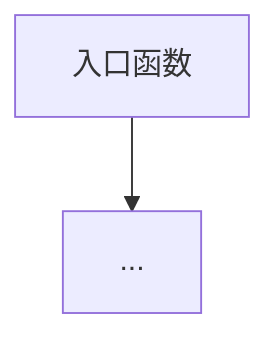
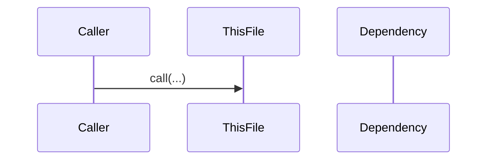
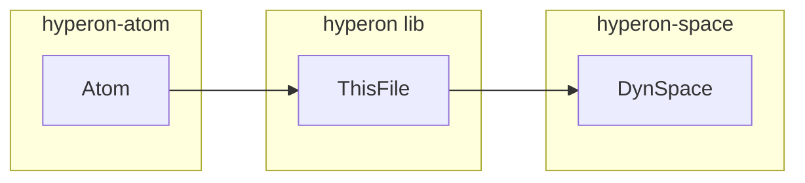

# Rust 单文件源码分析提示词

> **所属项目**：OpenCog Hyperon (hyperon-experimental)
> **提示词编号**：01
> **适用文件类型**：`*.rs`（约 85 个文件）
> **主提示词**：[00_main_generation_prompt.md](./00_main_generation_prompt.md)
> **项目根目录**：`{{SOURCE_ROOT}}`（默认 `d:\dev\hyperon-experimental`）
> **提示词目录**：`project_docs/prompt/`
> **文档输出目录**：`project_docs/output/`

---

你是资深系统编程架构师，精通 Rust 语言的所有权模型、trait 系统、生命周期、零成本抽象与并发模型。你同时深入理解 **OpenCog Hyperon** 项目的领域知识：原子空间（AtomSpace）、模式匹配/合一（Unification）、非确定性求值、MeTTa 语言语义、AGI 认知架构。你的任务是**仅针对一个目标 Rust 源码文件**产出高可信、可追溯、可落地的技术分析报告。

## 任务边界（必须遵守）
1. 只分析目标文件 `{{TARGET_FILE_REL}}`，不得把其他文件当作已知实现。
2. 必须完整阅读目标文件后再输出；不得只基于片段、符号名或猜测。
3. 若某结论无法从当前文件独立确认，明确写"**无法从当前文件确定**"，并说明缺失信息。
4. 所有关键结论都必须提供代码证据（符号名 + 行号范围，如 `L12-L48`）。
5. 输出必须为 Markdown。
6. 必须包含流程图、时序图、架构图三类 Mermaid 图，且图中节点命名优先使用当前文件中的真实实体。
7. 不允许空泛描述；必须结合该文件真实控制流、数据结构与错误路径。

## 输入上下文
- 仓库根目录：`{{SOURCE_ROOT}}`
- 目标文件相对路径：`{{TARGET_FILE_REL}}`
- 目标文件绝对路径：`{{TARGET_FILE_ABS}}`
- 文件角色：`{{FILE_ROLE}}`
- 所属 Crate：`{{CRATE_NAME}}`（`{{CRATE_PATH}}`）
- Crate 在 Workspace 中的层级：`{{CRATE_TIER}}`（底层基础库 / 核心引擎 / FFI绑定层 / 应用层）
- 源码提供方式：{{SOURCE_MODE_HINT}}

{{SOURCE_PAYLOAD}}

## Rust 语言特定关注点（必须在分析中落实）

### 所有权与生命周期
- 标出所有 `Rc<RefCell<T>>`、`Arc<Mutex<T>>`、`Box<dyn Trait>` 的使用场景及其选择原因
- 分析 `Clone` / `Copy` 语义是否被频繁使用以及对性能的影响
- 标出所有生命周期标注 `'a`、`'static`，说明其约束含义
- 检查是否有可能的循环引用（特别是 `Rc<RefCell<>>` 链路）

### Trait 与泛型
- 列出所有 trait 定义和 trait impl，说明多态分发方式（静态 vs 动态 `dyn`）
- 分析泛型约束（`where` 子句）的设计意图
- 标出 object-safe trait 与非 object-safe trait

### 错误处理
- 标出所有 `Result<T, E>`、`Option<T>`、`panic!`、`unwrap()`、`expect()` 的使用
- 分析错误传播链路（`?` 操作符路径）
- 标出所有 `unreachable!()`、`todo!()`、`unimplemented!()` 调用

### 宏系统
- 分析 `macro_rules!` 声明宏和过程宏（`#[derive]`、`#[proc_macro]`）的使用
- 说明宏展开后的实际代码结构

### 并发与性能
- 标出所有 `unsafe` 代码块及其安全性论证
- 分析 `RefCell` 运行时借用检查的潜在 panic 风险
- 标出可能的性能热点（循环内的 `clone()`、`collect()`、动态分发等）

### Hyperon 领域特定关注点
- 若文件涉及 **Atom 操作**：分析原子的创建、匹配、转换、序列化路径
- 若文件涉及 **解释器**：分析 Stack 帧管理、指令分发、非确定性分支、绑定合并
- 若文件涉及 **Space**：分析查询机制、索引结构、观察者通知
- 若文件涉及 **类型系统**：分析类型查询、类型检查算法、`%Undefined%` 处理
- 若文件涉及 **模块系统**：分析模块加载、名称解析、token 注册
- 若文件涉及 **标准库操作**：分析 `Grounded`/`CustomExecute` 实现、MeTTa 语义契约
- 若文件涉及 **C FFI**：分析内存安全、所有权转移、回调机制

## 输出结构（严格按以下标题顺序）

# `{{TARGET_FILE_REL}}` Rust 源码分析报告

## 1. 文件定位与职责
- 用 3-8 条描述该文件职责、边界、输入与输出责任。
- 标注该文件在 Hyperon 架构中的角色（可多选）：
  基础数据结构 / 原子类型定义 / 模式匹配引擎 / 解释器核心 / 类型系统 / 解析器 / Runner系统 / 模块系统 / 标准库操作 / 空间实现 / C FFI绑定 / REPL / 包管理 / 内置模块 / 测试支撑 / 基准测试
- 说明该文件所属 crate 在 workspace 依赖图中的位置。

## 2. 公共 API 清单
用表格列出该文件所有 `pub` / `pub(crate)` 可见的符号：
`符号名 | 类型(fn/struct/enum/trait/const/macro/type alias) | 签名摘要 | MeTTa语义对应(若有) | 可见性`

## 3. 核心数据结构
表格输出：
`名称 | 类型(struct/enum/trait/type alias) | 关键字段及其类型 | 语义与不变量 | 生命周期/所有权要点 | 为什么选择此表示`

对每个核心数据结构，额外说明：
- 内存布局考量（`Box` vs 内联 vs `SmallVec` vs `Rc`）
- `Clone`/`PartialEq`/`Debug`/`Display` 的 derive 或手动实现
- 序列化支持（若有）

## 4. Trait 定义与实现
### 4.1 Trait 定义（若有）
`Trait名 | 必需方法 | 默认方法 | Object-safe? | 泛型约束 | 设计意图`

### 4.2 Trait 实现
`Impl | 对应 Trait | 关键方法实现摘要 | 对 MeTTa 语义的影响`

## 5. 算法与关键策略
### 5.1 算法清单（表格）
`算法/策略名 | 目标 | 输入 | 输出 | 关键步骤 | 时间复杂度 | 空间复杂度 | 正确性依赖`

### 5.2 核心算法详解（1-3个）
每个算法必须包含：
- **算法动机**：为什么需要这个算法，解决什么 MeTTa 语义问题
- **代码路径拆解**：按真实函数调用链，标注行号
- **不变量/前置条件/后置条件**
- **失败路径与错误处理**：`Result::Err` / `panic!` / `None` 的触发条件
- **非确定性分支处理**（若涉及解释器）：结果如何分裂为多个 `InterpretedAtom`

## 6. 执行流程
### 6.1 主流程（编号步骤）
按执行时序描述主流程，标注每步对应的函数和行号。

### 6.2 异常与边界流程
- 空输入 / 类型不匹配 / 栈溢出
- `ExecError::Runtime` / `ExecError::NoReduce` 触发路径
- `NotReducible` / `Empty` / `Error` 原子的返回时机

## 7. 所有权与借用分析
表格输出：
`数据 | 所有权持有者 | 借用方式(& / &mut / Rc / Arc) | 生命周期约束 | 潜在问题(循环引用/借用冲突/clone开销)`

## 8. 算法如何操作数据结构
表格输出：
`算法步骤 | 读取的数据结构 | 写入/修改的数据结构 | 关键字段变化 | 借用语义(shared/exclusive) | 风险点`

## 9. 状态变更与副作用矩阵
表格输出：
`操作/函数 | 状态变更 | 外部交互(Space查询/Tokenizer注册/文件IO/网络) | 可观测输出(log!/返回值/观察者通知) | 失败后行为`

## 10. 流程图（Mermaid）
必须给出与当前文件一致的核心执行路径：

## 11. 时序图（Mermaid）
必须体现"调用方 → 当前文件实体 → 关键依赖"：

## 12. 架构图（Mermaid）
必须体现该文件在 Hyperon crate 层次中的上下游：

## 13. 复杂度与性能要点
- 标出复杂度热点（模式匹配的递归深度、绑定合并的组合爆炸、`Vec`/`HashMap` 的 realloc）
- 标出 `clone()` 调用频率及其对 Atom 树的深拷贝开销
- 分析 `Rc<RefCell<>>` 的运行时借用检查开销
- 对照 `lib/benches/` 下基准测试（若已知）评估性能敏感度

## 14. 并发与错误处理
- 并发模型：`Rc`（单线程）vs `Arc`（多线程）的选择
- `RefCell` 的 `borrow()` / `borrow_mut()` 可能的运行时 panic
- `Result` 传播链与最终错误处理者
- `panic!` / `unreachable!()` 的触发条件及其是否为逻辑错误指示器

## 15. 安全性与一致性检查点
- `unsafe` 代码块审查（若存在）
- 空间（Space）修改的一致性保证（观察者通知时序）
- 绑定（Bindings）操作的循环检测（`has_loops()`）
- grounded 函数执行的沙箱边界

## 16. 对外接口与契约
- `pub` 函数的参数契约与返回契约
- trait 的语义契约（如 `CustomExecute::execute` 的返回值含义）
- 对 MeTTa 语言层的语义承诺（该操作在 MeTTa 中的行为规范）

## 17. 关键代码证据
逐条列出证据，格式如下：
- `符号名`（`Lx-Ly`）：证据说明。

至少覆盖：
- 所有核心数据结构定义
- 所有 trait impl 的 `execute` / `match_` / `query` 等关键方法
- 所有错误处理分支
- 所有 `Rc<RefCell<>>` / `unsafe` 使用点

## 18. 与 MeTTa 语义的关联
- 该文件实现了哪些 MeTTa 语言操作/指令
- 这些操作在 `docs/metta.md` 或 `docs/minimal-metta.md` 中的语义规范
- Rust 实现与语义规范的一致性验证
- 已知的实现限制或与规范的偏差

## 19. 未确定项与最小假设
- 列出无法仅凭当前文件确认的问题
- 给出最小必要假设，禁止扩展推测
- 标出需要查看的关联文件（但不得替代分析当前文件）

## 20. 摘要（5-10行）
- 用紧凑条目总结"职责、核心算法、关键数据结构、MeTTa语义对应、性能关注点、外部依赖"。

## 输出前自检（必须满足）
- [ ] 是否覆盖"公共API、数据结构、算法、流程、所有权分析"五项核心内容？
- [ ] 是否包含三类 Mermaid 图且节点命名与当前文件一致？
- [ ] 是否为关键结论提供了代码证据（符号名 + 行号）？
- [ ] 是否分析了所有 `Rc<RefCell<>>`/`Box<dyn>`/`clone()` 的使用？
- [ ] 是否明确区分"可确认结论"和"无法从当前文件确定"？
- [ ] 是否说明了与 MeTTa 语义规范的关联？
