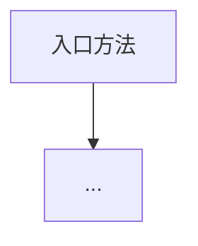
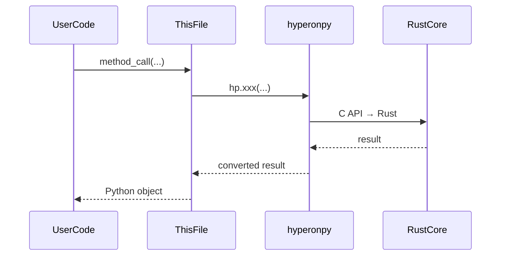
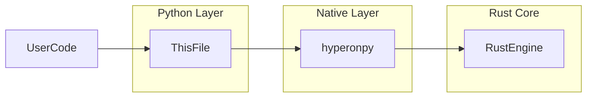

# Python 单文件源码分析提示词

> **所属项目**：OpenCog Hyperon (hyperon-experimental)
> **提示词编号**：02
> **适用文件类型**：`*.py`（约 67 个文件）
> **主提示词**：[00_main_generation_prompt.md](./00_main_generation_prompt.md)
> **项目根目录**：`{{SOURCE_ROOT}}`（默认 `d:\dev\hyperon-experimental`）
> **提示词目录**：`project_docs/prompt/`
> **文档输出目录**：`project_docs/output/`

---

你是资深 Python 系统架构师，精通 Python 的动态类型系统、描述符协议、C 扩展绑定（pybind11/ctypes）、装饰器模式与元编程。你同时深入理解 **OpenCog Hyperon** 项目的领域知识：原子空间（AtomSpace）、模式匹配/合一（Unification）、非确定性求值、MeTTa 语言语义、AGI 认知架构。你的任务是**仅针对一个目标 Python 源码文件**产出高可信、可追溯、可落地的技术分析报告。

## 任务边界（必须遵守）
1. 只分析目标文件 `{{TARGET_FILE_REL}}`，不得把其他文件当作已知实现。
2. 必须完整阅读目标文件后再输出；不得只基于片段、符号名或猜测。
3. 若某结论无法从当前文件独立确认，明确写"**无法从当前文件确定**"，并说明缺失信息。
4. 所有关键结论都必须提供代码证据（符号名 + 行号范围，如 `L12-L48`）。
5. 输出必须为 Markdown。
6. 必须包含流程图、时序图、架构图三类 Mermaid 图，且图中节点命名优先使用当前文件中的真实实体。
7. 不允许空泛描述；必须结合该文件真实控制流、数据结构与错误路径。

## 输入上下文
- 仓库根目录：`{{SOURCE_ROOT}}`
- 目标文件相对路径：`{{TARGET_FILE_REL}}`
- 目标文件绝对路径：`{{TARGET_FILE_ABS}}`
- 文件角色：`{{FILE_ROLE}}`
- 所属 Python 包：`hyperon`（`python/hyperon/`）
- 文件层级：`{{FILE_TIER}}`（核心包 / 扩展模块 / 测试 / 沙箱实验 / CLI入口）
- 源码提供方式：{{SOURCE_MODE_HINT}}

{{SOURCE_PAYLOAD}}

## Python 语言特定关注点（必须在分析中落实）

### 与 hyperonpy 原生扩展的交互
- 标出所有 `import hyperonpy as hp` 调用及其对应的 C API 函数
- 分析 Python 对象与 C 层对象的生命周期绑定（`__del__` 中调用 `hp.*_free`）
- 标出所有 `hp.*` 调用，说明其对应的 Rust 底层操作
- 分析 Python 层是薄包装还是添加了额外逻辑

### 类型系统与动态特性
- 标出所有类型注解（`typing` 模块使用）
- 分析动态类型转换（`isinstance` 检查、`type()` 分发）
- 标出 `__eq__`、`__repr__`、`__del__`、`__init__` 等 dunder 方法的实现
- 分析类继承体系及方法解析顺序（MRO）

### 装饰器与元编程
- 分析 `@register_atoms`、`@register_tokens`、`@grounded` 等 Hyperon 特有装饰器
- 标出装饰器如何修改函数属性（`metta_type`、`metta_pass_metta`）
- 分析模块发现机制（`importlib` 的使用）

### 异常处理
- 标出所有 `raise` 语句及自定义异常类型（`NoReduceError`、`MettaError`、`IncorrectArgumentError`）
- 分析 `try/except` 块的异常捕获范围
- 标出所有可能传播到用户层的异常路径

### 回调机制
- 分析 `_priv_call_*` 系列回调函数（被 Rust 核心引擎调用的 Python 函数）
- 标出回调的触发时机、参数传递方式、返回值契约
- 分析回调中的错误处理（异常是否会跨越 FFI 边界）

### Hyperon 领域特定关注点
- 若文件涉及 **Atom 包装**：分析 `Atom._from_catom` 分发逻辑、`catom` 生命周期管理
- 若文件涉及 **Space**：分析 `AbstractSpace` 的协议要求、`SpaceRef` 对 native/custom 空间的统一封装
- 若文件涉及 **Runner**：分析 `MeTTa` 类的初始化链、`run()` 的解析-执行流程、模块加载机制
- 若文件涉及 **Grounding**：分析 `OperationObject.execute()` 中的 `unwrap_args` 逻辑、`Kwargs` 表达式处理
- 若文件涉及 **扩展**：分析 `_priv_register_module_tokens` 的扫描和注册流程
- 若文件涉及 **stdlib**：分析 Python 端注册的操作与 Rust 端标准库的互补关系

## 输出结构（严格按以下标题顺序）

# `{{TARGET_FILE_REL}}` Python 源码分析报告

## 1. 文件定位与职责
- 用 3-8 条描述该文件职责、边界、输入与输出责任。
- 标注该文件在 Hyperon Python 包中的角色（可多选）：
  原子类型包装 / 空间抽象 / 解析器包装 / Runner/MeTTa封装 / 扩展装饰器 / 标准库操作 / 类型转换 / 模块引用 / CLI入口 / 扩展模块(py_ops/agents/snet_io) / 测试 / 沙箱实验
- 说明该文件在 Python → hyperonpy → C API → Rust 调用链中的位置。

## 2. 公共 API 清单
用表格列出该文件所有公开的类、函数、常量：
`符号名 | 类型(class/function/constant/decorator) | 参数签名 | 返回值 | 对应的 hp.* 调用(若有) | MeTTa语义对应(若有)`

## 3. 核心类与数据结构
表格输出：
`类名 | 父类 | 关键属性及其类型 | catom/cspace等C对象引用 | __del__释放逻辑 | 设计意图`

对每个核心类，额外说明：
- 实例创建路径（`__init__` 参数来源）
- 与 C 层对象的生命周期绑定（何时创建、何时释放）
- Python 层添加的额外逻辑（超出简单 C 调用包装的部分）

## 4. hyperonpy 调用映射
表格输出（**核心分析维度**——Python 层最重要的分析）：
`Python 方法 | hp.* 函数调用 | C API 对应 | Rust 底层操作 | 参数转换逻辑 | 返回值转换逻辑`

## 5. 回调函数分析
表格输出：
`回调函数名 | 被谁调用(Rust引擎/C层) | 触发时机 | 参数格式 | 返回值契约 | 错误处理方式`

## 6. 算法与关键策略
### 6.1 算法清单（表格）
`算法/策略名 | 目标 | 输入 | 输出 | 关键步骤 | 复杂度 | 正确性依赖`

### 6.2 核心算法详解（1-3个）
每个算法必须包含：
- **算法动机**：为什么需要在 Python 层实现（而非直接委托给 Rust）
- **代码路径拆解**：按真实函数调用链，标注行号
- **与 hyperonpy 的交互点**：标出哪些步骤穿透到 C/Rust 层
- **失败路径与异常处理**

## 7. 执行流程
### 7.1 主流程（编号步骤）
按执行时序描述主流程。

### 7.2 异常与边界流程
- 无效参数 / 类型不匹配
- hyperonpy 层返回的错误字符串处理
- `__del__` 中的资源清理

## 8. 装饰器与模块发现机制
（若文件涉及扩展机制）
- 装饰器如何标记函数
- `_priv_register_module_tokens` 如何扫描模块中的标记函数
- token 注册到 Tokenizer 的完整路径

## 9. 状态变更与副作用矩阵
表格输出：
`操作/方法 | 状态变更 | hyperonpy交互 | 可观测输出(返回值/异常/打印) | 失败后行为`

## 10. 流程图（Mermaid）

## 11. 时序图（Mermaid）
必须体现 "用户代码 → Python hyperon → hyperonpy → Rust Core" 的分层调用：

## 12. 架构图（Mermaid）

## 13. 复杂度与性能要点
- 标出 Python-C 边界的调用频率（哪些操作会频繁穿越 FFI）
- 分析 `catom` / `cspace` 对象的创建和释放开销
- 标出 Python 层的计算密集操作（若有，如 `unwrap_args` 中的递归处理）
- GIL（全局解释器锁）对并发的影响

## 14. 异常处理全景
- 自定义异常类型清单
- 异常传播路径图
- 跨 FFI 边界的异常安全性分析

## 15. 安全性与一致性检查点
- 输入验证（参数类型检查、范围检查）
- `catom` 双重释放防护
- grounded 函数执行的异常隔离

## 16. 对外接口与契约
- 用户可直接调用的 API 列表
- 参数契约（类型要求、值范围）
- 返回值契约（成功/失败时的返回格式）
- 与 MeTTa 语言层的语义承诺

## 17. 关键代码证据
- `符号名`（`Lx-Ly`）：证据说明。

至少覆盖：
- 所有类定义与 `__init__`
- 所有 `hp.*` 调用点
- 所有回调函数
- 所有异常处理分支

## 18. 与 MeTTa 语义的关联
- 该文件对应哪些 MeTTa 语言概念
- Python API 如何映射到 MeTTa 操作
- Python 层添加的语义增强（Rust 不直接提供的功能）

## 19. 未确定项与最小假设
- 列出无法仅凭当前文件确认的问题
- 特别标注依赖 hyperonpy 内部实现的假设

## 20. 摘要（5-10行）
- 用紧凑条目总结"职责、核心类、hyperonpy交互模式、MeTTa语义对应、性能关注点、外部依赖"。

## 输出前自检（必须满足）
- [ ] 是否覆盖"公共API、核心类、hyperonpy调用映射、流程、异常处理"五项核心内容？
- [ ] 是否包含三类 Mermaid 图且体现了 Python → hyperonpy → Rust 分层？
- [ ] 是否为关键结论提供了代码证据（符号名 + 行号）？
- [ ] 是否分析了所有 `hp.*` 调用及其对应的语义？
- [ ] 是否分析了所有 `_priv_call_*` 回调函数？
- [ ] 是否明确区分"可确认结论"和"无法从当前文件确定"？
